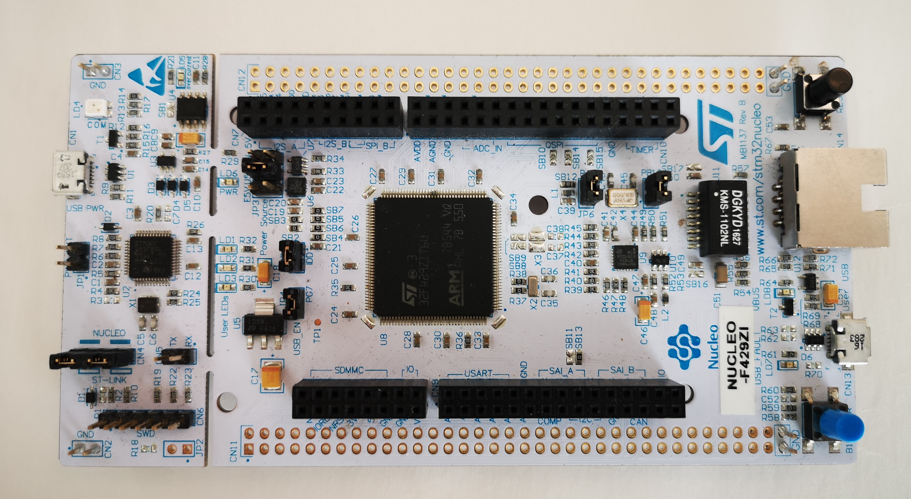
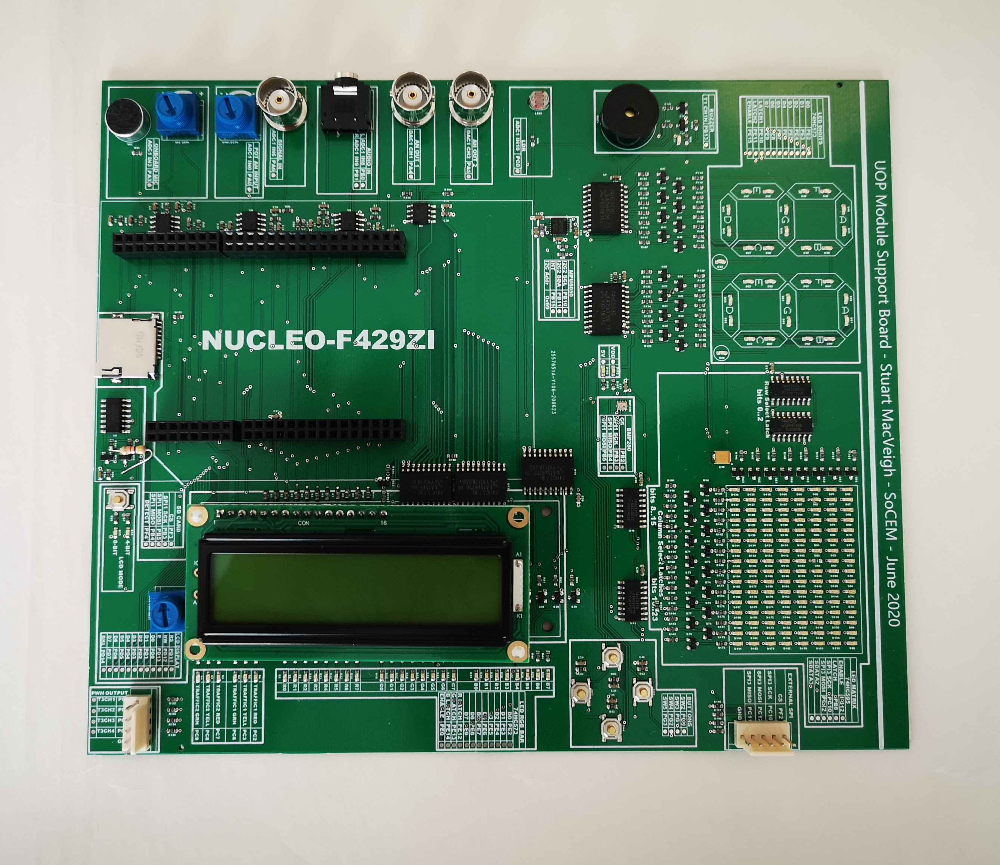
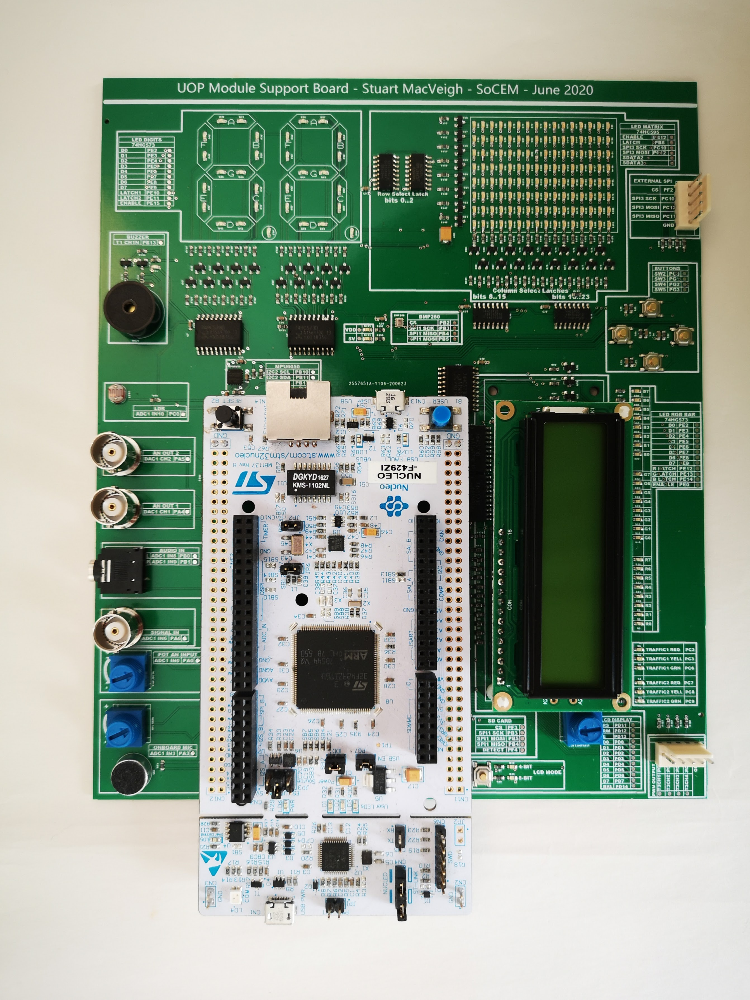

[Table of Contents](README.md) 

---

# Familiarization with the Hardware
There are two pieces of hardware provided with this course:

* **Target Board** - A small low-powered "microcontroller", typically _embedded_ into a larger electronic system, that we will be programming to monitor the external environment and control devices.
 
* **Module Support Board** - This is a custom board containing sensors and output devices. You plug your Target Board into this in order to perform the various lab exercises.

 > There is another term you might encounter - the _host_ computer. This is referring to your PC. It is the machine you are writing code on. We write code on the _host_ and run it on the _target_

## Target Board
The target computer you will be programming is a small low-cost microcontroller based on the [Arm Cortex M4](https://www.arm.com/products/silicon-ip-cpu/cortex-m/cortex-m4)

* The microcontroller is a [STM32F429ZI](https://www.st.com/en/microcontrollers-microprocessors/stm32f429zi.html) made by [ST Microelectronics](https://www.st.com)
* The board which hosts this device (and a few peripheral devices) is a [ST-Nucleo-F429ZI](https://os.mbed.com/platforms/ST-Nucleo-F429ZI/)

An image of the Nucleo board is shown below:

This board is connected to your host PC using a USB connector. **Do not connect this yet**

   > It might be worth noting that Arm Ltd. design the core of Cortex M [microcontroller](/glossary/microcontroller.md), but do not actually manufacture any silicon. The devices are made by other organisations who license the design from Arm.

You will use this board throughout your course. It is surprisingly capable for such a low-power device.

## University of Plymouth Module Support Board
The [Nucleo Target Board](#Target-Board) contains a few _peripherals_, including a push switch, three [Light Emitting Diodes (LEDs)](/glossary/led.md). 

> Peripherals refer to external devices connected (interfaced) to the microcontroller chip. These are either input devices (such as a switch, or a temperature sensor) or output devices (such as an LED or motor controller). Some devices, such as storage cards and memory chips, are both input and output devices.

The Module Support Board contains a **lot** more peripherals you can communicate with. This will help you gain valuable experience interfacing to electronic devices as you go through the course. 

Your Nucleo board connects directly onto this board.

Before you connect the USB cable, connect your Nucleo board to the MSB.

* Check the alignment using the image below and carefully connect your Nucleo to the module support board.

* Never force! The connectors need to be aligned carefully such that only gentle pressure is needed to get the Nucleo pins to seat into the sockets.

It is suggested that you do not remove the Nucleo from the module support board until instructed to do so.

### Schematics
You are encouraged to study the schematics of the module support board.

| Version | Link |
| - | - |
| 2 | [Schematics for v2](../Hardware/ModuleSupportBoard/msb_schematics_v2.pdf) |
| 4 | [Schematics for v4](../Hardware/ModuleSupportBoard/msb_schematics_v4.pdf) |
| |

> **TIP:** To open this link in a separate window, hold down CTRL and click. 
>
> Alternatively, the PDF file is located in the folder `Hardware\ModuleSupportBoard`

---

[NEXT - Software Tools](software-tools.md)