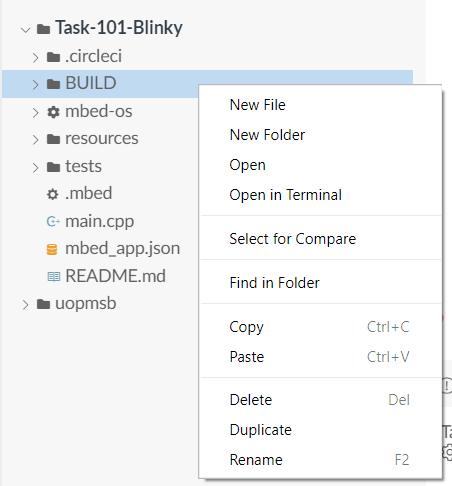

[Table of Contents](README.md) 

---

# Testing the Software
Once you are confident the hardware is working, we can turn our attention to programming.

For this, we will use Mbed Studio to perform the following steps:

1. Open the sample code (written in the language C++) and download the required libraries
1. **Build** the code into something the target computer can understand
1. **Deploy** and **execute** the code on the target board
1. **Edit** the code in Mbed Studio to make a small change
1. **Debug** the code, stepping through line by line
1. Clean up our disk by deleting temporary files.

## Task101 - Blinky!
When learning to program an embedded computer, the tradition is to run "Blinky", a program that simply flashes an LED on and off. This is very simple to do in Mbed.

[Click this link](https://plymouth.cloud.panopto.eu/Panopto/Pages/Viewer.aspx?id=1cdd2263-5644-4322-841d-abfe0101c82a) to watch a video on how to program your board with Mbed Studio.

**TASK** - Now repeat the steps yourself. |

## Debugging
A powerful tool in Mbed Studio is the "debugger". Although this tool is primarily designed to help find errors (bugs) in your code, it is also a powerful educational tool.

> The debugger allows you to run your code, line by line, observing how it works through cause and effect. 

[Click this link](https://plymouth.cloud.panopto.eu/Panopto/Pages/Viewer.aspx?id=e151c5c8-980d-42d6-ab32-abfe010d3a67) to watch a video on how to **debug** your code.

**TASK** - Now repeat the steps yourself.

## Adding the Shared Libraries (New!)
Every project needs at least one library, and usually two:

The libraries used on this course include:

* Mbed-OS - provided by Arm, this library provides all the code to make it easy to access the micontroller. Without this, it is not an mbed project.
* `libuopmsb` - New in 2021, and provided by the University of Plymouth, this library provides support for using the hardware on the Module Support Board (MSB).
   * It also provides support for the different versions of the MSB.

The Mbed-OS library is very large. If you have a lot of projects (as we do on this course), then each project will consume in excess of 1Gb of disk space. Since Mbed Studio v1.2, there is an option to share Mbed-os library files between projects.

To see how to manage libraries in each Task (and your own projects), watch the following video:

[Click Here](https://plymouth.cloud.panopto.eu/Panopto/Pages/Viewer.aspx?id=2780dcd0-541a-464a-8aa2-adac00c305c4) to watch a video showing how this is done.

**TASK** - Now repeat the steps yourself.

It is suggested only need to download the Mbed-OS library once, and use the shared library method for all additional projects.

## Clean up the files (Optional)
In each project, a number of different folders are created when you (i) add libraries and (ii) build your code. All this can be deleted recreated at any time.

Sometimes, you may want to delete these folders to save disk space. Or maybe you want to zip up your project and submit it as a coursework deliverable.

It is quite simple to to clear some disk space. Using Explorer (Windows) or Finder (Mac), you can delete the `BUILD` and `mbed-os` folders. Do NOT delete the any file ending with the extension `.lib`!

You can also delete the `libuopmsb` **folder** if present. It is suggested you do NOT do this from within Mbed Studio itself. Do NOT delete an `.lib` files.

---

[Contents](README.md) 

[NEXT - Troubleshooting](troubleshooting.md)