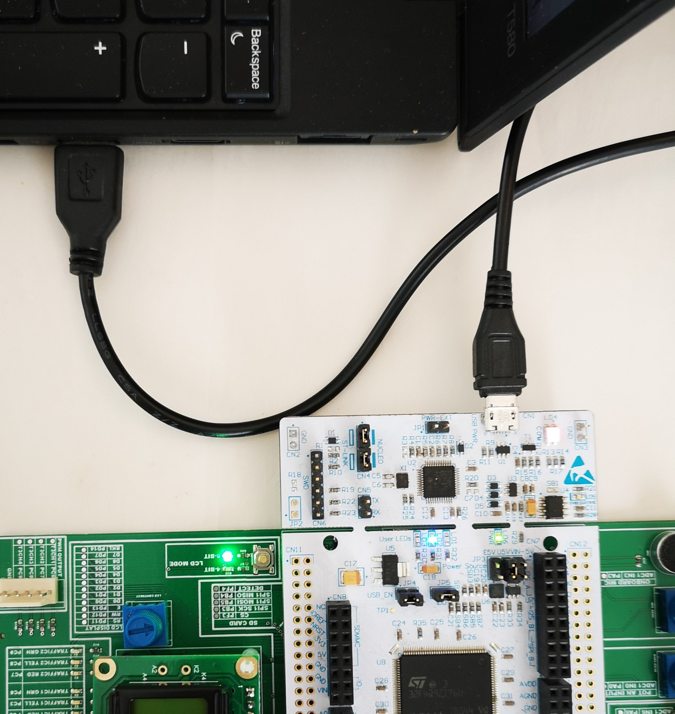
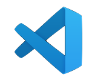

[Table of Contents](README.md) 

---

# Software Tools
During this course you will use a variety of software tools. This section includes the software tools needed to program your target board.

* All the software we use in this course is free for students
* Where possible, software is supported cross platform

1. [Microsoft Teams](#Microsoft-Teams)
1. [Mbed Studio](#Mbed-Studio)
1. [Visual Studio Code](#Visual-Studio-Code)
1. [GitHub Desktop](#GitHub-Desktop)
1. [GCC Compiler (Optional)](#GCC-Compiler)
1. [Windows C++ Compiler (Optional)](#windows-c-compiler)
1. [PuTTY](#putty-serial-terminal)

We will now install each package in turn. Should any of the following steps fail, you can contact the module leader or technician (via instant message) and they should be able to help you.


## Microsoft Teams

For University of Plymouth students, this is essential!

> [Click this link to download and install Microsoft Teams](https://www.microsoft.com/microsoft-365/microsoft-teams/download-app)

Teams allows us to collaborate in many ways, including screen sharing and even remote control. This has proven highly effective for supporting students with technical questions.

When you run Teams for the first time, sign in with your university credentials. Then check your audio and video settings are set to your preferred devices.


## Mbed Studio
We use a software tool called Mbed-Studio that allows us to write code and program our target board.

The term [Mbed](https://os.mbed.com/) refers to a framework for rapidly and easily programming Arm based microcontrollers. It is used in most of our modules where microcontrollers are used. 

> You may have heard of the [Arduino](https://www.arduino.cc/) system? It is similar in many ways. In fact, for the latest versions, Arduino is built on top of Mbed-os.

Before installing Mbed-Studio, first you need a free account on mbed.com

### Creating an Account on mbed.com
You cannot use Mbed without first creating an account on mbed.com. This is a requirement for many of our embedded modules.

* Go to https://os.mbed.com/ and click "Sign Up For Free"

Once you have created your account, please tell us what your username is:

[CLICK HERE TO REGISTER YOUR MBED.COM USERNAME](https://forms.office.com/Pages/ResponsePage.aspx?id=6-c3VPuDGk2_07skfgYb8XOZulv_kVlCjUXVUJQ1RZVUMVFNWjFOWkhPTE84OVBHT0lTMzI5QVVMVy4u)

This will help us better support you. Never disclose your password!

### Installing Mbed Studio
The first step is to download and install the version of Mbed Studio for your computer, but there are a couple checks you should do first.

> [Click this link to download Mbed-Studio](https://os.mbed.com/studio/)

**Failing to ensure the following risks the software install to (silently) fail.**
* Check there are no pending restarts due to a Windows update. 
* Check there is sufficient disk space on your system drive.

Once you system is ready, run the installer and you will probably find it is mostly self-explanatory. It is suggested you install "for all users". Other than that, choose default options. Since version `1.0`, many of the additional tools needed for this software come included.

In the event you do need to reinstall, see the [section on troubleshooting](troubleshooting.md#Failed-installations-and-Reinstalling-Mbed-Studio) first.

### Connecting your Target Board
The software that allows your PC to recognize your target board comes with Mbed Studio. The most important of these is the ST Link Driver.

To test this, you should now connect your Nucleo Board to your host PC using the supplied USB cable



For the Mac and Linux, there is nothing else to do at this stage. For Microsoft Windows, you can run Device Manager and check to see if the drivers are correctly installed:


If there are exclamation marks next to any of the ST devices, please refer to the [section on troubleshooting](troubleshooting.md).



## Visual Studio Code
This is a really useful piece of software used for editing software and configuration files. It can be obtained using the following address:

https://code.visualstudio.com/

This is one of the preferred methods for editing text files and programming source files outside of Mbed Studio. It can even be used as a complete development environment (with the right plugins).


## GitHub Desktop
These notes and all the source code are hosted on a site known as [GitHub](https://github.com/), which is a web repository that leverages the powerful [git version control system](https://git-scm.com/).

> Do not worry what a version control system is yet. You will use one simply to obtain the sample code for this course. The complex topic of software version control will be discussed later, and falls under the topic of _Software Engineering_.

For this course, you will need to do two things:

1. Create an account on GitHub
1. Install GitHub Desktop and Sign In

### Create an Account on GitHub
First of all, you can simply create an account using https://github.com/

> You might want to change your account to a student account in order to get additional benefits - https://education.github.com/pack

Once you have done this, you must register this using the following form:

[CLICK HERE TO REGISTER YOUR GITHUB USERNAME](https://forms.office.com/Pages/ResponsePage.aspx?id=6-c3VPuDGk2_07skfgYb8XOZulv_kVlCjUXVUJQ1RZVUM0dBMUxWREE1RVlHUFVBSTJTTUtHWlg5RS4u)

We need this information in order to share code with you. Never disclose your password!

### Install GitHub Desktop on your Computer
You can download the very useful GitHub Desktop software on your own computer using the following link:

https://desktop.github.com/

When you run this the first time, you make be asked for your GitHub username and password. Once this is entered for a particular computer account, it should remember it for you. If you change computer or user account, it will need to be reentered.

### Clone the Notes
At some point, the tutor will email you a link to obtain a copy of various projects on GitHub. This link should launch use GitHub desktop automatically.

1. [Navigate to this page](https://github.com/UniversityOfPlymouth-Electronics/Embedded-Systems)
1. Click the `Code` button and select `Open with GitHub Desktop`

[Click here to watch a video explaining how to do this](https://plymouth.cloud.panopto.eu/Panopto/Pages/Viewer.aspx?id=e15dcb65-dbcc-404f-a4f1-abfe00ee6f33)

> **IMPORTANT - PLEASE READ**
>
> Clone the files **outside** of any folder that is synchronized to the cloud (such as OneDrive, DropBox or iCloud). Building software generates thousands (even millions) of small temporary files which you probably do NOT want to synchronize to the cloud. To do so would use unnecessary CPU and network bandwidth.
>
> On a personal machine (not shared with anyone else), I strongly suggest you use a folder with a short path and no spaces, such as `C:\git`. You could also clone in `C:\Users\<username>` _where `<username>` refers to your username_.
>
> GitHubDesktop tends to default to your `Documents` folder. **I DO NOT RECOMMEND YOU USE THIS** when using Mbed

### Pulling Updates
Occasionally, the notes and sample code will be changed. Before you start any work, it is strongly suggested you click the "Fetch Origin" button in GitHub desktop.

### Making and saving your own edits
I suggest you create your own repository for your own work. Copy the tasks from the Embedded-Systems repository into your own workspace. This way:

* You can push your changes to your own private repository
* You can easy obtain updates to the tasks / notes without having to merge them into your own code

Watch the following video to show you how to make a copy of each task:

[VIDEO: Making a copy of the tasks for editing](https://plymouth.cloud.panopto.eu/Panopto/Pages/Viewer.aspx?id=a231fa66-1072-4057-8902-adad00daf7fc)

If you want to keep your edits on GitHub (recommended), then watch the following video:

[VIDEO: Saving your work on GitHub](https://plymouth.cloud.panopto.eu/Panopto/Pages/Viewer.aspx?id=7f378c52-3df6-48af-9012-adad00dded03)

### Difference between GitHub and a Cloud Provider
You may already be using a cloud service, such as OneDrive, iCloud or DropBox. These services monitor a collection of folders and mirror everything in the cloud. This is often done in the background while you work.

This is fine for office documents and photos, but less suited to software development.

A key difference is:

* We can often identify certain files type we do NOT need to keep. These are identified in a file named `.gitignore` (you can find this in the root of the repository)
* With Git and GitHub, **we** choose when the files are synchronized and in which direction. However, this does mean getting into the habit of doing this.

There is much more than could be said about these tools, but for now, we will leave this and focus on coding.

### Pull Requests (advanced)
GitHub has great support for "Pull Requests". If you find an error in the notes or the Tasks, you can do the following:

* Create a branch for the fix using the Embedded-Systems repository
* Make the edit
* Commit the change and push (it will offer a pull request)

This will generate an email for the tutor to review your proposed changes and the option to merge them in.

## GCC Compiler
At the time of writing, [Mbed Studio](https://os.mbed.com/studio/) contains a number of components, including the following:

* Mbed Studio IDE - a cross platform IDE for Windows, Mac OS and Linux operating systems
* [ARM C6 Compiler](https://developer.arm.com/tools-and-software/embedded/arm-compiler) - specially licensed for Mbed Studio
* [PyOCD Debugger](https://pypi.org/project/pyocd/)
* [Mbed OS Libraries](https://os.mbed.com/docs/mbed-os)

Each of these can be viewed as separate projects in their own right, and that come bundled together as part of the Mbed Studio.

* There is also the [Mbed Command Line Interface (CLI)](https://os.mbed.com/docs/mbed-os/latest/quick-start/offline-with-mbed-cli.html) for experienced developers. 
   * This commonly uses the [GNU ARM Embedded Toolchain GCC_ARM](https://developer.arm.com/tools-and-software/open-source-software/developer-tools/gnu-toolchain/gnu-rm/downloads)

If you are experiencing difficulty debugging your code in Mbed Studio, you could try the GCC_ARM toolchain. You can do this as follows (for Windows and Mac OS):

1. Download and install the [GNU ARM Embedded Toolchain GGC_ARM](https://developer.arm.com/tools-and-software/open-source-software/developer-tools/gnu-toolchain/gnu-rm/downloads) - check the supported versions.
2. Follow the [instructions here](https://os.mbed.com/docs/mbed-studio/current/installing/switching-to-gcc.html)

### Example (for Windows)
Below are the instructions given to University of Plymouth students:

* Install the [GNU ARM Embedded Toolchain GGC_ARM](https://developer.arm.com/tools-and-software/open-source-software/developer-tools/gnu-toolchain/gnu-rm/downloads) v9-2020-q2

* Using a text editor, create a file `external-tools.json` with the following content:
```JSON
{
    "bundled": {
        "gcc": "C:/Program Files (x86)/GNU Arm Embedded Toolchain/9 2020-q2-update/bin"
    },
    "defaultToolchain": "GCC_ARM",
    "_defaultToolchain": "ARMC6"
}
```

* You may need to adjust the path in the JSON file to match your installation folder.
    * Note the forward slash `/` is used as a path delimiter.
* Copy `external-tools.json` to `C:\Users\<useraccount>\AppData\Local\Mbed Studio` (where `<useraccount>` is a folder with the same of your current user).
* Restart Mbed Studio

If you want to switch back to ARMC6, simply edit `external-tools.json` and move the underscore `_` as follows (and restart):

```JSON
{
    "bundled": {
        "gcc": "C:/Program Files (x86)/GNU Arm Embedded Toolchain/9 2020-q2-update/bin"
    },
    "_defaultToolchain": "GCC_ARM",
    "defaultToolchain": "ARMC6"
}
```

I personally like to have the option of using either compiler.

## Windows C++ Compiler

Sometimes it is useful to be able to write C and C++ on the host computer. 

* For Ubuntu Linux, you would install using `sudo apt install build-essential gdb`
* For Mac OS, you can install XCode or Visual Studio for Mac
* For Windows, you can install Visual Studio and add the C++ tools, or Visual Studio Code alongside a suitable C++ Compiler.

Windows is the more common scenario, but also arguably the more complex one and there are a few choices. 

* Visual Studio is the simplest, but also the largest install. Note that for commercial use, Visual Studio is paid commercial software.
* We suggest the free [Visual Studio Code](https://code.visualstudio.com/) for consistency across all platforms. For this, you need to install a suitable C and C++ toolchain alongside it.

The MinGW compiler is a good choice, and is part of the [MSYS2](https://www.msys2.org/) distribution. Instructions can be found here: https://code.visualstudio.com/docs/cpp/config-mingw

You can also use Windows Subsystem for Linux 2 (WSL2) - https://code.visualstudio.com/docs/cpp/config-wsl. Note that for Windows 10, the default is WSL1. You will need to follow [specific instructions](https://learn.microsoft.com/en-us/windows/wsl/install-manual) to install WSL2.

## PuTTY Serial Terminal
This is useful and may be used at different times

[CLICK HERE TO DOWNLOAD PuTTY](https://www.chiark.greenend.org.uk/~sgtatham/putty/latest.html)

This tool has various applications that are used at different stages in the course. The most basic is as a Serial Terminal emulator. 

> Note that Mbed Studio has a built-in serial terminal. However, some modules may not use Mbed Studio. If Mbed Studio is running, you may also find PuTTY does not work. 

---

[NEXT - Testing the Hardware](hardware-testing.md)