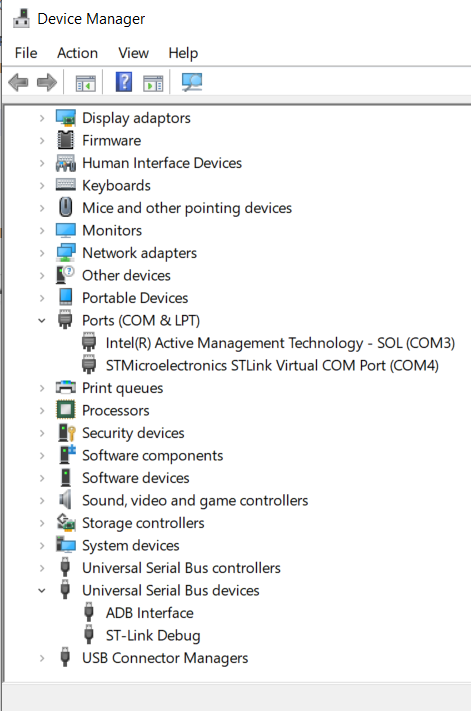
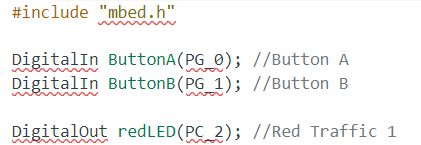
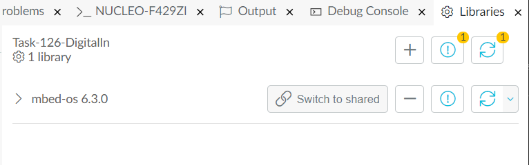

[Table of Contents](README.md) 

---

# Troubleshooting
If you are having problems with Mbed studio, please check the sections below, and certainly before uninstalling and reinstalling. 

## Summary of the most common sources of problems
There are a number of issues which can cause problems with Mbed-studio. A quick summary is provided here:

* Ensure your source files are in a short path preferably without any spaces, such as `c:\git` (on Windows)

* Whatever you do, do not put your source files in a folder managed by tools such as OneDrive (or other cloud services).

* One of the common mistakes is to forget to click the library tab and ensure that the project has an `mbed-os` folder. If you don’t do this you will notice that many lines in the editor have read underscores.

* `mbed-os.lib` is a file in every project that contains a URL. This points to get up and a specific version of the mbed libraries. It is suggested you use version 6.3

* Consider updating the firmware on your Nucleo board (see below).

* In the event that Mbed studio crashes (or a debug session crashes), go into task manager and ensure that all instances of Mbed Studio and any python applications are closed.

## Firmware

If any of the previous steps fail, it is best to contact a member of staff, either in person, or via Teams.

* When you connect your ST Board, it should appear as an external storage device on your computer. Browsing this drive you should see two files. If not, inform the module staff and maybe use Teams to screenshare so they can diagnose the problem.

* One of the most common issues is the "firmware" on the Nucleo Boards. This firmware is partly responsible to maintaining the connection between the host PC and the Target. You can update to the latest version using the [ST Link Update Tool](#ST-Link-Drivers-and-Utilities).

* On the ST Link, check the power light is GREEN and not red. If Red, this suggests the USB port may not be able to supply sufficient power.

* If the debug fails, ensure there are no syntax errors in your code. If now, try unplugging your USB cable from your host PC and reconnecting it. In some cases, I have had to reboot the host PC to get debugging to work.

## Board Not Detected in MS Windows

For Microsoft Windows, run Device Manager and check to see if the drivers are correctly installed:

If there are exclamation marks next to any of the ST devices, it probably means your ST Link drivers are not installed.

## ST Link Drivers and Utilities
If there are exclamation marks against any of the ST devices, you may need to install the driver manually.  There are also some additional tools that you may need from time to time.

* ST Link Drivers ([STSW-LINK007](https://www.st.com/content/st_com/en/products/development-tools/software-development-tools/stm32-software-development-tools/stm32-utilities/stsw-link009.html)) - the latest version of the ST Drivers for Windows
* ST Link Update ([STSW-LINK007](https://www.st.com/content/st_com/en/products/development-tools/software-development-tools/stm32-software-development-tools/stm32-programmers/stsw-link007.html)) - used to upgrade the firmware on your Nucleo Board (all host platforms)
* STM32 ST-LINK utility ([STSW-LINK004](https://www.st.com/content/st_com/en/products/development-tools/software-development-tools/stm32-software-development-tools/stm32-programmers/stsw-link004.html)) - a useful tool for resetting and wiping boards. Rarely needed but sometimes useful

To obtain these packages, you need to create an account on st.com first. Please speak with one of the staff members if you have trouble doing this.

## Cannot make a project the "Active Program"
If you right-click a mbed project, and the option to make it the "Active Program" is missing, this usually means you are missing the file `mbed-os.lib` in you project.

> The `mbed-os.lib` file is simply a text file which contains a URL. This URL points to the GitHub repository for a given version of mbed-os. 
>
> For your convenience, a copy of this file for different versions of mbed-os can be found in the `mbed-os-versions` folder.
   
## Squiggly Lines under my Code
If you open a project and see lots of "squiggly" underlines, you probably don't have the mbed-os libraries included in your project.

<figure>

<figcaption>The red underlines under mbed-os types suggests your project does not include the mbed-os library</figcaption>
</figure>

* Click the libraries tab
* Check the mbed-os library version
    * If no version is stated, this suggests the `mbed-os.lib` file is missing (see section above)
* Check for a number against the problems button. 
    * Do not click it until you have read the options below

<figure>

<figcaption>This warning indicates there is no mbed-os library</figcaption>
</figure>

* For a stand alone application, click the button and select to "Fix All Problems". 
    * **Note** that his will download all the Mbed-os sources and consume over 1Gb disk space
* If you want to save disk space, hover your mouse pointer over the mbed-os version and click the "Switch to shared" button and navigate to the mbed-os folder in another project. 

<figure>

<figcaption>Click the "Switch to shared button" and navigate to the mbed-os folder in another project</figcaption>
</figure>

## Cannot Program or Start A Debug Session
If you are trying to start a debug session, and you are getting error messages about the debugger timing out, you might need to restart the debug service on your PC.

https://plymouth.cloud.panopto.eu/Panopto/Pages/Viewer.aspx?id=54f0b0ff-eb0f-41d7-bc19-ac0600e5f949

## Cannot Debug my Code
If you are experiencing problems debugging your code in Mbed Studio, you might want to try the GCC compiler instead of the ARM C6 Compiler.

[Instruction are here](software-tools.md#GNU-Compiler)

## Failed installations and Reinstalling Mbed Studio (Windows)
This should be a last resort. However, there are situations where an Mbed studio install fails:

* When there was a pending Windows update when you installed Mbed Studio.
* When disk space is very low.

In such cases, I suggest you completely uninstall Mbed Studio and reinstall "for all users".

This forum post contains instruction on how to ensure Mbed studio is completely removed:

https://forums.mbed.com/t/installation-aborted-on-win10/8220/3

To quote:

1. Please run an uninstaller for Mbed Studio. You can use either Add/Remove Programs or find uninstaller in your Mbed Studio install location.

1. Please check that following paths do not exist. Please delete those folders in case that they are still there: C:\Program Files\Mbed Studio, C:\ProgramData\Mbed Studio, ~\AppData\Local\Programs\Mbed Studio, ~\AppData\Local\Mbed Studio.

1. Install Mbed Studio again

---

[Table of Contents](README.md) 