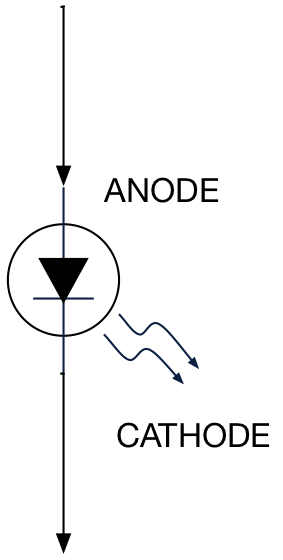
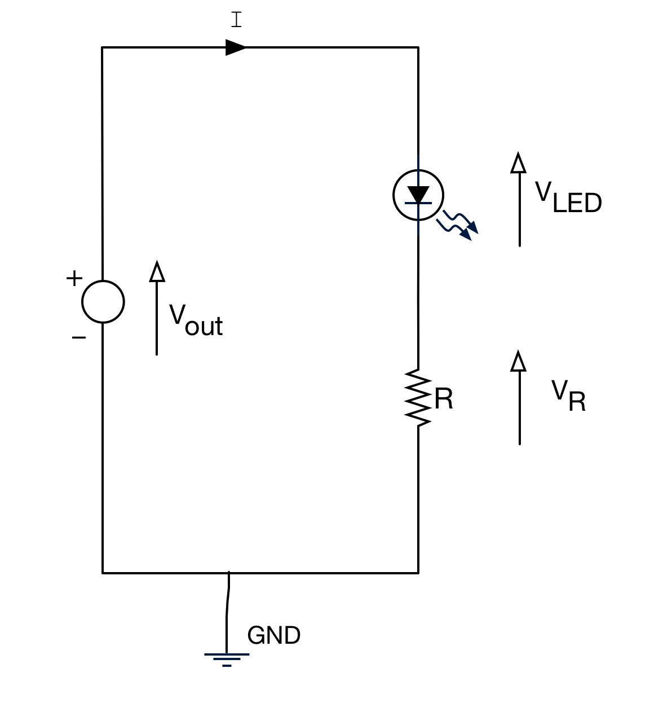

[Glossary](/glossary/README.md)

---

# Light Emitting Diode (LED)

An electronic device that emits light when a current passes through it. As with any diode, electrical current can only pass in one direction (from the “anode” to the “cathode”). The schematic symbol for an LED is shown below (there are some variants. Sometimes the circle is missing). 

The anode typically has a longer lead as identified in the photo.

Consider the LED circuit below. 

The current `I` needs to be sufficient such that the LED light is sufficiently bright. We say this is now biased. There will be a voltage drop across the diode `V``LED`. Note that this would not significantly rise if `I` was to rise (maybe by reducing `R`). 

The current needed for full brightness and the voltage drop `V``LED` will vary with each device. You need to consider these parameters carefully before selecting an LED and the resistor `R`.

Note that if you try and pass current through an LED in the opposite direction (reverse biased), almost zero current will flow. In the circuit above, swapping the LED direction would mean that `V``LED` &approx; `V``out` and no light would emit.

## Characteristics of an LED

In your kit, you will find three LEDs: red, green and amber. The data sheets for these devices are provided on the module site. 

However, the most important characteristics for a clear visible brightness are as follows:

	
| Colour | current (approx.)	| Voltage |
| --- | --- | --- |
| RED |	2mA	| 1.7V |
| AMBER | 2mA | 1.85V |
| GREEN	| 2mA |	1.9V |

You can drive much higher currents through these LED’s but the additional perceived brightness is not significant.

We want to keep current LOW for two reasons:

1. **The source of power for the LED will usually a microcontroller pin**. From the data sheet, the maximum output current is limited to 25mA (milliamps) for a single pin, up to a total maximum of 120mA for all pins.
1. We want to (and should) try to save power

There will be tolerances around these values, and they do not need to be precise.

> If you are using the module support board, there are a great deal more LEDs available. The characteristics for these will differ from the above and the resistor values will be fixed.

## Calculating the Correct Resistor Value
As is often the case, within the acceptable range, there is no absolutely correct resistor value. It depends on how bright you want the LED to be.

> Electronics is full of "trade-offs" like this. We want to save power, but also be able to see the LED when illuminated.

Returning to the circuit, let's drive a GREEN led:

The brightness is determined by the current `I`. We need to make a decision what current we would like. 

For example, we could choose `I=2mA` (`2 x 10``-3``A`)

From the data, this results in an LED voltage of `1.9V` 

According to Kirchoff’s second law, `V``out``=V``R`` + V``LED`

Therefore, the voltage across the resistor must be `V``R``=3.3V-1.9V=1.4V`

Next, we use **Ohms Law** to calculate `R`. 

> The famous Ohms Law states that the volage across a linear resistive device = the current multiplied by the resistance.
>
> `V = I * R` 

* We know the current `I=2mA`
* We know the voltage across the resistor `V``R``=1.4V`
* We therefore calculate `R = V``R` `/ I = 1.4/2E-3 = 700` &Omega;

However, from our resistor stock, we had `680` &Omega; resistors, so that was chosen as the nearest value.

