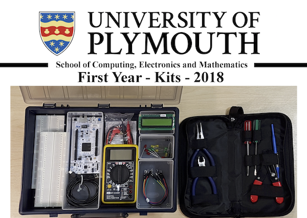
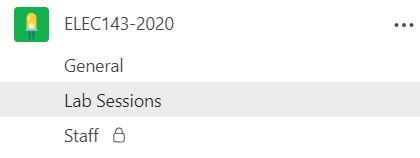
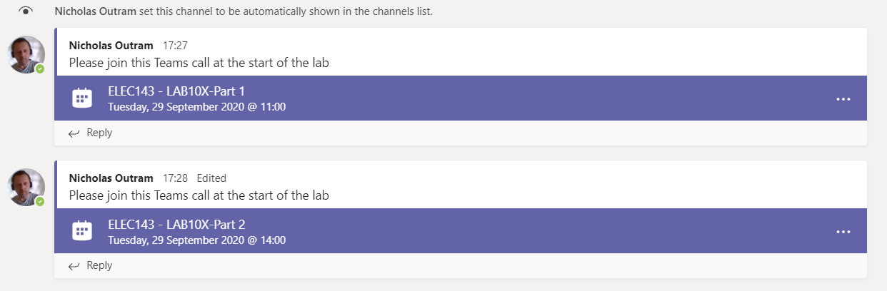

[UP - Overview](../README.md)

---
 
# Embedded Systems in Context - Level 4

## What is new
This content has been migrated from [a previous version](http://blogs.plymouth.ac.uk/embedded-systems/microcontrollers/mbed-os-2/courses/embedded-systems-in-context-level-4/foreward/) based on mbed-os 5.

**Changes for 2021:**

The following changes are confirmed.

* Module Support Board v4 provided to all stage-1. 
   * This has an extra switch mute the buzzer (by popular demand!)
   * The MPU6050 is populated by default (motion sensor)
   * The BMP was replaced with an alternative SPL06-001
   * New schematics have been added
* [New Driver Library](https://github.com/UniversityOfPlymouth-Electronics/libuopmsb) is now used to assist with managing different board versions. This includes support for the new devices. These notes have been updated to reflect this.
* All projects are updated to Mbed-OS 6.13 and use Mbed Studio 1.4.2 onwards
* Various corrections and typos fixed

**Changes for 2020:**

* Adoption of Mbed Studio v1.X
* Adoption of Mbed-os 6.X
* More content on the fundamentals of C and C++ programming
* The [existing glossary](http://blogs.plymouth.ac.uk/embedded-systems/glossary-2/) is being migrated to a [new version](/glossary/README.md) 
* Blended delivery model

# Level 4 Course
If you are a student at the University of Plymouth, welcome to the first lab!

As a guide, each section should take approximately 2 lab sessions (4-6 Hrs / section). There are additional tasks for those that finish early or want to do further self study. You may need to spend time at home completing the tasks.

| Wk | Section | Title |
| --- | --- | --- |
| 1   |   | [Getting Started and Introduction](Introduction.md) |
| 2 | 1 | [Digital Outputs 1](Digital_Outputs_1.md) |
| 3-4 | 1 | [Digital Outputs 2 and Iteration](Digital_Outputs_2.md) |
| 5 | 2 | Potential Dividers (self study) |
| 5 | 3 | [Digital Inputs and Conditionals](Digital_Inputs_1.md) |
| 6-7 | 4 | [Analogue Input, arrays and strings](Analogue_Input_1.md) |
| 8 | 5 | [Analogue Output and functions](Analogue_Output_1.md) |
| 9-13 | - | Coursework and Assessment + Advanced Topics |

_Provisional Time Plan for Practicals_

Section 2 is different to the other tasks. This is a research based task which you are advised to tackle as a group. Do not ignore this task - all content in this document may be examined in an end of module test.

## Using the Glossary
Some crucial information is contained in the [glossary](/glossary/README.md).

This is so that the document is not cluttered with every detail. Do not ignore the glossary. You should read every entry referenced in each lab. In many cases, you may see a hyperlinked word (jargon typically). Some of these are links to glossary items. If you select them you can jump to the glossary items.

## Setting Expectation
Remember that each student on the course has a different background. Some may have done some electronics or programming before. Others may have done neither. It is difficult to design a course that works for everyone. 

This module is designed on the assumption that you have no electronics or software experience. However, we equally want it to be challenging and interesting for those with prior experience. Therefore you will find each section has some compulsory tasks, and some which are optional.

> Do not feel bad if you don’t have time for the extra tasks. You will meet some of these challenges later in the programme.
>
> Equally, if you have done some software before, beware of complacency and seek opportunities to push yourself, explore new areas and ask questions.

As a final remark, this is a fairly intensive course. You cannot learn to play the piano in 13 weeks - the human brain simply does not work like that, so don’t expect to master programming at the end. This is the beginning of your education - we hope it’s an enjoyable one.

## Your Kits
You are provided with a Kit that enables you to work both in the lab and at home. The contents will vary from year to year (the image is only indicative). 

You may also be loaned other equipment, such as a "Picoscope". Further instructions will be given on how to use it.

## Attending Labs
Formal labs are scheduled at specific times in your timetable. Whether you are attending in person or remotely, you should use the Teams channel for that lab.

When you click this channel, you should see meeting links

Join the appropriate meeting by clicking the link. You can turn off your video and audio, and even the incoming video to save bandwidth.

Labs will contain interactive elements. Participating in these is important.

## Lectures
Each week there is a lecture, which often includes live recorded demo's. By the time you read this, the first lecture will have been delivered and recorded.

If you did not manage to attend the lecture for this week, please ensure you catch up via the video hosted on the [DLE](https://dle.plymouth.ac.uk).

> On the right hand-side, locate the "Panopto Block"

There you will find links to recorded lectures. You can also subscribe to these if you have a RSS on your computer or smart-device.

> Panopto is our University video streaming service. It supports multiple video streams, closed captions and chapter points. This makes it much easier for students to find content within a video.
>
> Some videos are restricted to a specific cohort of students, where others may be public. Please do not distribute these videos elsewhere.  

---

[NEXT - Digital Outputs: Week 2](Digital_Outputs_1.md)
