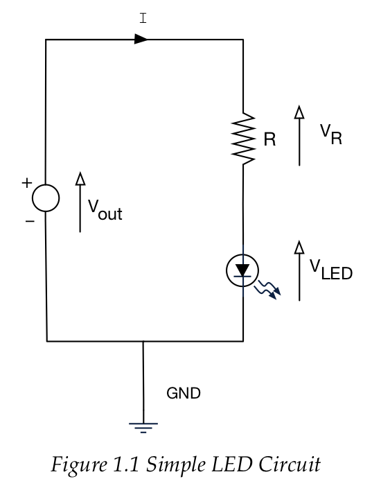

[Up - Digital Outputs: Week 2](Digital_Outputs_1.md)

--- 

# Task101 Blinky
This is the first application which you will download and build. 

> If you have not already tried this application and watched the videos, see the section in [getting started](../getting_started/software-testing.md#Task101-Blinky!)

You can also browse the code online here:

[Task101 - Blinky](/Tasks/Task-101-Blinky)

Let's take a quick look at the code:

```C++
#include "mbed.h"

// Create a DigitalOut “object” called greenLED. Pass constant LED1 as a “parameter”
DigitalOut greenLED(LED1);

//These are "commented out" and so are not part of the program. You can uncomment them by removing the // characters
//Your task is to make a sequence alternating between Green+Red and just Blue 
//DigitalOut blueLED(LED2);
//DigitalOut redLED(LED3);

//The main function - all executable C / C++ applications have a main function. This is our entry point in the software
int main() 
{
    // ALL the repeating code is contained in a  “while loop”
    while(true) 
    { 
        //The code between the { curly braces } is the code that is repeated forever

        // Turn onboard LED ON  
        greenLED = 1; 

        // Wait 1 second (1 million microseconds)
        wait_us(1000000); 

        // Turn LED OFF
        greenLED = 0;

        // Wait 1 second
        wait_us(1000000); 
    }
}
```

| **TASK 101-1**
| --- |
| Read all the comments in the code. Try and understand what you can, but don't worry if it does not all mean much. |
| 1. Check you can **build** the Task 101-Blinky project. [Watch this video](https://plymouth.cloud.panopto.eu/Panopto/Pages/Viewer.aspx?id=1cdd2263-5644-4322-841d-abfe0101c82a) if you are unsure. |
| 2. Check you can **debug** the code, running line by line [as shown in this video](https://plymouth.cloud.panopto.eu/Panopto/Pages/Viewer.aspx?id=e151c5c8-980d-42d6-ab32-abfe010d3a67) | 
| 3. Uncomment the following two lines (lines 9 and 10 in the software)| 
| `//DigitalOut blueLED(LED2);`
| `//DigitalOut redLED(LED3);` |
| *Challenge*  -Your task is to make a sequence alternating between Green+Red and just Blue. [See this video as a demonstration](https://plymouth.cloud.panopto.eu/Panopto/Pages/Viewer.aspx?id=5b0ac1b2-56eb-4108-ae83-abff00ff02ae) |

Before we write any more code, let's step away and look at the electronics.

##  A Little bit of Electronics
So what is going on here? Hopefully you can see the connection between the lines of code and the effect, but what you might not be aware of is the electronics.

In electronics, we mostly work with one (or both) of the following signal types :

* **Analogue** - where voltages and currents can take any value, typically between and upper and lower limit
* **Digital** - where signal voltages can only be one of two possible values

For this section, the signals are all going to be digital. Let’s start with a simple circuit diagram, or schematic as it’s also known, as shown below:



Consider the following circuit diagram (also known as a **schematic**):

1. **Constant Voltage Source**. Think of this as the “perfect battery”. What ever the current `I` flowing in the circuit, the voltage across this device is **always** V<sub>out</sub>. In our circuit, this will be typically be 3.3 Volts
1. **Resistor**. This is used to limit the current `I` that flows through the LED (to avoid damaging it and to save power). Resistors have a resistance property measured in Ohms (symbol &Omega; ).
1. **Light Emitting Diode (LED)** - A non-linear device that emits photons of light when an electrical current passes through it. Current can only flow in one direction. Different LEDs have different characteristics.

| **TASK 101-2** |
| --- |
| Read more about the LED [here](/glossary/led.md) |
| Now calculate a suitable current limiting resistor value for the RED and AMBER LEDs in your kit. The data is below: 

| Colour | current (approx.)	| Voltage |
| --- | --- | --- |
| RED |	2mA	| 1.7V |
| AMBER | 2mA | 1.85V |


## Controlling an LED with a mechanical switch
Watch the following video. This explains how a mechanical switch can be used to control a current through an LED, causing it to light up:

https://plymouth.cloud.panopto.eu/Panopto/Pages/Viewer.aspx?id=2cba4d8a-123a-4fd0-bf4f-ac0200f2b66b

In this video, we saw how the current was controlled by )_mechanical_ means.

<figure>

<figcaption>Mechanical push switch</figcaption>
</figure>

## Controlling and LED with an electronic switch
Watch the following video. This demonstrates a _transistor_, the electronic equivalent of a mechanical switch

https://plymouth.cloud.panopto.eu/Panopto/Pages/Viewer.aspx?id=ec363cc0-3c20-427b-894c-ac0200f5595c

Some key points from this video:

* We use a device called a transistor to electronically control the current flow through the LED 
* There are two types of transistor, the Field Effect Transistor (FET) and the Bi-Polar
   * For the FET, the state of the transistor (ON or OFF) is controlled by a voltage (electrical field). Almost zero current flows into the device
   * For the Bipolar, the state of the transistor is controlled by the input _current_

For the software in [TASK101-1](#task101-blinky), we controlled an LED with software.

* A microcontroller pin can be switched ON (3.3V) or OFF (0V) through software, thus becomes a voltage source. However, it has a very limited capacity to source any current

### General Purpose Input Output (GPIO)
The microcontroller has many pins. Some of these can be configured for digital input or output. Such pins are known as General Purpose Input Output pins, or GPIO.

When configured as an output, a GPIO pin acts as a voltage source and can adopt one of two possible values:

* OFF - 0V
* ON - 3.3V

On the Nucleo board, there are 3 LEDs provided (LED1, LED2, LED3) each with a different colour (Green, Blue and Red). These LEDs are driven directly by the microcontroller using a circuit similar to the following:

<figure>

<figcaption>Using a microcontroller pin (GPIO_PIN) to directly drive a the current through an LED</figcaption>
</figure>

This is a common thing to do as it is simple, but does not scale to many devices. On the module support board, there are many more LEDs, so transistors are used the reduce the current demands on the microcontroller:

<figure>

<figcaption>Using a microcontroller pin (GPIO_PIN) to control the current through an LED using a transistor</figcaption>
</figure>

Either way, using software to control the state of `GPIO_PIN` allows us to switch current on and off through the LED.

Let's now look at the code:

### Controlling a GPIO through software
On modern microcontrollers, there are many on-chip devices. It is not common to use all these devices. In fact, there are rarely enough pins to use all devices at once. Therefore, pins support multiple functions. 

For example, a single pin might be able to support ONE of the following:

* Digital Input / Output
* PWM Output
* Serial Interface Clock Output

Don't worry about what these devices are (yet). All we need to now is that we need to select which function we wish to use. In Mbed, this is made very simple. In our code, we saw the following line:

```C++
DigitalOut greenLED(LED1);
```

where `LED1` is the pin name. Actually, `LED1` is synonymous with pin `PB_0` (try hovering the mouse over `LED1` in Mbed Studio and read the pop-up).

> We say the pin PB_0 is located on PORTB, pin 0

It is labelled `LED1` to make the code more readable. We could equally have written:

```C++
DigitalOut greenLED(PB_0);
```

> In C++, we say we have created a software _object_ `greenLED` of _type_ `DigitalOut`. We have pass the pin name `PB_0` as a _parameter_ so that the electronics inside the chip can be set up accordingly. The code to do this is cleverly hidden from us.
>
> Note the jargon in _italics_. These are terms we will keep meeting.
>
> The effect of this line is to configure pin PB_0 as a GPIO pin, _configured as a digital output_.

Having done this, we can now easily **control** the state of this pin using the _object_ `greenLED`. To switch it to the ON state (3.3V), we can write the following:

```C++
greenLED = 1;
```
> NOTE
> 
> This is using a little bit of "C++ Magic" to make code look pretty. Another way to write the exact same thing would be:
>
> `greenLED.write(1);`
> 
> but this is less readable.

To switch it to the OFF state (0V), we can write the following:

```C++
greenLED = 0;
```

#### Flashing the LED
If we were to switch the pin ON and OFF in succession:

```C++
greenLED = 1;
greenLED = 0;
```

we would never see the LED light up. This is because it happens so fast. Therefore, we need to add a delay between these actions:

```C++
greenLED = 1; 

// Wait 1 second (1 million microseconds)
wait_us(1000000); 

greenLED = 0;
```

The line `wait_us(1000000);` adds a pause of 1s (1,000,000 microseconds). In fact, under the hood, this engages another on-chip device known as a **hardware timer**. We will meet timers again later in the course.

### Repeating Forever with a while-loop
Of course, this example switches the LED ON and OFF until the power is turned off. We say it loops.

> This is bit like saying you "play a song on loop", whereby you play the same song (or collection of songs over and over again). My kids like to do this :)

To see this, we step out a bit, and look at the `while-loop`

```C++
    while(true) 
    { 
        ...

        //CODE STATEMENTS GO HERE 

        ...
    }
```

We will meet these loops more formally later, but for now, we can hopefully get some insight into what this does. 

The code between the curly-braces `{ }` is repeated forever. In general, you use a `while-loop` with a **condition** (something that is resolved as `true` or `false`)

```C++
    while(<condition>) 
    { 
        ...

        //REPEATING CODE STATEMENTS GO HERE 

        ...
    }

    ...

    // Code here can only be run once the condition is false

    ...

```

* If the condition is `true`, the code between the braces is run, then the condition is tested again. It will keep repeating as long as the condition is `true`.
* If the condition ever becomes `false`, then the whole loop is skipped.

> **EXPERIMENT**
>
> Try changing the condition to the keyword `false`
>
> Using the debug mode, step through the code line by line. How often does the code between the braces { } run?
>
> Do you understand why?
>
> Now replace `false` with the condition `1<2`, such that you replace:
>
> ```C++
> while (true)
> ```
> with
>
> ```C++
> while (1<2)
> ```
>
> Again, test by stepping through your code.

## A word about objects
In the text above, there was a mention of software _objects_. These are part of the C++ language. 

> NOTE that the concept of an object does **not** feature in the C language (which is a subset of C++)

C++ is said to be an "object orientated programming" (OOP) language". The Mbed-OS framework relies heavily on OOP to make it so easy and quick to write applications.

> Just writing `DigitalOut led(PB_0);` invokes many lines of (hidden) code.

We will be reusing many of the objects in Mbed OS over the coming weeks, but not writing any until much later in the course. OOP is a subject which needs further study.

## Quiz (required)
Click the following link and answer the questions as best you can. This is purely formative (just for feedback). You  are not being assessed! However, it is used to inform staff about student progress so they can help you. It is also evidence of engagement / attendance.


[CLICK THIS LINK](https://dle.plymouth.ac.uk/mod/quiz/view.php?id=1161831)

> **Note** that these quizzes are used to monitor student engagement and to help the tutor provide feedback when required. *Please ensure you complete them before moving to the next task*.

Next, we are going to build on what you have learned so far and try to write some simple code.

---

[NEXT - Task 102 - SOS](TASK102.md)