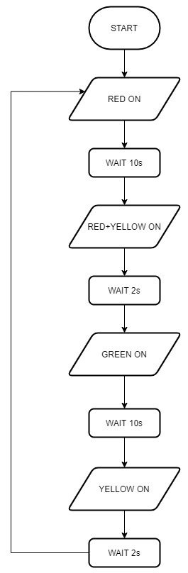

[Up - Digital Outputs: Week 2](Digital_Outputs_1.md)

--- 

# Task 104 - Traffic Lights
In a previous section we saw how to control a digital output so that it can be switched on or off. Now we are going to apply this to a simple problem.

| TASK | Details |
| --- | --- |
| 1 | Set `TASK-104-TrafficLights` as the active project |
| 2 | Build the project |
| 3 | Run the code |
| 4 | Now debug the code, stepping over each line. Make sure you understand what each line does |
| 5 | Modify the code to the light follows the following sequence depicted in the _flow chart_ below |
| |

Assume a light is OFF if not explicitly mentioned as an output.

<figure>

<figcaption>Flow chart for a basic traffic light sequence</figcaption>
</figure>
<figure>

| TASK | Details |
| --- | --- |
| 6 | Modify the task so that "YELLOW ON" becomes "FLASH YELLOW 4 TIMES |
| |

## Stretch Tasks
Sometimes I include some additional tasks to push those that finished early and have previous experience. 

**IMPORTANT - You do not need to do these tasks unless you wish to**. They assume prior experience and are not suitable for beginners. We will cover these topics at a later date.

| STRETCH TASK | Details |
| --- | --- |
| 1 | Using the official documentation for mbed os, read about the `BusOut` data type. Can you use this instead of  `DigitalOut`? |
| 2 | Using the official documentation for mbed os, read about the `Timer`. Replace each `delay_us` function call with a while-loop that reads a timer.
| Tip. | For the above, the documentation often includes example code. Also remember to use documentation for the latest version of mbed os |
| |

---

[Up - Digital Outputs: Week 2](Digital_Outputs_1.md)