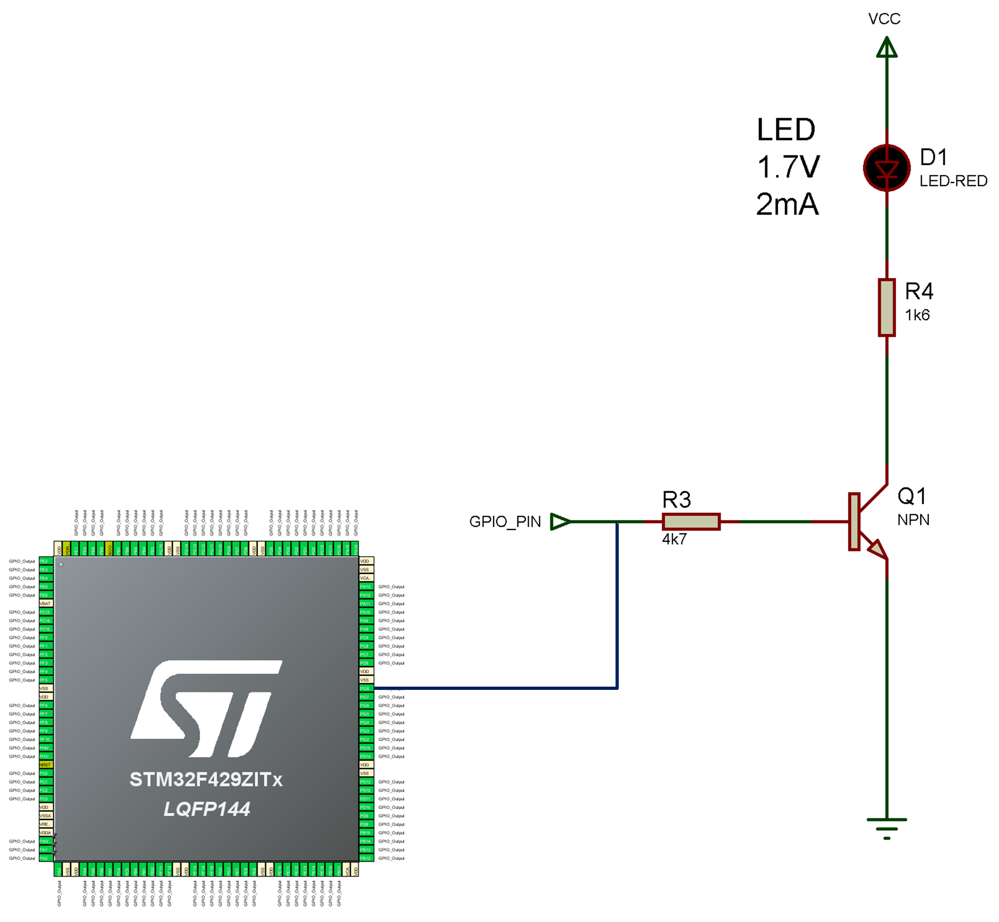

[UP](Digital_Outputs_2.md)

---

# Digital Outputs - `DigitalOut`
This is a first look at digital outputs with Mbed OS. Before we start, you are advised to download a copy of the module support board schematics (circuit diagram) for future reference.

[Refer to the schematics here](../getting_started/hardware.md#Schematics)

> **TIP:** To open this link in a separate window, hold down CTRL and click. 
>
> Alternatively, the PDF file is located in the folder `Hardware\ModuleSupportBoard`

**You may be directed to the schematics**. You are encouraged to try and related what we do in software to the circuit diagrams.

## General Purpose Input Output (GPIO)
One of the most commonly used interfaces is the General Purpose Input-Output (GPIO). These are pins on the microcontroller which can be in one of the following states:

* ON (3.3V)
* OFF (0.0V)
* Not connected (_floating_)

In this section, we will be configuring pins as digital outputs. There is where the microcontroller sets the pin to one of these states. At this stage, we will only consider the output to be ON or OFF.

Consider the figure below:

* When the microcontroller pin is set HIGH, the transistor Q1 switches ON, and current can flow through it. The LED then switches on.
* When the microcontroller pin is set LOW, the transistor Q1 switches OFF, and no current can flow through it. The LED then switches off.

> When you switch a transistor fully ON, it is a bit like closing a mechanical push switch. Instead of a finger press, you use a small electrical current.
>
> A key point is that the current needed to switch the transistor ON and OFF is _much_ less than the current in the LED. This means our microcontroller is able to control many more LEDs in this way. 

<figure>

<figcaption>Microcontroller output controlling an LED via a transistor </figcaption>
</figure>

## GPIO Outputs with `DigitalOut`
We will now formally look at the type `DigitalOut`.

Let's first look at a circuit diagram from the module support board:

<figure>

<figcaption>Microcontroller output controlling an LED via a transistor </figcaption>
</figure>

Here we observe three transistors controlling three LEDs (RED, YELLOW and GREEN). The inputs are labelled as follows:

* TRAF_RED1
* TRAF_YEL1
* TRAF_GRN1

On a circuit diagram (also known as a schematic), we do not draw lines between all points on the diagram. If we did this, it would be very messy and hard to follow! Instead,we use labels to indicate which points are connected together.

| TASK-114 | Details |
| --- | --- |
| 1. | [Download the schematics for the module support board](../getting_started/hardware.md#Schematics) |
| 2. | Look at the first page. Find the labels listed above |
| 3. | Write down the microcontroller pins they are connected to. Hint. The pin name will begin with a `P` |
| |

| Version | Link |
| - | - |
| 2 | [Schematics for v2](../Hardware/ModuleSupportBoard/msb_schematics_v2.pdf) |
| 4 | [Schematics for v4](../Hardware/ModuleSupportBoard/msb_schematics_v4.pdf) |
| |

[CLICK HERE FOR A HINT](../img/circuit/traffic1_mcu.png)

Hover your mouse to reveal the answers:

| LED | Pin | 
| --- | --- |
| RED | <p title="PC2">?</p> |
| YELLOW | <p title="PC3">?</p> |
| GREEN | <p title="PC6">?</p> |

As we saw in an earlier task, you can use the `DigitalOut` type to control each of the outputs. For example:

```C++
DigitalOut redLED(PC_2);
```

This will configure pin PC2 as a digital output, that is, a pin that can be asserted as OFF (0.0V) or ON (3.3V).

> Note the naming convention used in Mbed OS. We actually write `PC_2` and not `PC2`

To set this output HIGH, we simply write the following:

```C++
redLED = 1;
```
To set the output LOW, we simply assign it to 0:

```C++
redLED=0;
```

If we wished to flash the led on and off four times, we could use a while loop (as shown in the lecture):

```C++
int count = 0;
while (count < 4) {
    redLED = 1;
    wait_us(250000);
    redLED = 0;
    wait_us(250000);
    count = count + 1;
}
```

With the above, now attempt the following task.

| TASK-114 | Details |
| --- | --- |
| 4. | Watch the following video on how to create your own Mbed-OS project |
| - | https://plymouth.cloud.panopto.eu/Panopto/Pages/Viewer.aspx?id=cecdcb02-1840-4e0f-bae6-ac5900c4d5eb |
| 5. | Create a project named TASK-114 |
| 5. | In `main.cpp`, write a program to generate the standard traffic light sequence |
| - | RED, RED+YELLOW, GREEN, FLASHING YELLOW (one and off 4 times), repeat.. |
| - | Each phase should last 2 seconds |
| - | Try and use a while-loop to implement the flashing |
|  | A solution is provided |
| |

### Initial Values
Sometimes you want the output to be in a particular state when the code starts. By default, the output will be LOW.

If you want the pin to be HIGH at start-up, then specify this as a second parameter:

```C++
DigitalOut redLED(PC_2,1);
```

| TASK-114 | Details |
| --- | --- |
| 6. | Update your solution so that ALL LEDs are on at the start (as a power-on test)  |

See Task-114-Solution to see the tutor's version.

## Quiz
Please click the link and attempt all question. You may need to research some of the answers.

https://dle.plymouth.ac.uk/mod/quiz/view.php?id=982851

---


[Next - GPIO Outputs: `BusOut`](TASK115.md)