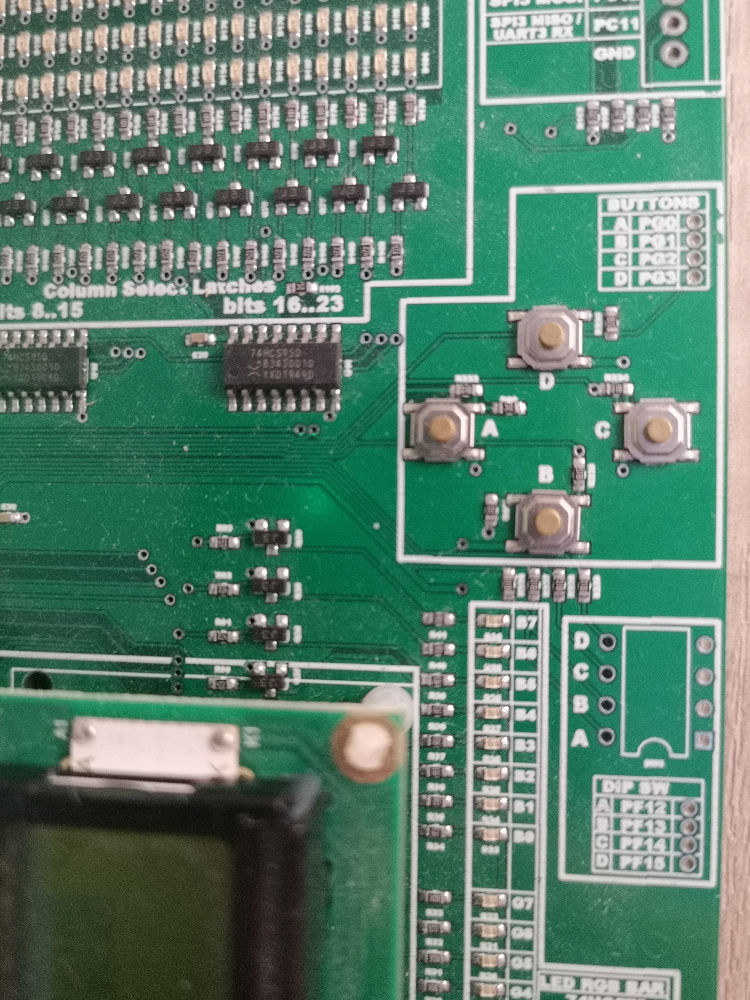
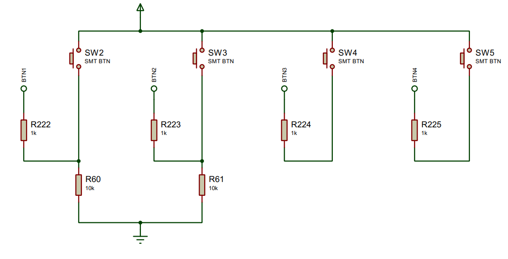
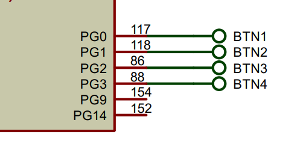

[Up - Digital inputs](Digital_Inputs_1.md)

--- 

# Digital Inputs - `DigitalIn`
Until know, we have looked at how a microcontroller can control the state of an **output** pin.

* A pin can be *asserted* HIGH or LOW
* We can use `DigitalOut`, `BusOut` or `PortOut` to control individual or groups of output pins
* These are General Purpose Input Output (GPIO) pins

When we talk of GPIO pins, so far the pins have been configured as outputs. In this section, we configure them as inputs.

## Module Support Board
There are four push buttons on the module support board

<figure>

<figcaption>Showing the 4 push buttons on the module support board</figcaption>
</figure>

| Button | Pin | Pull-Down Resistor |
| --- | --- | --- |
| BTN1 / A | PG_0 | YES |
| BTN2 / B | PG_1 | YES |
| BTN3 / C | PG_2 | NO |
| BTN4 / D | PG_3 | NO |

The schematic for the buttons is as follows:

<figure>

<figcaption>Showing the configuration of the 4 push buttons on the module support board. Note that BTN1 and BTN2 both have external pull-down resistors, whereas BTN3 and BTN4 do not</figcaption>
</figure>

Tracing these back to the microcontroller, we can confirm the pin connections:

<figure>

<figcaption>Showing the configuration of the 4 push buttons on the module support board. Note that BTN1 and BTN2 both have external pull-down resistors, whereas BTN3 and BTN4 do not</figcaption>
</figure>

Remember that these are inputs, so pressing and releasing a switch will assert a logic signal on the microcontroller pin.

> The microcontroller pin MUST be configured as an input so that it can *sense* the logic level.

To configure a pin as an input, we have some helpful types in Mbed:

* `DigitalIn` for reading a single input pin
* `BusIn` for reading a group of N input pins as an N-bit binary value
* `PortIn` is similar to `BusIn`, except all pins must be from the same hardware port (faster than `BusIn`).
* `DigitalInOut` - which allows a pin to be configured at run-time. This is very useful, but we also need to be careful.  

## `DigitalIn`
The most commonly used type is `DigitalIn`. This allows us to read the logic level on a pin that is asserted by an external device (such as a switch).

| TASK126 | DigitalIn |
| --- | --- |
| 1. | Make Task126 the active program |
| 2. | Build and run the code |
|    | Press and release button A to see what it does |
|  | Note if the solution is reliable. You *might* find the switch registers some false press and release events |
| 3. | Step through the code using the debugger and ensure you understand how the code works |

Here is the code from Task126:

```C++
DigitalIn ButtonA(PG_0); //Button A
DigitalOut redLED(PC_2); //Red Traffic 1

// main() runs in its own thread in the OS
int main()
{
    int btnA;
    // Turn OFF the red LED
    redLED = 0;

    while (true) {
        // Wait for the button to be pressed
        do {
            btnA = ButtonA; //Read button A
        } while (btnA == 0);


        //Toggle the red LED
        redLED = !redLED;

        // Wait for the button to be released
        do {
            btnA = ButtonA; //Read button A
        } while (btnA == 1);
    }
}
```

Note first how the pin `PG_0` is configured as an input: 

```C++
DigitalIn ButtonA(PG_0);
```

Once this is done, you can read the state of the pin by simply referring to `ButtonA`.

| TASK126 | DigitalIn |
| --- | --- |
| 4. | Modify the code to add another input, this time for Button B |
| 5. | You task to toggle the LED if *BOTH* button A or button B are pressed, followed by *either* being released |

A solution is provided if you get stuck

> **Remember** - to construct more complex conditions, you can use the `&&` operator for AND and `||` for OR.
>
> With a while or do-while loop, you specify the condition to repeat the loop and NOT exit the loop.


| TASK126 | DigitalIn |
| --- | --- |
| 6. | Modify the code to include all four inputs (A-D) |
| -  | Use the code below to add buttons C and D |
| -  | All buttons must be pressed and released to toggle the LED |
| -  | See TASK127 for a solution |

```C++
DigitalIn ButtonC(PG_2, PinMode::PullDown); //Button C
DigitalIn ButtonD(PG_3, PinMode::PullDown); //Button D
```

> **Note** 
> 
> These pins need an additional parameter `PinMode::PullDown`. Refer back to the schematic and you will see the switches don't have their own external pull-down resistors.
> 
> This microcontroller has the option to use **internal** pull-down resistors which can save on external components.

## Reflection

In the example above, we added four inputs but these were entirely independent. This made the code increasingly untidy and repetitive. As we saw with `DigitalOut` and `BusOut`, we can group inputs together using `BusIn` and simplify this code.

We will look at this next.

--- 

[NEXT - Task127 - BusIn](TASK127.md)