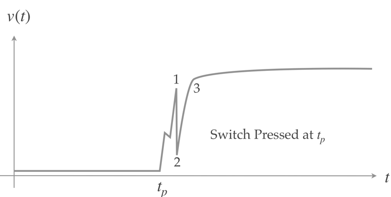

[Up - Digital inputs](Digital_Inputs_1.md)

--- 

# Switch Debounce
In this section, we address a very practical issue, that of switch-bounce.

In the following task, the intention once again is that an LED will toggle each time a switch is pressed and released.

* As the switch is pressed, the LED will toggle

| TASK128 | Switch Bounce |
| --- | --- |
| 1. | Make Task128 the active program |
| 2. | Read the code to understand what it does |
| 3. | Build and run the code. Does it work perfectly all of the time ? |
| - | If it does, try using the input `BlueButton` instead |
| - | Compare with one other student to see what their experience is similar |

If it very likely that at some point, you may have noticed the software did not behave as intended. This is because of switch bounce. This is depicted in the figure below:

<figure>

<figcaption>Illustration of switch bounce as a switch it pressed. Note point 2 which could be registered as a false switch release</figcaption>
</figure>

> Switch bounce is caused by mechanical contacts. False connect and breaks occur just as the switch opens and closes. This can result in false press and release events being registered. It is a statistical phenomena which is why it can be difficult to reproduce and will also depend on the individual switch design and age.

To address this, you need to design your system to make switch bounce statistically less likely. The standard way to do this is to add a small delay. 

<figure>

<figcaption>Illustration of switch de-bounce. As soon as point 1 is detected, the input is ignored until such time that is has settled. The longer you wait, the more certain this has happened</figcaption>
</figure>

| TASK128 | Switch Bounce |
| --- | --- |
| 4. | Try adding a 100ms delay after each switch while-loop.  |
| - | Does this improve the situation? |
| 5. | What happens if you add a 1uS delay (1 uS)?  |
| 6. | What happens if you add a 5s delay (5000000 uS)? | 

## Reflection

What is hopefully clear is that there is a **trade-off** between  robustness and responsiveness.

Switch bounce is a real phenomena which should never be ignored. Even non-contact switches (e.g. magnetic) will still suffer this phenomena to some extent.

---

[NEXT - TASK 130 - If Statements](TASK130.md)