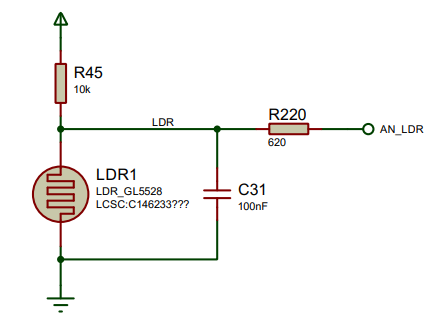
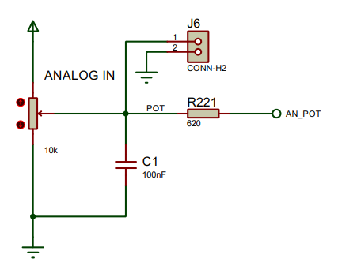
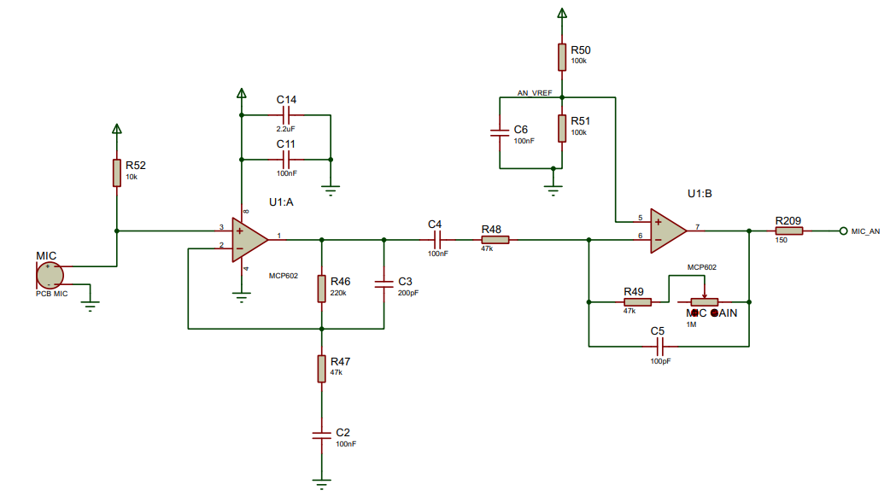

[Up - Digital inputs](Digital_Inputs_1.md)

--- 

# Analogue to Digital Conversion
In this task, we look at another flow-control technique, `switch-case`. 

| TASK150 | Using `AnalogIn` |
| --- | --- |
| 1. | Make Task150 the active program |
| 2. | Build and run the code. |
| 3. | Shine a torch on the light dependent resistor and note the change in value displayed (see image below)" |
| 4. | Turn the blue potentiometer dial and note the change in value. What are the maximum and minimum values? |
| 5. | Gently brush your finger on the microphone to see if you can generate bigger changes in the microphone value |
| 6. | If you leave everything constant, why do you not get constant values for any of these inputs? |

You can identify these as follows:

<figure>

<figcaption>1. Light Dependent Resistor; 2. Potentiometer; 3. Microphone</figcaption>
</figure>

If we now look at the individual circuits.

## Light Dependent Resistor
The schematic below shows the light dependent resistor arranged in a potential divider.

<figure>

<figcaption>Light Dependent Resistor Circuit</figcaption>
</figure>

The analogue voltage `AN_LDR` is connected to an analogue input pin of the microcontroller. The code to enable the Analogue to Digital Converter (ADC) is shown below:

```C++
AnalogIn ldr(AN_LDR_PIN);
```

We read the voltage as a 16-bit value as follows:

```C++
unsigned short lightVal = ldr.read_u16();
```

| TASK150 | Using `AnalogIn` |
| --- | --- |
| 7. | As you shine light on the LDR, how does the value change? (up or down) |
| 8. | So when light is shone on the LDR, does it's resistance go up or down? |

## Potentiometer
Another analogue input device on your board is the blue potentiometer. The circuit is as follows:


<figure>

<figcaption>Light Dependent Resistor Circuit</figcaption>
</figure>

As before, the analogue voltage `AN_POT` is connected to an analogue input pin of the microcontroller. The code is almost identical:

```C++
AnalogIn pot(AN_POT_PIN);
...
    unsigned short potVal   = pot.read_u16();
```

| TASK150 | Using `AnalogIn` |
| --- | --- |
| 8. | Turn the pot to the two extremes are see if you can obtain the minimum and maximum values 0 and 0xFFFF |
| 9. | Can you adjust the pot to get the mid-point 0x8000? |
| -- | Note the effect of noise on the signal |

## Microphone
The third device we are going to use is the microphone. The circuit for this is somewhat more complex but the principle is the same:

<figure>

<figcaption>Light Dependent Resistor Circuit</figcaption>
</figure>

The code is again, the same:

```C++
AnalogIn mic(MIC_AN_PIN);
...
    unsigned short micVal   = mic.read_u16(); 
```

| TASK150 | Using `AnalogIn` |
| --- | --- |
| 10. | with a quiet room, what is the approximate average value of the microphone input? |

You should find that with no noise, for the microphone, the ADC value should be *centred* around `0x8000` which is half-maximum. It will vary a from board to board. 

> The microphone signal will swing above and below the midway operating point

To convert this to a signed value, do the following:

| TASK150 | Using `AnalogIn` |
| --- | --- |
| 11. | For the microphone signal, convert it to a signed integer and subtract the operating point (0x8000) |
| 12. | Print this new signed value to the terminal. You should see it wavering positive and negative. |


## Challenge 1
Write some code to do the following:

* Turn on a green LED when a light is shone on the LDR
* Turn on a yellow LED when the potentiometer voltage is over 0x8000 (half way)
* Turn on a red led when someone claps their hands in the room

> Tips: 
>
> For the microphone, remember to subtract 0x8000 to remove the DC offset and then use the abs() function to remove the sign (+/-)
>
> You will need to do some experiments to find suitable threshold values 

| TASK150 | Using `AnalogIn` |
| --- | --- |
| 13. | Can you set the potentiometer near the mid point so the LED flickers? |

## Challenge 2 (Bar Display)
This one is more tricky.

You may have noticed that there is some code to control the red, green and blue LED strips. Each of these contain 8 LEDs.

Can you use these to display signal levels on the three input devices:

* Green display for the LDR
* Red display for the POT
* Blue display for the Microphone 

---

1. [NEXT - Task 152 - Hysteresis](TASK152.md)