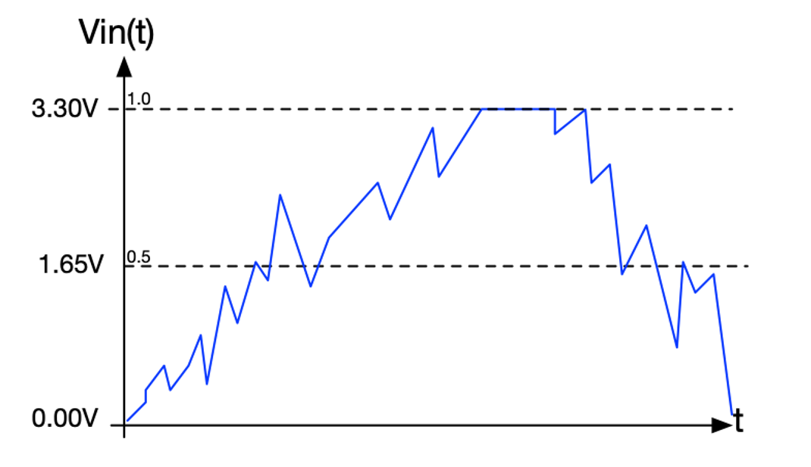
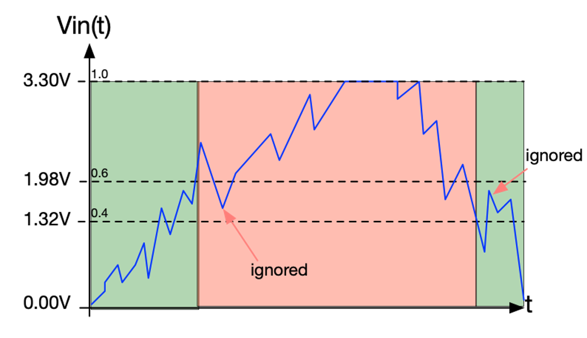

[Up - Digital inputs](Digital_Inputs_1.md)

--- 

# Hysteresis and Analogue Input
In this task, we look at means to manage noise when detecting "thresholds"

| TASK152 | Hysteresis |
| --- | --- |
| 1. | Make Task152 the active program |
| 2. | Build and run the code |
| 3. | Turn the pot to the two extremes and monitor the serial output. You should be able to turn on the buzzer and LED by setting a voltage |
| 4. | Adjust the potentiometer so that the value fluctuates around 0x8000. You should be able to carefully set it so that the light and buzzer randomly switch on and off |

Note that signals are always subject to noise, and despite all efforts, there is no practical way to eliminate noise entirely.

The problem with this application is that it has a single threshold `0x8000` (half maximum).

<figure>

<figcaption>Showing problem of noise as a signal crosses a single detection threshold. As the value approaches the threshold, so the noise can trigger multiple crossings.</figcaption>
</figure>

## Hysteresis
You task is to make this application much more robust. One way is to use hysteresis. This involves using two thresholds.

* When the LED is OFF, we look for a higher threshold to switch it ON (e.g. 0x9000)
* Once the LED is ON, we *then* look for a lower threshold to switch it OFF (e.g. 0x7000)

<figure>

<figcaption>Showing the principle of hysteresis and there being two thresholds and two states</figcaption>
</figure>

For this to work, we need to keep track of which state (ON or OFF) we are currently in and adapt the rules accordingly.

| TASK152 | Hysteresis |
| --- | --- |
| 5. | Using what you have learned so far, can you modify this code now to use hysteresis? |
| -  | Use 0x9000 as an upper threshold |
| -  | Use 0x7000 as a lower threshold |
| -  | Once you have tried, see my solution in solution.txt |

---

[NEXT - Task 156 - Arrays](TASK156.md)
