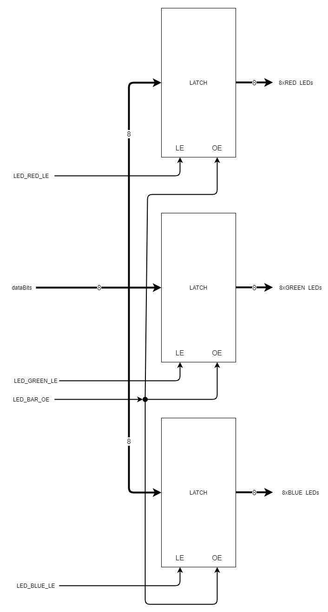

[Up -Functions and Analogue Outram](Analogue_Output_1.md)

--- 

# Functions and Scope
One of the most important topics in C and C++ programming is functions. One thing programmers do not like is repetition. Aside from making code repetitive to write, read and long, repetition repeats both code and any bugs present.

> If you fix a code in one place, and that code is replicated elsewhere, you will need to remember to fix it everywhere else as well!

## A little bit of hardware - the LATCH
Adjacent to the LCD display are three sets of 8 LEDs arranged in lines.

If we were to connecting these directly to the microcontroller, this could consume 24 GPIO pins!

As a compromise, each group of 8 shares the same data lines. In the figure before, this is labelled `dataBits`. 

The problem now is how to specify which group to control.

Some digital **latches** have been introduced to solve this problem. Each group of 8 LEDs has it's own 8-bit digital latch circuit.

> We have been using latches all the time! When we use `DigitalOut`, we set a value and then leave it. We say we "set and forget". We do not have to keep setting a pin to 0 or 1. It always remembers the last value is was set to.

Consider the figure below:

<figure>

<figcaption>Latched LED Configuration</figcaption>
</figure>

### Latch Enable (LE)
The latch enable pin (`LE`) is central to the operation of the latch:

* When `LE` is set to 1, the output simply follows the input (`dataBits`)
* When `LE` is then set to 0, the current output value is held, and it ignores subsequent changes in the input.

So, to control the red LEDs: 

* we first ensure all `LE` inputs are 0
    * So all latches ignore the common input signal `dataBits`
* we set `dataBits` to the desired red LED bit pattern
* we set LED_RED_LE to 1 _for a short period of time_ (e.g. 1&mu;s )
* We then pull LED_RED_LE back to 0

We can then repeat the procedure for the green and blue LEDs by simply changing their respective `LE` pins.

> Remember - for any given latch, as long as the `LE` pin is low, any changes to input (`dataBits`) will be ignored.

### Output Enable
The latches in this example are similar to 8-bit variables, or "registers". They store a value internally, which if required, assert the output pins (which in turn drive the LEDs)

You can also turn off the outputs so they all go low, by disabling the **output enable (OE)**.

> Note that OE is what we call **active low**. 
> * When it is zero, the output is enabled
> * When it is one, the output is disabled.

In this circuit, all the `OE` pins are connected together so we can disable / enable all the outputs at the same time. This does not affect the internally latched values

Let's see this in action:

| TASK-170A | Functions |
| --- | --- | 
| 1.  | Make Task-170A the active program |
| 2.  | Build and run the code to see what it does |
| 3.  | Study the code, read the comments and see if it aligned with the description above |
| 4.  | Step through the code with the debugger to help you understand it if necessary |
| 5.  | Do you notice anything repetitive about this code? |

You may notice that the code is somewhat similar for the three groups of LEDs. Let's start to factor this out into separate functions.

Let's start with an example, which initialised all LEDs to the OFF state.

| TASK-170B | Functions |
| --- | --- | 
| 1.  | Make Task-170B the active program |
| 2.  | Build and run the code to see what it does |
| 3.  | Study the code, read the comments |
| 4.  | Step through the code with the debugger. When you get to the line that reads `led_init()`, click the "step in" button (or press F11) |

This demonstrated an example of a parameterless function.

* No data was passed to the function
* It was simple a way to group a sequence of programming statements into a function so it can be reused.

## Passing Parameters

Very often, we pass data to a function in order to customise it's behaviour. For example:

```C++
void dispIntAsHex(int a)
{
    printf("%X\n", a);
}
```

This function accepts a single parameter `a` of type `int`. It displays this value in HEX and then returns. We would invoke this as follows:

```C++
// Literal constant
dispIntAsHex(10);
```

or maybe

```C++
int p = 10;
dispIntAsHex(p);
```

| TASK-170B | Functions |
| --- | --- | 
| 5.  | Modify `led_init()` to take an unsigned integer as a parameter |
| -   | Use this value to set the initial value of all the latches. |
| 6.  | Add a second parameter of type `bool`. When set to `true` the outputs should switch on, otherwise they should remain disabled |
| -   | Test your code with the debugger |
| -   | See solution-1.txt if you are stuck |


There is more code that is repetitive. Consider the code to set the latch value for the red LEDs:

```C++
        //Update the red
        wait_us(1);
        dataBits = 0xFF;    //Set the 8-bit data pattern
        wait_us(1);
        LED_RED_LE  = 1;    //Copy dataBits to red latch outputs
        wait_us(1);         
        LED_RED_LE  = 0;    //Ignore inputs (dataBits)
        wait_us(1);
```

This is very similar to the green and blue LEDs.

| TASK-170B | Functions |
| --- | --- | 
| 6.  | Can you write and text the following function to set the latch value for a given set of LEDs? |
| -   | `void setLatch(uint8_t dat, char col)` |
| -   | `dat` is the data value |
| -   | `col` is the colour, set as 'g' (for green), 'r' (for red), 'b' (for blue) |
| -   | See solution-2.txt for one possible solution |

The code in main should read:

```C++
int main()
{
    printf("Functions demo\n");

    led_init(0x00, true);

    while (true) {

        //Update the red
        setLatch(0xFF,'r');

        //Update the green
        setLatch(0b10101010, 'g');

        //Update the blue
        setLatch(0b11001100, 'b');


        for (unsigned int n=0; n<10; n++) {
            //Enable all the LED BAR Latch Outputs
            LED_BAR_OE = 0;

            //Wait
            wait_us(500000);

            //Disable the latch outputs
            LED_BAR_OE = 1;

            //Wait
            wait_us(500000);            
        }

        //Spin forever
        while(true);

    }
```

You can see that writing functions can make the code more readable and reduces repetition. Having all the functions at the top of the source files might now be your preference.

| TASK-170B | Functions |
| --- | --- | 
| 7.  | Cut and paste the `main` function so it is the first function in `main.cpp` |
| 8.  | Try and build the code - what happens? |

The error occurs because you have called the functions `led_init` and `set_latch` before they were defined.

> When the compiler reaches these function calls in `main`, it is unable to check if they exist or whether the parameters are the correct type. This is a historical behaviour of C compilers.

To resolve this, all you need to do is _declare_ these functions in advance, so the compiler has advanced warning.

| TASK-170B | Functions |
| --- | --- | 
| 9.  | Add the following lines before `main` and build the code |
| -  | See solution-3.txt for a final solution |

```C++
void setLatch(uint8_t dat, char col);
void led_init(uint8_t dat, bool enabled);
```

## Returning Values
So far, all the functions we have used have accepted parameters, but not have returned any results. Let's now look at an example of returning values.


| TASK-170C | Functions |
| --- | --- | 
| 1.  | Make Task-170C the active program |
| 2.  | Build and run the code to see what it does |
| 3.  | Study the code, read the comments |
| 4.  | In main there is a line that reads `int delay_ms = getDelayMS();` |
| -   | Use the debugger to step into this function. |
| -   | Use the debugger to find out what range of values this function returns (you will need to turn the potentiometer from one extreme to the other) |
| 5.  | Do you always get the same result? Explain |

This was an example of a function that returns a value. Again, this helps keep the main code simple and is easier to test.

> We could now test each of the functions separately. What would be better is if they were not all in the same file, so they could be reused in other projects

## Challenge
Currently the LEDs just flash on and off with the same LED patterns. It being close to a UK festive season, it is traditional to have decorative lights. Even better, it would be good to have the light sequence change. 

* Now try and modify the code in 170C to display a sequence of LED patterns that flash on and off.
* In addition to the functions created here, use arrays to cycle through a sequence of 10 LED patterns. Red, green and blue should all have different patterns (so maybe use three arrays)

## Local and Static Local Variables
We continue looking at functions now, and how to further tidy up the tree light application.

| TASK-172A | Functions |
| --- | --- | 
| 1.  | Make Task-172A the active program |
| 2.  | Build and run the code to see what it does |
| 3.  | Study the code, read the comments |

The following code has been added to the main function:

```C++
//Get average delay value
for (unsigned int n=0; n<32; n++) {
    int potValue = getDelayMS();     //Get raw value (with noise)
    meanPotValue = 0.95*meanPotValue + 0.05*potValue; //Handy forumula!
}
int delay_ms = (int)meanPotValue;    //Cast to integer
```

> This code uses the simple "digital low-pass filter" to smooth the incoming signal x
> 
> y<sub>n+1</sub>=&alpha;y<sub>n</sub>+(1-&alpha;)x<sub>n</sub>
>
> where x<sub>n</sub> is the next input sample, y<sub>n+1</sub> is the next output and &alpha; is a coefficient 0.0&#8804;&alpha;<1.0

The actual purpose is not that important here. What is more important is that we know how to move code to a function:

| TASK-172A | Functions |
| --- | --- | 
| 4.  | Can you write a function to encapsulate the smoothing shown above. |
| -   | It should perform all the operations, including the loop and calling `getDelayMS()` |
| -   | It should take a `double` as a parameter (to specify &alpha;) and return an `int` (the output) |
| -   | You will have to also relocate the variable `meanPotValue` |
| 5.  | Compare with Task-172B which has a solution |

If you struggled with this task, that is understandable. Do study the solution.

Note the following about the solution in Task-172B:

* The function `getAverageDelay` now does most of the work, but is not entirely self-contained
    * It relies on access to the variable `meanPotValue`
* The variable `meanPotValue` had to be put somewhere it could be accessed. 
    * Keeping it in `main` would leave it is as a **local** variable (which is only accessible in `main` and nowhere else)
* `meanPotValue` is now said to have **global scope**
    * This means it can be access from **anywhere**. 
    * This is not ideal. What if that name was already used?

| TASK-172B | Statics |
| --- | --- | 
| 1.  | Make Task-172B the active program |
| 2.  | Comment out the line `double meanPotValue = (double)getDelayMS();` |
| 3.  | Uncomment the line inside the `getAverageDelay` function that reads `static double meanPotValue = 0.0;` |

Note the keyword `static` on the front.

| TASK-172B | Static Local Variables |
| --- | --- | 
| 4.  | Use the debugger to step into `getAverageDelay` |
| -   | One the first occasion, note the initial value of `meanPotValue` |
| -   | One the second occasion, compare what happens. Does `meanPotValue` get reset to 0.0? |

A note about static local variables

* A **static** local will only be initialised the **first time** the function is called. 
* From then on, the line `static double meanPotValue = 0.0;` is ignored. 
* **static local** variables also retain their values.

The advantage here was that a global variable is now local. It has the advantage of retaining it's value but avoids the risk of _name collisions_. It also means the function `getAverageDelay` is more self-contained.

| TASK-172B | Static Local Variables |
| --- | --- | 
| 5.  | Remote the keyword static. Use the debugger to step into `getAverageDelay` again. What has changed? |

This will break the logic of this code as `meanPotValue` will we set to 0.0 every time.

Refer back to the lecture notes for more information.

### Moving Functions into other files
This is one of the most useful tricks in C and C++ programming, but also one that so often confuses students.

Therefore, I have made a short video

https://plymouth.cloud.panopto.eu/Panopto/Pages/Viewer.aspx?id=ed665b3a-7d19-4085-b8e7-ac8a0101dbe1


| TASK-172C | Global Functions |
| --- | --- |
| 1.  | Using the link above, watch the video on moving functions into another file. | 
| 2.  | Make Task-172C the active program |
| 3.  | Build and run the code to see what it does |
| 4.  | Study the code, read the comments. Note that some of the code is now moved into `LED_Latch.cpp` |

> **Separation of Concerns**
>
> In this version, all the code concerning the LEDs has been moved out of `main.cpp` and into a separate file `LED_Latch.cpp`. 
> 
> There is no code in `main` that needs direct access to the hardware associated with the LED display
>
> Instead, code in `main` calls functions written in the `LED_Latch.cpp` file
>
> All the code inside the `LED_Latch.cpp` file is concerned with the LED display and nothing else. We call this _separation of concerns_


| TASK-172C | Global Functions |
| --- | --- |
| 5.  | Move the following two functions to their own CPP file? |
| -   | `getAverageDelay` |
| -   | `getDelayMS` |
| -   | Also move any related variables and make them `static` as appropriate |
| 6.  | A solution is available (try not to peek until you have tried yourself!) |

> **Note** - You should add the following lines to the top of every file in your project:
>
```C++
#include "../lib/uopmsb/uop_msb_2_0_0.h"
using namespace uop_msb_200;
```
>
> This provides support for your module support board, including all the pin names.

# Quiz
A quiz on functions is available on the DLE. Please complete this quiz.

https://dle.plymouth.ac.uk/mod/quiz/view.php?id=1005421

---


