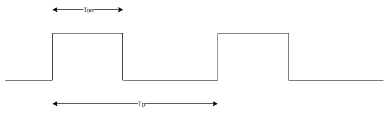
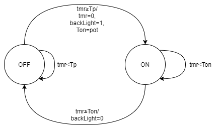

[Up -Functions and Analogue Outram](Analogue_Output_1.md)

--- 

# Pulse Width Modulation
In previous exercises, we have used digital outputs in Mbed to drive LED circuits, or even make them flash. 

## Delays and the Timer Class
One of the most important tasks in an embedded system is to implement accurate delays. We have already used functions such as `wait_us`, but how do they work?

Build into the microcontroller are a number of **hardware timers**. These are counters which can be configured to run independently.

Let's look at the basic use of Timers to replicate the `wait_us` function:

| TASK-176 | Timers |
| --- | --- |
| 1. | Make Task-176 the active program |
| -  | Build and run. Watch the LCD screen |
| 2. | Adjust the blue potentiometer to see what it does |

## Implementing a wait using `Timer`
At the start of the code, we see the `Timer` being created and stated:

```C++
Timer tmr;
tmr.start();
```

Once we do this, **the timer will count on it's own**, even if the CPU enters a sleep state.

> This is a really important point. Behind the `Timer` type are on-chip hardware timers which count independently of of the CPU. The programmer does not need to do anything to control the timer except to start, stop and reset when needed.
>
> This means the timer is not affected by your code. It runs in parallel, making it very accurate and dependable.
>
> In C or C++, most accurate timings make use of hardware timers.

We can then read the timer value at any point. A `wait` is performed by blocking on the timer:

```C++
while (tmr.elapsed_time() < 2s);
```

This loop will spin until the timer value equals or exceeds `2s`. We say it is **BLOCKING**.

> **A note about C++ and Time**
> 
> Although nice to read, you might be wondering how this works.
>
> `tmr.elapsed_time()` returns a value of type `std::chrono::microseconds`, which turns out to be just a `long long` integer.
>
> The literal value `2s` is converted into `long long` automatically and scaled using a clever C++ feature known as operator overloading.
>
> Don't worry about what this means. For now, it is enough to follow examples and understand the general idea.

## Rapid Polling and Timers
Timers are devices, and in effect, mostly considered input devices. We do not have to block on a timer to read it's value.

A useful design pattern is rapid polling, and although was covered in a previous exercise, is something worth repeating.

The concept of rapid polling is as follows:

* Read the 'state' of all input devices WITHOUT blocking
* Update internal state and outputs
* Repeat at high enough speed to avoid missing any deadlines

What do we mean by state? In essence, where we are following a sequence, it's a number which indicates what point we have reached in the sequence.

We see this concept being used for the LCD backlight. The signal driving the LCD back-light is depicted below.

* The signal is ON for a proportion of the time Ton/Tp, known as the _duty_ (where 0.0 ≤ duty ≤ 1.0 )
    * The larger the duty, the more power is delivered to the backlight
    * For 3.3V logic, the **mean output voltage=3.3V*duty**
    * When duty=0, the light will be off
    * When duty=1.0, the light we be at full brightness
    * When duty=0.5, the power delivered to the light will be at 50% of maximum 
* The rate of switching must be too fast for the human eye to notice any flicker (e.g. Tp≤1ms)

<figure>

<figcaption>Pulse Width Modulation (PWM) signal for controlling the LCD backlight. The duty=Ton/Tp. The mean output voltage is 3.3V * duty.</figcaption>
</figure>

> Controlling the **mean** voltage in this way is known as **Pulse Width Modulation**.

Later we may wish to communicate with other hardware, so to avoid any significant blocking in the code, we are going to use rapid polling and a _finite state machine_ to generate this signal. The diagram below is the _finite state diagram_ used to specify this solution. 

<figure>

<figcaption>Finite state diagram for the code</figcaption>
</figure>

> Don't be put off by the word  _state_. In this example, it is just a variable that is equals to 0 (OFF) or 1 (ON). It tells us where we are in the sequence and what rules to apply.

The state diagram can be described in words:

* When in state ON
    * If the timer has not yet reached Ton, do nothing
    * Otherwise, set the state to OFF and turn ON the backlight
* When in state OFF
    * If the timer is less than Tp (1ms in this code), do nothing
    * Otherwise, set the state to ON, turn ON the backlight, read the POT (for a new Tp) and reset the timer to 0.

> Note the following:
> * The variables `backLight` and `Tp` are only updated when certain events occur. This is simply for efficiency.
> * In each state, the coding rules are adapted.

First we need to keep track of the _state_. To make the code more readable and safer, we can create a new data type using an `enumerated` type

```C++
typedef enum {OFF, ON} LCD_STATE;
```

We then create a simple variable of this type:

```C++
LCD_STATE state = ON;
```

The variable `state` is actually an integer, but you can now assign it values `ON` (1) and `OFF` (0) in the code. The state machine code is shown below:

```C++
while(true) {
    switch (state)
    {
        case ON:
            if (tmr.elapsed_time() > (Ton*1ms)) {
                state = OFF;
                dispBackLight = 0;
            }
            break;

        case OFF:
            if (tmr.elapsed_time()>=1ms) {
                state = ON;
                dispBackLight = 1;
                Ton = pot;
                tmr.reset();
            }
            break;
    }
}
```

| TASK-176 | Timers |
| --- | --- |
| 3. | By turning the dial on the potentiometer, note the change in the LCD backlight brightness. |
| -  | Can you see any flicker? | 
| 4. | Study the timing diagram, state diagram and the code. Can you match the code to the state diagram? |

## Using PwmOut
Pulse Width Modulation (PWM) is a common technique for controlling the power delivered to a range of devices, including LEDs (for brightness) and DC motors (for speed). 

The advantage of this method is that is only requires very simple drive electronics.

Looking at the code above, it could quite a lot of work to generate a simple PWM signal. Luckily, on the device we have on this course, there are on-chip PWM devices designed to do this for you!

| TASK-178 | `PwmOut` |
| --- | --- |
| 1. | Make Task-178 the active program. Build and run. |
| 2. | By turning the dial on the potentiometer, note the change in the LCD backlight brightness. |
| 3. | Study the code carefully and read the comments below |

Note the following line:

```C++
PwmOut dispBackLight(LCD_BKL_PIN);
```

The type is `PwmOut` instead of `DigitalOut`. This encapsulates code to configure one of the on-chip PWM controllers.

> Note that not all pins can be used with a PWM controller. Check the documentation for specifics.

At this stage nothing will happen. We need to specify Tp (period) and the duty (from which Ton is derived).

```C++
dispBackLight.period(0.001f);   // 1ms
dispBackLight.write(1.0);       // 100% duty
```

As soon as this is done, the PWM will start to generate it's output (on it's own - no further intervention is needed). In this case, the duty is 100%, so the output stays high.

Now all that remains is to update the duty periodically. This is still performed within a rapid polling loop:

```C++
Timer tmr;
tmr.start();

while(true) {
    
    //Once every 100ms, re-read the POT and update the duty
    if (tmr.elapsed_time() >= 250ms) {
        float u = pot;              // Every 250ms, read the pot... 
        dispBackLight.write(u);     // ... and update the brightness.
        tmr.reset();
    }
    //Other non-blocking code could go here
}
```

The duty is modified simply by writing a new floating point value `u`, where `0.0 ≤ u ≤ 1.0`

```C++
dispBackLight.write(u);
```

Note this is only performed every 250ms as we do not need to change it any more frequently.

| TASK-178 | `PwmOut` |
| --- | --- |
| 4. | Modify the code so that the on-board LED (Pin `LED1`) is also controlled by the potentiometer |
| 5. | Modify the code to also measure the value from the light dependent resistor (pin `AN_LDR_PIN`). Use the `AnalogIn` type to do this |
| 6. | Once a second, display both the latest LDR and potentiometer values on the LCD display |


## Reflection
Pulse Width Modulation is a popular method for controlling how much power (on average) is delivered to a device. The output is a pulsed signal with a duty cycle and repetition rate.

Examples include devices such as LEDs and DC Motors.

* You can control the brightness for a LED as long as the pulse repetition rate is too fast for the human eye to notice (as flicker)
* You can control the speed of a motor as it has mechanical inertia. Pulsing a motor on and off at too a rate that is too low would not work. Equally, too high and the reactive properties of the motor makes it inefficient.


---

[Up -Functions and Analogue Outram](Analogue_Output_1.md)