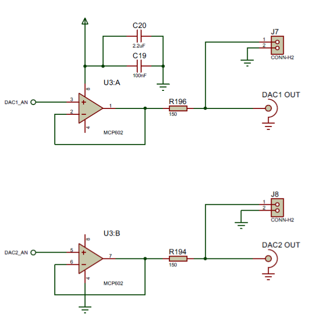

[Up -Functions and Analogue Outram](Analogue_Output_1.md)

--- 

# Digital to Analog Conversion (ELEC35X only)
For this section, you will need access to an oscilloscope or Picoscope. **If you are on a computing pathway, you can skip this section**.

The schematic below shows the connection of the DAC pins to the BNC connectors on the module support board. There are also test points J7 and J8. For this exercise, you can probe pin 1 of J7.

<figure>

<figcaption>Course Icon</figcaption>
</figure>

| TASK-180 | DAC |
| --- | --- |
| 1. | Make Task-180 the active project |
| 2. | Build and run the code |
| 3. | Using your scope, probe pin 1 of J7 |
| -  | Using the POT, adjust the amplitude of the waveform |
| -  | Using the output, can you calculate the frequency of the signal? |
| 4. | Modify the code to produce a 1Hz signal |
| -  | Again, use the scope to confirm the frequency |

Inspecting the code, you can see the simplicity of using a DAC.

The code to create the `AnalogOut` is as follows:

```C++
AnalogOut dac1(DAC1_AN_PIN);
```

> Note that very few pins are available as DAC pins.

To write a value to the DAC, you simply assign a value between 0 (0.0V output) and 1.0 (3.3V output).

In this example, a sinusoid is generated as follows:

```C++
dac1 = 0.5f + amplitude * 0.5f * cos(n*DELTA);
```

Note the 0.5 offset and scaling. This is necessary as `cos` ranges from -1.0 to +1.0. Using this formula the signal swings between 0.0 and +1.0, with a mean of 0.5.

> The same will be true for most ADC circuits. Analogue signals will often have a constant DC offset added so the analogue signal ranges between 0V and a maximum (3.3V for this device).
>
> This means you will may need to remove the offset once in the digital domain.


