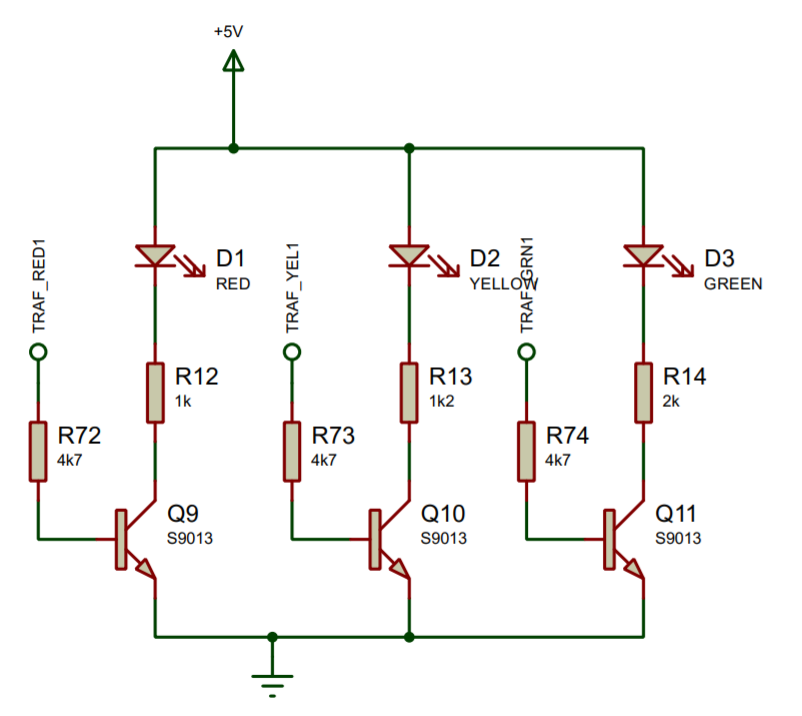
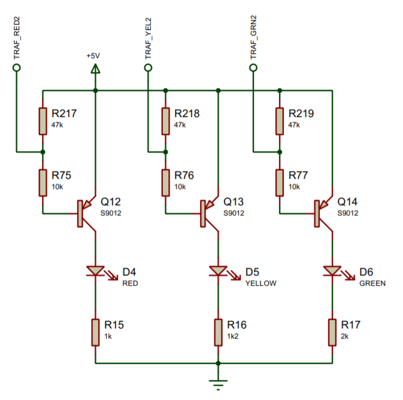
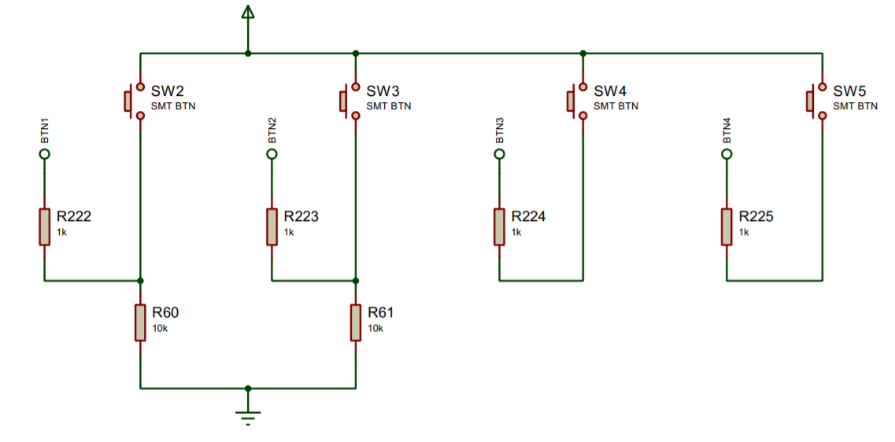

[Back to Contents](README.md)

---

# DigitalIO
This is a deeper dive into digital IO with Mbed OS. Before we start, you should download a copy of the module support board schematics.

[Refer to the schematics here](../getting_started/hardware.md#Schematics)

> **TIP:** To open this link in a separate window, hold down CTRL and click. 
>
> Alternatively, the PDF file is located in the folder `Hardware\ModuleSupportBoard`

**You will need to make frequent reference to the schematics**. At this level, we are encouraging the students to read the schematics and workout for themselves how to write software to control it.

## Related Lectures
For Plymouth students, the relevant lecture slides are here:

| Lecture | Title |
| - | - |
| 01-01 | [01-01 - Introduction and block overview](https://dle.plymouth.ac.uk/mod/url/view.php?id=1848283&forceview=1) |
| 01-02 | [01-02 - Digital Outputs and Terminal IO in mbed](https://dle.plymouth.ac.uk/mod/url/view.php?id=1848284) |
| 01-03 | [01-03 - Digital Inputs in Mbed](https://dle.plymouth.ac.uk/mod/url/view.php?id=1848285) |
| |


## GPIO
The most familiar of interfaces is probably the General Purpose Input-Output (GPIO). 

### Task 201 - Push Pull
For a push-pull output, we use the `DigitalOut` **class**. What is a class? It is a custom data type (as opposed to a built in data type, such as `int` and `float`). We will discuss in detail in level 4. For now, let's look at an example using the "traffic lights".

The code in Task-201 is shown below

```C++
#include "mbed.h"

// Hardware Definitions
#define TRAF_GRN1_PIN PC_6
#define TRAF_YEL1_PIN PC_3
#define TRAF_RED1_PIN PC_2

// Objects
DigitalOut grn(TRAF_GRN1_PIN);
DigitalOut yel(TRAF_YEL1_PIN);
DigitalOut red(TRAF_RED1_PIN,1);

int main()
{
    while (true) {
        red = 0;
        yel = 1;
        grn = 1;
        wait_us(500000);
        red = 1;
        yel = 0;
        grn = 0;  
        wait_us(500000);    
    }
}
```

| **TASK 201** |
| --- |
| Read all the comments in the code. |
| 1. Build and run Task 201. |
| 2. Now run the code in debug mode (single step) |
| 3. What is the state of the red LED **before** the code enters main? |
| 4. Modify the code so that all the LEDs are on at the start of main |
| 5. Find the traffic lights in the schematics. Confirm these are compatible with PUSH-PULL outputs |
| |

In the example above, pins `PC_2`, `PC_3` and `PC_6` were configured as push-pull outputs.

> **Questions**
>
> If we wished to drive some 5V logic, would PUSH-PULL be a the best choice? Why?
>
> From what you observe, is the `main` function the first code that executes? Evidence your answer.
>
> Do all the LEDs change at the same time? Why?

### TASK-202-`BusOut`
In the previous example, we drive three LEDs using push-pull GPIOs. For the purpose of this task, this technique was fine. However, each LED state had to be controlled independently. Another option is to control a group of LEDs using the `BusOut` class.

The code in Task-202 is shown below:

```C++
#include "mbed.h"

// Hardware Definitions
#define TRAF_GRN1_PIN PC_6
#define TRAF_YEL1_PIN PC_3
#define TRAF_RED1_PIN PC_2

// Objects
// DigitalOut grn(TRAF_GRN1_PIN);
// DigitalOut yel(TRAF_YEL1_PIN);
// DigitalOut red(TRAF_RED1_PIN,1);
BusOut leds(TRAF_RED1_PIN, TRAF_YEL1_PIN, TRAF_GRN1_PIN);

int main()
{
    while (true) {
        leds = 0;   //Binary 000
        wait_us(500000);
        leds = 7;   //Binary 111
        wait_us(500000);    
    }
}
```

| **TASK 202** |
| --- |
| 1. Build and run the code. |
| 2. Now run the code in debug mode and step through each line |
| 3. Determine the state of the leds when the code enters main? |
| 4. Try setting `leds` to different values | 
| 5. Write a for-loop to count from 0..7. Set the LEDs to the binary equivalent of the count. i.e. The sequence is 000, 001, 010, 011, ... , 111
| 6. Now add three more pins. The labels are `PB_0`, `PB_7` and `PB_14`. Modify the code to flash all the pins on and off.
| |

Note how the *object* `leds` was declared:

```C++
BusOut leds(TRAF_RED1_PIN, TRAF_YEL1_PIN, TRAF_GRN1_PIN);
```

`BusOut` is the type (a class). Note the order of the parameters when initialising this object.

We can set `leds` to a decimal value, 
> **Questions**
>
> We can set the value of `leds` to an integer. Which LED represents the least significant bit of this integer?
>
> When we declare `leds`, a number of parameters are provided. These are pin names. Are the parameters specified least significant bit first, or most significant bit first? Why do you think this might be?
>
> Read the [documentation for `BusOut`](https://os.mbed.com/docs/mbed-os/v6.3/apis/busout.html). You may need to change the version to match the code. How many pins can you control at once?
>
> In step 6 above we added some additional pins. Are all the pins on the same port? Explain.

With `BusOut` you can control up to 16 pins from _any_ port. It is intended to be flexible. Under the hood, `BusOut` simply maintains an array of `DigitalOut` objects. The code iterates through the array, changing each output in turn. This means the output pins _cannot_ change simultaneously. There will therefore be a small amount of _timing skew_ between them. This is the trade-off for convenience.

### TASK-203-`PortOut`
Unlike `BusOut`, the `PortOut` class can only control pins from the same port. The reason you might want to do this is performance (especially if timing-skew is an issue).

```C++
#include "mbed.h"

// Hardware Definitions
#define TRAF_GRN1_PIN PC_6
#define TRAF_YEL1_PIN PC_3
#define TRAF_RED1_PIN PC_2
#define LEDMASK 0b0000000001001100
// Objects
//BusOut leds(TRAF_RED1_PIN, TRAF_YEL1_PIN, TRAF_GRN1_PIN);
PortOut leds(PortC, LEDMASK);

int main()
{
    while (true) {
        leds = 0;   //Binary 000
        wait_us(500000);
        leds = 0xFF;   //Binary 11111111
        wait_us(500000);    
    }
}
```

| **TASK 203** |
| --- |
| 1. Build and run the code. |
| 2. Now run the code in debug mode and step through each line |
| 3. Determine the state of the leds when the code enters main? |
| 4. Which bits in LEDMASK are set to `1` and why? (see the documentation on `PortOut`) |
| 5. Change `LEDMASK` to `0b0000000001001000`. What effect does this have and why? |
| 6. Now modify the code to also flash the on-board LEDs. The pin labels are `PB_0`, `PB_7` and `PB_14`. _hint_: You will need another instance of `PortOut` | 
| 7. Modify the code to flash the LEDs using the XOR operator `^`. Your while-loop should only need two lines of code within the code block. **<p title="leds = leds ^ LEDMASK; wait_us(500000);">Hover here to see the solution</p>** |
| |

We saw in this exercise that `PortOut` is used to set outputs bits on a particular port. All pins will change simultaneously.

Now we look at another GPIO configuration, _Open Drain_.

### TASK-204 - Open Drain with `DigitalInOut`
The module support board you are using has two set of "Traffic Lights", purposely configured in a slightly different way. Let us first consider Traffic Light Set 1:

<figure>

<figcaption>Traffic Light Set 1. Note the use of the NPN transistor.</figcaption>
</figure>

We can write a truth table for this circuit where `TRAF_RED1` is the input and the LED state is the output.

| `TRAF_RED1` | TRANSISTOR STATE | LED STATE |
| --- | --- | --- |
| LOW | OFF | OFF |
| HIGH | ON | ON |
| FLOATING | ? | ? |
| |

This is your standard "push-pull" configuration. We used this circuit in a previous exercise. Now compare and contrast to Traffic Light Set 2:

<figure>

<figcaption>Traffic Light Set 2. Note the use of a PNP transistor.</figcaption>
</figure>

This circuit is different. Study it carefully, then consider the following question.

> **Question**
>
> For Traffic Light Set 2, try and complete the table. Hover the mouse over the `?` to reveal the answers.
>
> | `TRAF_RED2` | TRANSISTOR STATE | LED STATE |
> | --- | --- | --- |
> | LOW | <p title="ON">?</p> | <p title="ON">?</p> |
> | HIGH | <p title="OFF">?</p> | <p title="OFF">?</p> |
> | FLOATING | <p title="OFF">?</p> | <p title="OFF">?</p> |
> | |
>

To better understand this, it is helpful to look at the electronics for a GPIO pin:

<figure>

<figcaption>Digital outputs of a microcontroller can be configured as standard (typically push-pull) or open-drain outputs. Source: https://os.mbed.com/media/uploads/tbjazic/05outputs.png</figcaption>
</figure>

Note how in the open-drain configuration, there is no "push" transistor (in reality, both transistors would be present with the upper one held off). 

> V<sub>out</sub> would need to be pulled high with a pull up resistor.
>
> V<sub>out</sub> would default to the HIGH state. When switched on (V<sub>in</sub>=HIGH), the transistor Q3 pull the output LOW.

It should be stated that different devices can offer different configurations. You should always check the device documentation. 

> **NOTE**
>
> Some devices also include the option to include internal Pull-Up and Pull-Down Resistors. This can save external circuitry, although we need to be careful about current limits. We will not be using this and not all devices provide this option.

In the sample code below, the output pin is initialised as `OpenDrainNoPull`:

```C++
#define TRAF_GRN2_PIN PC_9
#define TRAF_YEL2_PIN PC_8
#define TRAF_RED2_PIN PC_7

#define TRAF_WHITE_PIN PF_10

//BusInOut Traffic_Lights_2(PC_7,PC_8,PC_9);
DigitalInOut grnLED(TRAF_GRN2_PIN, PinDirection::PIN_OUTPUT, PinMode::OpenDrainNoPull, 0);

int main()
{
    //Note the logic
    while (true) {
        grnLED = 1;
        wait_us(1000000);
        grnLED = 0;
        wait_us(1000000);
    }
}
```

Note the following:

The `grnLED` object is initialised with 4 parameters. 
```C++
DigitalInOut grnLED(TRAF_GRN2_PIN, PinDirection::PIN_OUTPUT, PinMode::OpenDrainNoPull, 0);
```

* `TRAF_GRN2_PIN` is the pin label
* `PinDirection::PIN_OUTPUT` specified this is in output mode (you can also configure it for input mode).
* `PinMode::OpenDrainNoPull` sets the output configuration to OPEN DRAIN, with no internal pull-up or pull-down resistors
* The default output state is LOW

| **TASK 204** |
| --- |
| 1. Build and run the code. |
| 2. Now run the code in debug mode and step through each line |
| 3. Determine the state of the leds when the code enters main. Explain. |
| 4. Without using copy and paste, add another open-drain output for `TRAF_RED2_PIN` and make it flash in the opposite state to the green. 
It is important you type this in yourself (slowly) and note how the autocomplete helps you see all the options available |
| 5. In your source code, right click `PinMode` and select "Go to Definition". This will open the header file with the definition of this type.

Learning to use autocomplete and to explore the Mbed sources is a valuable skill.

## Digital Inputs
Let's now look a forms of digital input. This will include GPIO type inputs and serial interfaces (Keyboard in this case).

The module support board has 4 push switches:

<figure>

<figcaption>Course Icon</figcaption>
</figure>

> **Note**
>
> `SW2` and `SW3` have pull down resistors, whereas `SW4` and `SW5` do not.
>
> When `SW4` is not pressed, the outputs are *floating*
> 
> These two sets of switches will need to be managed slightly differently.

### `DigitalIn`
The `DigitalIn` type is the simplest digital input. It allows us to sense the state of an input pin. It assumes the input signal is asserted either HIGH or LOW.

We can use this for `SW2` and `SW3` and they always provide strong signals (HIGH or LOW)

Some sample code is shown below:

```C++
#include "mbed.h"
// Hardware Definitions
#define TRAF_GRN1_PIN PC_6
#define TRAF_YEL1_PIN PC_3
#define TRAF_RED1_PIN PC_2

#define TRAF_GRN2_PIN PC_9
#define TRAF_YEL2_PIN PC_8
#define TRAF_RED2_PIN PC_7

#define TRAF_WHITE_PIN PF_10

#define BTN1_PIN PG_0 
#define BTN2_PIN PG_1
#define BTN3_PIN PG_2 // No pull down
#define BTN4_PIN PG_3 // No pull down

// Inputs
DigitalIn SW2(BTN1_PIN);
DigitalIn SW3(BTN2_PIN);
DigitalInOut SW4(BTN3_PIN,PIN_INPUT,PullDown,0);
DigitalInOut SW5(BTN4_PIN,PIN_INPUT,PullDown,0);

// Outputs
DigitalOut ledRed(TRAF_RED1_PIN);
DigitalOut ledYel(TRAF_YEL1_PIN);
DigitalOut ledGrn(TRAF_GRN1_PIN);

int main()
{
    while (true) {
        if (SW2 == 1) {
            ledRed = 1;
        } else {
            ledRed = 0;
        }

        if (SW3.read() == 1) {
            ledYel = 1;
        } else {
            ledYel = 0;
        }
    }
}
```

**Note the following:**

We are only reading two switches, SW2 and SW3. The input pins are configured as follows:

```C++
DigitalIn SW2(BTN1_PIN);
DigitalIn SW3(BTN2_PIN);
```

In the main body of the code, we read these inputs as if they were variables. For example:

```C++
...
        if (SW2 == 1) {
            ledRed = 1;
        } else {
            ledRed = 0;
        }
...
```

For SW3, we see how to use the explicit function `read()`

```C++
...
        if (SW3.read() == 1) {
            ledYel = 1;
        } else {
            ledYel = 0;
        }
...
```

Either method works thanks to some neat C++ code under the hood. We will learn how to achieve this later.

| **TASK 205** |
| --- |
| 1. Build and run the code. |
| 2. Now run the code in debug mode and step through each line |
| 3. Modify the code to use SW4 and SW5 |
| 4. Explain why the parameter PullDown is needed for SW4 and SW5 |
| |

### `BusIn`
In the case of digital outputs (push-pull), we saw there were three types:

* `DigitalOut`
* `BusOut`
* `PortOut`

Similarly, for digital inputs, there are three types:

* `DigitalIn`
* `BusIn`
* `PortIn`

Using the online documentation, you can read about these types.

| **TASK 206** | - |
| --- | --- |
| 1. | Watch [this video](https://plymouth.cloud.panopto.eu/Panopto/Pages/Viewer.aspx?id=409e91ba-e2ef-42b1-8cc8-ac4e010b2022) to see how to create a new "bare-metal" project |
| 2. | Create a new project Task 206 and copy the code from the previous task. |
| 3. | Now run the code in debug mode and check you can step through each line |
| 4. | Modify the code such that when BOTH SW4 and SW5 are held down, all three LEDs light. |
| 5. | Now modify the solution in 4 to use `BusOut` for the LEDs (in place of DigitalOut). Test to ensure it works. |
| 8. | Modify the solution in 5 to use [BusInOut](https://os.mbed.com/docs/mbed-os/v6.3/apis/businout.html) in place of DigitalInOut (for the switches). Remember to configure it as an input. Again, test. |
| 9. | Did you manage to make your code shorter? |
| 10. | Now compare your code to the solution provided | 
| | |

## Timers
One of the most important and commonly used on-chip peripherals is the **hardware timer**. Different devices have a different number of timers, and they are not standard. However, Mbed-os _abstracts_ us from the hardware specifics and allows us to use hardware timers with ease.

> Hardware abstraction clearly has benefits in terms of making code simple and portable, but can you think of any disadvantages?

There are a few notable types that use hardware timers, including the following:

* `Timer` - Creates a timer object which can be started, stopped and read (among other things).
* `Ticker` - Used to create a timer that fires an interrupt on specific intervals. This is an important topic which we will cover these in more detail later in the course.
* `PwmOut` - A digital output that autonomously pulses high and low at a specified rate and duty cycle.

> Before Mbed-OS 6, the `Timer` type was much simpler to use. To keep that simplicity (for now), we will use a custom `Timer` type called `TimerCompat`. This is just Timer with some extra functions added.
>
> You will find the code for this in the header file (in case you are curious). 

Let's look at the `TimerCompat` type:

```C++
#include "../lib/uopmsb/uop_msb_2_0_0.h"
using namespace uop_msb_200;

// Hardware Definitions
#define TRAF_RED1_PIN PC_2

// Inputs
DigitalIn SW_BLUE(USER_BUTTON);

// Outputs
DigitalOut ledRed(TRAF_RED1_PIN);

// Timer(modified version from Timer)
TimerCompat tmr1;

int main()
{
    //Time how long it takes to perform a printf
    tmr1.start();
    printf("Hello World!\n");
    tmr1.stop();

    //Print out how long it took
    unsigned long long dur = tmr1.read_ms();
    printf("The time taken was %llu milliseconds\n", dur);    

    //Now to use a timer to implement a delay
    tmr1.start();
    while (true) {
        //Wait for switch press
        while (SW_BLUE == 0);

        //Turn on LED
        ledRed = 1;

        //Wait for 500ms
        tmr1.reset();
        while (tmr1.elapsed_time() < 500ms); //How about this for C++ magic :)

        //Turn off LED
        ledRed = 0;
    }
}
```

Study the code above carefully. The code is not yet complete. 

Now then attempt the following tasks:

| **TASK 207 (Part 1)** | |
| --- | --- |
| 1. | Make the project `Task-207-Timer` the active program and click the View->Serial Monitor menu item. |
| 2. | Build and run the code, noting the serial output from `printf` statements. Note how long the `printf("Hello World")` statement takes |
| 3. | Change the string from `Hello World\n` to `Hello World How Are You\n` |
| 4. | Run the code again and compare the times. |
| |

You might be surprised how long a `printf` takes! You can also see how a hardware timer can be used to measure elapsed time.

Further down in the main while-loop, we see some code that waits for a switch press:

```C++
while (SW_BLUE == 0);
```
The switch has no memory / buffering capacity, so we created this **busy-wait loop** and **blocked** the program until the switch was pressed. By doing this at such speed, the chance of missing a switch press/release is extremely small!

The code then waits on a timer (to create a delay)

```C++
tmr1.reset();
while (tmr1.elapsed_time() < 500ms);
```

### Busy-waiting and BLOCKING
Both of these are examples of [busy-wait loops](https://en.wikipedia.org/wiki/Busy_waiting). This is characterised by a very rapid and repeated polling of a single hardware device until a specific state has been reached.

> Busy-waiting, also known as **spinning**, is something that is generally avoided if possible partly because it wastes CPU cycles and power. 

Busy-waiting / spinning is _one_ of the ways our code can become **blocked**. In fact, one of the most important concepts to grasp is the notion of **blocking**

> _A process/program that is **blocked** is one that is waiting for some event, such as a resource becoming available or the completion of an I/O operation, before proceeding further instructions._

In the examples above, the I/O operations were related to a GPIO input (connected to a switch) and a hardware timer. 

| **TASK 207 (Part 2)** | |
| --- | --- |
| 5. | Now you are to complete the program. |
| | The intention is that each time the BLUE switch is pressed and released, the LED toggles (ON->OFF or OFF->ON) |
| | You must debounce both the press and release of the switch. i.e. After a press _or_ release, you must add a delay. |
| | You are to implement a delay using the `TimerCompat` type as shown in the example above. |
| |

### Using `wait`
Implementing delays is a very common requirement in embedded software development. Instead of writing code to read Timers, we have a convenient group of functions in Mbed to simplify the process of blocking on a timer.

```C++
wait_us(1000);    //1000 uS == 1ms
```  

There is also a `wait_ns` function for even more fine-grained timing.

| **TASK 207 (Part 3)** | |
| --- | --- |
| 6. | Replace the timer loops with a suitable wait function |
| |

Hopefully, you code is a little shorter and easier to read now.

> **A note about wait functions in Mbed-OS**. 
>
>Currently, we are using "bare-metal" Mbed, which is a smaller and more lightweight version of the full implementation.
>
> Later in the course we will switch to the full implementation and begin to use the Real Time Operating System (RTOS) features, where some different wait functions will be used. These work quite differently. 

### Brief Reflection

Already it was noted that blocking on busy-wait loops are wasteful of CPU cycles and power, but there is another problem with blocking in this way, and the next exercise should hopefully highlight this:

## Two Switch Challenge
Note how these examples are simple. They follow the basic principle of a sequential machine, with code running in a strict sequence. However, this can soon lead to problems when blocking devices are added to the task.

Given what we now know about blocking, let us now see how it can cause significant complexity in out software.

A video demonstrating the challenge is here.

| **TASK 208** | The Two Switch Challenge |
| --- | --- |
| 1. | [CLICK THIS LINK TO SEE A VIDEO DEMONSTRATION OF THE CHALLENGE](https://plymouth.cloud.panopto.eu/Panopto/Pages/Viewer.aspx?id=71f9b678-4c7a-49fb-9229-ac5500a53879) |
| | + Read the key points below |
| 2. | Set the project Task-208-Challenge as the active program |
| 3. | Modify the code to solve the problem  |
| 4. | A number of solutions will be presented to you as we progress through the course |
| |

**Key points to observe**:

* You have two switches and three LEDs
* The first switch controls the red LED
* The second switch controls the green LED
* When a switch is pressed and released, its respective LED toggles state (ONE->OFF or OFF->ON).
* The yellow LED should flash on and off every 500ms. No switches are involved with this LED

This may seem simple, but there are some additional requirements you must meet:

* You must debounce the switches
* Both switches must be responsive at all times. Neither is permitted to be ignored.
* For those that remember how, you cannot use interrupts or PWM (sorry!)

Tips:

> Start this task with just one switch and one LED. Note the complexity / simplicity of the code.
>
> Then add a second switch. Note any difficulties you may have. Consider the fundamental issues that make this hard.
> 
> Finally, consider how you will keep the yellow LED flashing.


Don't spend too much time on this. If you can find a way to solve it, then great. If you end up with a tangled mess, that's ok as well. The important point is to understand the problem.

> A solution is provided - do NOT peek at this until you have given this task a try. It is not the only solution of course, but it is one worth studying carefully.

As we will discover later, we can simplify our code again with some new techniques.

## Terminal Input
Another commonly used peripheral is the UART (also known as a Serial Port). Mbed compliant boards connect one of the serial ports to the host PC via a "serial over USB" link. This is very useful for data logging and debugging applications.

| **TASK 112** | Revision |
| --- | --- |
| 1. | Set Task-112 as your active project |
| 2. | Ensure the serial monitor is visible (View->Serial Monitor) |
| 3. | Step through this example code. You will need to type responses into the serial monitor at certain points. Establish where blocking may be taking place. |
| 4. | Now go to Task-208-Soln. Build and run the code. |
| 5. | Now use the debugger to step through the code to help you understand it |
| 6. | Now add support for the BLUE button. Add some code such that when the user presses the BLUE button, they can type an integer value into the serial terminal and set the flash speed for the yellow LED. |
| 7. | Is it possible to keep the yellow LED flashing all the time? Explain.  | 
| |

## Stretch Task (Optional)
For those that want to push a little deeper, you might want to consider the following.

In the previous example, we observed the blocking nature of the serial port (UART). Unless we know a few more techniques, this is seemingly a hurdle. However, it is possible to access the serial interface in non-blocking mode. 

```C++
    BufferedSerial pc(USBTX, USBRX);
    pc.set_blocking(false);

    char c;
    ssize_t result = pc.read(&c, 1);

    printf("read returned the value %d\n", result);
    printf("Read: %c\n", c);

    if (result == -EAGAIN) {
        printf("No data in buffer\n");
    }
```

**Stretch Task** | Non Blocking Serial |
| --- | --- |
| 1. | Reattempt Task 112 to read the serial terminal in non-blocking mode |
| - | For this, you will need to read the characters manually and then convert the result to an integer. Consider reading them into a character array and using `stoi` function to concert the string to a decimal. Note that `stoi` expects a zero as an end of string marker.

## Quiz
Please click the following link and answer all questions as best you can.

https://dle.plymouth.ac.uk/mod/quiz/view.php?id=980380

It is very important you complete the quiz. These are formative, and do not contribute to your module mark. However, they provide valuable feedback for both students and tutors. They are also used as evidence of engagement. 

---

[NEXT - Lab2-C and C++ Structures](Cplusplus-structures.md)

