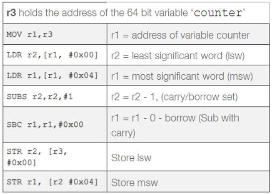

[Back to Contents](README.md)

---

# Multi-Tasking with Interrupts
We saw in the lab on rapid polling how to use a rapid polling loop to monitor inputs and update outputs at high-speed.

One argument against this approach is power-efficiency, and another is responsiveness.

* It is very hard to know what the loop time is, and what delay there will be between an input changing and the response.
* We say such systems are non-deterministic

At the heart of every desktop and portable computer is a CPU running a multi-tasking operating system. At lower levels, we would find the kernel of the operating system. Driving this are **hardware interrupts**.

One of the objectives of modern computers, and especially those which are battery powered, is to save power while maximising throughput. Most moderns CPUs and microcontrollers support at least one **sleep state**. This is a state where execution of code is paused, and selected peripherals are stopped (e.g. by disabling their clock).

> As a general rule, the more time a CPU can remain in a sleep state, so the lower the power consumption.

With this in mind, let's have a refresher of hardware interrupts on our embedded board.

> It should be noted that we are STILL using the **bare-metal** profile of Mbed. This ensures the real-time operating system (RTOS) is disabled (we don't need this until level 4).
>
> The reason for this is that the RTOS uses a timer interrupt, and this will keep waking the CPU. 
>
> See the file `mbed_app.json` in each project 

## Task-248 : Interrupts
This tasks reminds us of how to use interrupts to respond to external and internal hardware events. It also shows us how to put the microcontroller into a lower-power sleep state.


| TASK-248 | Interrupts in Mbed |
| --- | --- |
| 1.  | Make Task-248 the Active Program |
| 2.  | Build and run the code. Press button A to see what happens |
| 3.  | Read through the code and comments |
| 4.  | Using the debugger, put a breakpoint on the line that reads: |
| -   | `redLED = !redLED;` |
| 5.  | Allow the code to run such that the green LED is flashing. Press pause and note which line the debugger stops on. Repeat this a few times. How likely is it that the CPU is sleeping? |
| 6.  | Press button A and note where the code stops |
| 6.  | What actually called the function `funcA()` ? |

### `InterruptIn`
Note the data type for `btnA` is `InterruptIn`

```C++
InterruptIn btnA(BTN1_PIN);
```

This is very similar to `DigitalIn`, only that it allows you to attach interrupts to the associated pin.

```C++
btnA.rise(&funcA);
```

Here we request that when `btnA` rises (0->1), the function `funcA` is called automatically.

### `Ticker`
Note the type of `tick.

```C++
Ticker tick;
```

This is a hardware timer with an interrupt attached.

```C++
tick.attach(&funcTmr, 500ms);
```

Every 500ms, the timer will generate an interrupt and branch to the function `funcTmr`

### waking from sleep
The CPU spends most of it's time in the sleep mode. The **ONLY** way the CPU can wake is if a hardware interrupt should occur.

In this example, we see both GPIO and Timer based interrupts wake the CPU.

> It should be noted that although the timer interrupt is to some-extent predictable, the switch driven GPIO is NOT. The CPU has no idea when you will press the switch.
>
> We say that interrupts are **asynchronous** and run code **out of sequence**
>
> Until now, all our code has run **in sequence**, one statement following the other. Interrupts change all this as they are invoked not by our code, but via the on chip NVIC in response to asynchronous hardware events.
>
> This is a very important point which we will now look at in more details.

## Task-250 - Race Conditions
**This is one of the most important topics in this module.** Pay particular attention to this exercise as it underpins many issues you will meeting going forward. It is also the basis of some of the most difficult software faults to detect and fix.

| TASK-250 | Race Conditions |
| --- | --- |
| 1.  | Set Task-250 as your active program |
| 2.  | Build and run the task. |
| 3.  | Note the LED sequence |

In this example a timer is used to generate a **single** interrupt (using the `Timeout` class). 

If you inspect the code you will observe the following:

* There is a global variable `counter` initialised to zero
* There is a function `countUp()` that **increments** `counter` by 1 over 1,000,000 iterations. 
    * This is run ONCE and is called from `main()`.
* There is a function `countDown()` that **decrements** `counter` by 1 over 1,000,000 iterations. 
    * This is run ONCE and is invoked by an interrupt
* Both `countUp()` and `countDown()` share the same variable `counter`. Both only run ONCE.

Three LEDs are used in this project. 

* The green LED is on while `countUp()` is running
* The yellow LED is on while `countDown()` is running
* The red LED is on as long as `counter` is not equal to zero

| TASK-250 | Race Conditions |
| --- | --- |
| 4.  | Press the black reset button and again observe the green and yellow LEDs |
| -   | Note that green first switches on and then off, followed by yellow switching on and off. |
| -   | This shows that one function is allowed to finish before the other one starts |
| -   | At the end of the sequence, the red LED goes off as `counter` equals zero |

This makes numerical sense. The `countUp()` function adds 10,000,000 to `counter`, then the `countDown()` function subtracts 10,000,000. **The net result is zero**.

| TASK-250 | Race Conditions |
| --- | --- |
| 5.  | While holding down the blue button, press and release the black reset button. Again observe the green and yellow LEDs |
| -   | Note that there is a moment when both yellow and green are switched ON. |
| -   | This shows that one function is interrupting the other |
| -   | At the end of the sequence, the red LED stays ON. This means the  `counter` does NOT equal zero |
| -   | However, both functions have been allowed to run to completion! |

So what has changed here? In short, **nothing has changed except for timing**.

Let's look more closely at this:

```C++
...

    if (button == PRESSED) {
        t1.attach(&countDown, 15us);
    } else {
        t1.attach(&countDown, 2s);                   
    }
    
    //Run count up on the main thread
    countUp();
    
...
```

**Case 1: Blue button is NOT pressed**

The single timer interrupt does not occur for 2 seconds. This means `countUp()` has time to finish before the interrupt invokes `countDown()`

**Case 2: Blue button IS pressed**

The single timer interrupt now occurs just 15 microseconds after it is attached. This means `countUp()` is allowed to start, but does NOT have time to finish before it is interrupted by `countDown()`. When `countDown()` is complete, `countUp()` is allowed to complete.

However, the final value of `counter` is not zero, which is incorrect. So why the difference?

**It's still the same code. All that has changed is timing!**

## Race Conditions
This is one of the most sinister types of bug, and at root of this is **out of line** code execution.

In both `countUp()` and `countDown()`, we see the `counter` variable being modified. If we were to inspect the assembly code for each of these, we would see this resolves to CPU instructions. 

An example is shown below:

<figure>

<figcaption>ARM assembler for the C statement count-- with no optimisation</figcaption>
</figure>

This is the assembly language for `count--`. `count++` is very similar.

> Note the use of registers `r1`, `r2` and `r3`

We can divide this code into three sections:

* Fetch (from memory into registers)
* Modify (registers)
* Write (registers back to memory)

From the lecture, you may recall the following:

**Scenario 1:** count++ and count-- run exclusively

| main - `countUp()` | Event | ISR - `countDown()` |
| --- | --- | --- |
| Copy data from `counter` into registers | - | - |
| Modify registers (increment) | - | - |
| Write registers into `counter` | - | - |
| - | - | - |
| - | Interrupt -> | registers `r0-r3` pushed on the stack |
| - | - |Copy data from `counter` into registers |
| - | - |Modify registers (decrement) |
| - | - |Write registers into `counter` |
| - | <- return | registers `r0-r3` popped from the stack |
| `main()` continues | - | - |

Consider the case where `counter=5` at the start. At the end, the value remains unchanged.

**Scenario 2:** count++ is pre-empted by count-- 

| main - `countUp()` | Event | ISR - `countDown()` |
| --- | --- | --- |
| Copy data from `counter` into registers | - | - |
| Modify registers (increment) | - | - |
| - | Interrupt-> | registers `r0-r3` pushed on the stack |
| - | - |Copy data from `counter` into registers |
| - | - |Modify registers (decrement) |
| - | - |Write registers into `counter` |
| - | <- return | registers `r0-r3` popped from the stack |
| Write registers into `counter` | - | - |
| `main()` continues | - | - |

Consider again the case where `counter=5` at the start. Following the table above, At the end, you will find `counter=6`, which is the wrong result.

> This occurred because `count++` was preempted before it had time to write its result to memory. Furthermore, any value saved by `count--` in the ISR was overwritten upon return to `main`

## Critical Sections
Although the example above is very contrived, the phenomena is very real. 

> Such timing error can occur very rarely, and therefore can go undetected. Their impact can be catastrophic.

To avoid such errors, we need to perform two-key steps:

1. Identify all **critical sections** of code
2. Add additional measures to ensure such critical sections are never pre-empted by code that shares any common resource (memory, I/O, or any other mutable state).

What do we mean by critical section?
 
> Where 2 or more blocks of code make reference to the same mutable state (anything that can be written to) and where at least one block performs a write operation. These blocks are critical sections and must NOT be allowed to preempt each other.

The problem with interrupts is we don't know when they will occur, as they are **asynchronous**.

There are a few strategies we can use:

* Turn off interrupts during each critical section
* Temporarily elevate the priority of a code block to prevent it being preempted
* Rarely, we can perform an operation with a single assembly instruction. These can be added to our C code. This only applies for very simple operations.

## Protecting Critical Sections in Mbed
For this task, we find a solution for the race condition in the previous example.

| TASK-351 | Race Conditions |
| --- | --- |
| 1.  | Set Task-351 as your active program |
| 2.  | Build and run the task, first without the blue button being pressed, and secondly with the blue button held down |
| -  | In both cases, the red LED turns off |

Look at the new `countUp()` and `countDown()` functions. In each of these, we see a shared variable `count` being referenced. Both in this case modify this variable, so each constitutes a critical section in each function.

Therefore, the following has been added to prevent the read-modify-write cycle of `count++` and `count--` being interrupted.

For `countUp()`:

```C++
        CriticalSectionLock::enable();
        counter++; 
        counter++;
        counter++;
        counter++;
        counter++;
        counter++;
        counter++;
        counter++;
        counter++;
        counter++; 
        CriticalSectionLock::disable();
```

For `countDown()`:

```C++
        CriticalSectionLock::enable();
        counter--;
        counter--;
        counter--;
        counter--;
        counter--;
        counter--;
        counter--;
        counter--;
        counter--;
        counter--;  
        CriticalSectionLock::disable();
```

In simple terms:

* `CriticalSectionLock::enable();` turns off interrupts
* `CriticalSectionLock::disable();` returns them to their previous state (turns them back on in this case).

> **Why so many `counter++` instructions?**
> 
> In case you were wondering, this is a contrived example that presents a high probability of a race condition occurring for demonstration purposes. 
>
> In real applications, races might be quite subtle and hard to spot. Worst of all, they are often rare and hard to detect.

## `Volatile`?
You may have noticed the keyword `volatile` prefixing the `counter` variable and wondered what this means?

In the discussion above, the read-write-modify cycle was assumed to occur in sequence. A statement such as `counter++` logically speaking will behave as a read, a modify (increment) and write (back to memory).

For code that runs in sequence, the compiler will guarantee the behaviour you express through your source code. However, it may also use some techniques to optimise your code for speed and/or size, but without breaking the logic.

For example:

* It is not uncommon for a variable to be held in a register, making for faster code. This might mean the read, modify and write operations are separated.

* Some variables are optimised out entirely by committing a CPU register to it's value. This has a major performance benefit, especially in tight-loops with lots of modifications.

* The compiler might even reorder aspects of your code either to keep it shorter and/or faster. This won't break the logic of your code, but you might find when debugging that it "jumps about" unexpectedly as operations are performed in more optimal ways.

This is nothing that normally concerns us of course, that is until you write code that contains out-of-sequence execution, **such as an interrupt**. 

Optimising compilers (reasonably) assume code runs in the sequence you specify.

> C and C++ compilers know nothing of interrupts and certainly have no way of telling then they will occur.
>
> Where a variable is shared between two sections of code, and where one part of that code runs out of sequence, then compiler optimisation can break the logic.
>
> Do not confuse this with race conditions. Even in the absence of a race, data inconsistency can still occur.

Luckily, there is a way to suppress a variable being optimised, and that is to declare it as `volatile`. Doing so enforces the full read-modify-write cycle to all take place and at the point you specify it.

## Re-entrant Functions
Another danger with interrupts is non-reentrant functions, a famous example being `printf`.

We have already seen that functions that share mutable state with other code need additional protection to ensure they can be safely used in an interrupt.

This is not just limited to variables, it can include anything that is mutable (can be modified):

* Any global variables
* Static local variables
* Hardware I/O
* Even a database table on another machine

You may surprised at how many functions and classes are not interrupt safe. It is actually quicker to list the Mbed OS driver classes that **are** interrupt safe:

* DigitalIn, DigitalOut, DigitalInOut.
* InterruptIn.
* PortIn, PortOut, PortInOut, PwmOut.
* Ticker, TimerEvent, Timeout, Timer.

[reference: Mbed OS documentation](https://os.mbed.com/docs/mbed-os/v6.4/apis/thread-safety.html#thread-safety)

All the others must never be used in an interrupt service routine! This is quite a major restriction.

Of course, you can always write your own interrupt safe driver, but that involves bare-metal programming and knowledge of MCU specific registers.

## Task-252 - Serial Interrupts
This example shows how you can use interrupts with a serial interface. This uses the simpler `UnbufferedSerial` driver. There is no buffering, so it is important to read data as soon as it arrives.

| TASK-252 | Serial Interrupts |
| --- | --- |
| 1.  | Set Task-252 as your active program |
| 2.  | Build and run the task. |
| 3.  | Press `+` to increase the flash interval |
| 4.  | Press `-` to decrease the flash interval |

Note the following:

* `CriticalSectionLock` is used to avoid race conditions
* The variable `T` is `volatile`

The above example only processes single bytes. A greater challenge is to process strings.

**Challenge:**

In Task-252, the blue LED flashes at a rate that is controlled by the keyboard. The serial interface generates an interrupt every time a new byte is received.

Modify this code so that the flashing rate is controlled by the user typing the words UP or DOWN. Add additional state machines to detect each word (think of a word as a sequence of input values).

## Reflection
It is not unknown for developers to use interrupts and be completely oblivious to their dangers and limitations. In some applications, this could even pose a risk to life and/or the environment.

Most developer tools will not help you detect race conditions. Most code tests are unlikely to detect them especially when they are rare. 

Forgetting to make a variable volatile is another common error and very easy to make. 

**You** have to spot these errors by reading the code. A group code walk-through with experienced developers is one way to increase the chances of spotting such an error. It also comes with practise.

In contrast to rapid polling, interrupts are very efficient but also much more dangerous.

> In the absence of any interrupts, rapid polling has no pre-emption so is always safe from race conditions.

However, sometimes we simply have to use them, so this issue cannot be avoided entirely. The good news is you may be able to limit their use and approach multi-tasking in another and much simpler way. 

> That way is to use a Real-Time Operating System (RTOS)  to write **multi-threaded applications**.

Underpinning multi-threaded programming is a scheduler, driven by a timer interrupt. What does this achieve?

* The harder and more dangerous interrupt operations are abstracted away
* Running tasks in parallel is done for you.
* Lot of tools are provided to prevent race conditions
* Your code can be greatly simplified
* Accessing the CPU sleep mode is handled automatically
* Most functions and driver classes are thread safe, even where they are not interrupt safe
* Facilities are provided to allow interrupts to synchronise with threads, enabling your interrupts to remain very short and simple

This is the topic of the next section.

---

NEXT - [Serial Interfacing - Coming Soon](SerialInterfacing.md)


