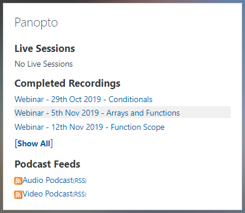

[UP - Table of Contents](../README.md)

---

# Table of Contents

1. [Advanced Embedded Programming](#advanced-embedded-programming---level-6)
1. [What's New](#what-is-new)
1. [Level 6 Course Structure](#level-6-course)
1. [Using the Glossary](#using-the-glossary)
1. [Setting Expectation](#setting-expectation)
1. [Your Kit](#your-kits)
1. [Attending Labs](#attending-labs)
1. [Lectures](#lectures)

---

# Advanced Embedded Programming - Level 6

These materials for part of the following modules taught at the University of Plymouth

* ELEC351 Advanced Embedded Programming
* COMP2008 Embedded Programming and the Internet of Things

All examples and tasks are written in C++. The embedded framework is Mbed OS. See the overview [here](../README.md).

## What is new
This content was originally migrated from [a previous version](http://blogs.plymouth.ac.uk/embedded-systems/microcontrollers/mbed-os-2/courses/embedded-systems-in-context-level-4/foreward/) based on mbed-os 5.

**Changes for 2021:**

The following changes are confirmed.

* Module Support Board v4 provided to all stage-1. 
   * This has an extra switch mute the buzzer (by popular demand!)
   * The MPU6050 is populated by default (motion sensor)
   * The BMP was replaced with an alternative SPL06-001
   * New schematics have been added
* [New Driver Library](https://github.com/UniversityOfPlymouth-Electronics/libuopmsb) is now used to assist with managing different board versions. This includes support for the new devices. These notes have been updated to reflect this.
* All projects are updated to Mbed-OS 6.13 and use Mbed Studio 1.4.2 onwards
* Various corrections and typos fixed

**Changes for 2021:**

* Adoption of Mbed Studio v1.X
* Adoption of Mbed-os 6.X
* More content on the fundamentals of C++ and Object Orientated Programming (OOP)
* Condition Variables
* The [existing glossary](http://blogs.plymouth.ac.uk/embedded-systems/glossary-2/) is being migrated to a [new version](/glossary/README.md) 
* Blended delivery model

**Changes for 2021:**

* Restructuring. Moved content from level 6 back to level 5
* Additional Lab using Azure IoT Central
* Added additional network tasks, including NTP and TCP socket programming

**Changes for 2022:**

* Introduction to the Standard Template Library (STL)
* Dynamic Memory Allocation and Smart Pointers
* More content on Templates
* Copy and Move Semantics, Constructors and Types
* The `using` and `namespace` keyword - coming soon (now deferred until 2023)
* USB on the go (OTG) - coming soon (now deferred until 2023)

# Level 6 Course Structure
This is an advanced programming module, that builds on content in levels 4 and 5. You may wish to survey some of the labs from previous year first.

In particular, make sure you are familiar with C/C++ structures, rapid polling and interrupts. If not, you must attempt those labs first as they underpin the content in this module.

| Topic | Content | - | Weeks |
| --- | --- | --- | --- |
| 1. | Review | [See level 5 Lab Schedule](../level5/README.md) - review labs on structures and interrupts | 1-2 |
| 2. | C++ and OOP | [Lab1-C++ Classes](Cplusplus-classes.md), [Lab2-C++ and OOP](Cplusplus-oop.md) | 3-4 |
| 3. | Multi-threaded programming and networking | [Lab3-Threads and Thread Synchronisation](threads1.md), [Lab4-Thread Abstractions](thread_abstractions.md), [Lab5-Network Programming](network_programming.md) | 5-7 |
| 4. | Coursework | | 7 - 13 |
| |

## Using the Glossary
Some crucial information is contained in the [glossary](/glossary/README.md).

This is so that the document is not cluttered with every detail. Do not ignore the glossary. You should read every entry referenced in each lab. In many cases, you may see a hyperlinked word (jargon typically). Some of these are links to glossary items. If you select them you can jump to the glossary items.

## Setting Expectation
Remember that each student on the course may have a slightly a different background. Some will be returning from placement; others may be repeating then module. There are many variations.

This module is designed on the assumption that you have some knowledge and experience of embedded C programming, and some familiarity with Mbed.  However, the first lab will be a refresher on interfacing with Mbed and Mbed Studio. 

We will then recap on what we mean by **blocking hardware** and the problems is presents.

We will then review three approaches to managing multiple hardware devices in real-time, namely:

* Rapid polling loops (from level 5)
* Interrupts and interrupt safety (from level 5)
* Multi-threaded programming (new in level 6)

Some of this may be a refresher of what you were taught in level 5. However, repetition is often helpful as students don't often grasp the concepts first time. 

> Even if you have done some of the above before, beware of complacency and seek opportunities to push yourself and try to go deeper into the subject.

As a final remark, this is a fairly intensive course. Multi-threaded programming will be new, but in our experience, students who grasp it take it further when they attempt their final year projects. If you master it, it is a gateway to access more advanced applications including networking, USB and Bluetooth.

## Your Kits
Different students may already have some of the equipment needed, depending on the year you first enrolled. You will be provided additional components that enable you to work both in the lab and at home. 

You may also be loaned other equipment, such as a "Picoscope" (assuming you don't already have one).

## Attending Labs
Formal labs are scheduled at specific times in your timetable. Whether you are attending in person or doing some self study, you should ask questions in the Teams channel for that lab.

Look for the channel that says "Lab Sessions"

Labs will also contain interactive elements. There will typically be a briefing at the start and a poll part way through. Participating in these is important.

## Lectures
Each week there is a lecture, which often includes live recorded demo's. By the time you read this, the first lecture will have been delivered and recorded.

If you did not manage to attend the lecture for this week, please ensure you catch up via the video hosted on the [DLE](https://dle.plymouth.ac.uk).

> On the right hand-side, locate the "Panopto Block"

There you will find links to recorded lectures. You can also subscribe to these if you have a RSS on your computer or smart-device.

> Panopto is our University video streaming service. It supports multiple video streams, closed captions and chapter points. This makes it much easier for students to find content within a video.
>
> Some videos are restricted to a specific cohort of students, where others may be public. Please do not distribute these videos elsewhere.  

---
[NEXT - Start the first lab](#Level-6-Course)

