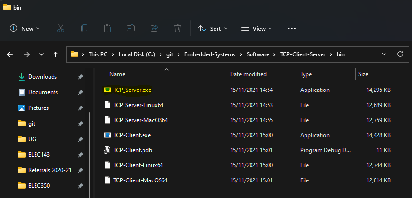
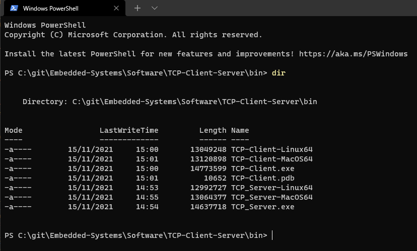
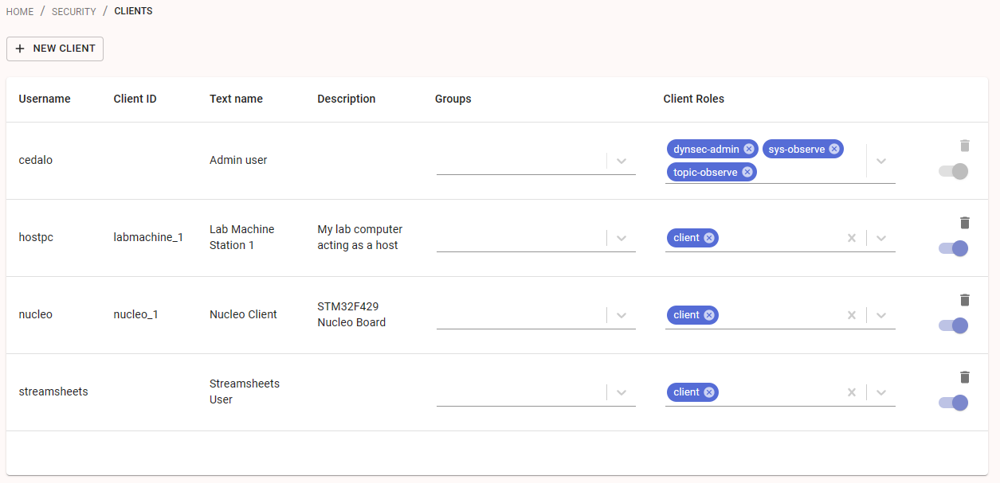

# [Back to Contents](README.md)

---

# Network Programming 
At the time of writing, we are observing a rapid growth in networked devices. Sometimes branded, the *Internet of Things*, what this amounts to are networked embedded systems which form part of a later network of computing devices and services. It is therefore more important than ever that we have some grounding in network programming.

## Connecting the target to the Internet
For some of the first tasks, the target board at least needs a connection to your host PC, and for later tasks, a route to the Internet. 

There are some options, and which you choose may depend on where your target board is located.

* Option 1 - local network socket. The board we are using as an ethernet port. This can be directly connected to a hub or switch for a local network. If working in a home environment, this might be directly into a home router, a network extender or maybe even an installed ethernet socket. Corporate networks may have socket security which prevent such configurations. 

* Option 2 - sharing the Internet with the host PC. Plymouth students are provided with a USB to Ethernet adapter. This adds an extra ethernet interface to a PC or Mac. The approach is to share the hosts active Internet connection with this additional adapter. By doing so, the host computer will allocate an IP address for the target, and route all Internet traffic requested from the target board. This configuration is likely to work best for students using their own PC. Corporate managed computers might not permit this.

* Option 3 - 3G/4G Access Point (charges may apply). One option some use is to source a 3G/4G access point. Some devices connect to the Internet over the cellular network, and provide access via an ethernet socket. However, some of these tasks need your host computer to share the same local network as the host. It can be quite difficult to allow the host to connect to the target network this way.

Other sophisticated options may exist. For Plymouth students, option 2 is the recommended approach (USB adapters are provided).

### New - Graphical Client and Server

In the following tasks, you need to run a server or client application on your host computer. Graphical alternatives are provided via the "releases" page in this repository:

https://github.com/UniversityOfPlymouth-Electronics/Embedded-Systems/releases


Download the zip file for your OS, unzip and run the executable.


## TCP/IP Client
In this example, the target device will act as a simple TCP/IP client. This will send data to a  small server application running on the host PC (written in C#.NET).

Before we begin, we need to provide a network connection to our host PC. If using the USB adapter, then the following video shows you how to share a PC Internet connection with the Nucleo Target:

https://plymouth.cloud.panopto.eu/Panopto/Pages/Viewer.aspx?id=bc691918-46a7-495f-b9ee-ade300cffc3b

Before you can run the server, you need to obtain the IP address for the target (Nucleo) and host (PC or Mac). The figure below represents a typical setup for a student (students are provided with a USB-Ethernet adapter)

<figure>

<figcaption>Typical Domestic Network Configuration</figcaption>
</figure>

Next you need to find out the IP address of the host PC. This is for the network adapter that is connected to the target (if you are using the USB adapter). You can see all the adapters and network addresses using the terminal. On unix systems, the command is `ifconfig -a`. For windows, it is `ipconfig /all`

For example:

```
   IPv4 Address. . . . . . . . . . . : 192.168.1.220(Preferred)
   Subnet Mask . . . . . . . . . . . : 255.255.255.0
```

Make a note of the IP address as you need this later.

Now we can run the server application. For Windows, the server application is `TCP_Server.exe` which can be found in this repository (see image below). Note also there are Mac OS and Linux versions as well.

<figure>

<figcaption>TCP_Server.exe</figcaption>
</figure>

Open a terminal, and change the directory where the server application is located. In the example above, you would type `cd C:\git\Embedded-Systems\Software\TCP-Client-Server\bin`

<figure>

<figcaption>Terminal</figcaption>
</figure>

 For Windows, you would type:

`TCP_Server.exe <ip address> 8080`

where <ip address> is substituted with the IP address found above. The server is now waiting for connection on TCP port 8080.

| Task-390-TCP-Client | - |
| - | - |
| 1 | Open Task-390 |
| 2 | In main.cpp, edit `#define IPV4_HOST_ADDRESS "192.168.1.220"` and change the IP address
| 3 | Build and run the code |
| - | Note the output on the server and the terminal |
| - | Hold down the blue button to stop both server and client |
| 2 | Read through the code and comments and try to follow how this works |
| 3 | **Modify the client to send a number (as a string) that increments each time** |

In this example, the NUCLEO target board is the *client*. The server is a bespoke application that listens for binary data on a TCP/IP socket. We happen to be sending ASCII bytes, but it is not limited to text.

The **client-server** relationship works as follows:

1. The listening *server* blocks waiting for a connection on port 8080. 
1. The *client* (NUCLEO) connects to the *server*. 
1. The client sends a stream of byes as a TCP request. 
1. The client now blocks waiting for a response.
1. A response is returned by the server (over the network) as another stream of bytes
1. The client unblocks and reads the response until all bytes have been received.
1. The connection is then closed (and forgotten)
1. The above repeats until "END" is sent by the client 

This exchange was performed using the TCP protocol, which is a lower-level (binary) protocol that expects a request *and* a response (or timeout). This is useful as the client can verify the data was received. Other protocols such as UDP do not require a response, but TCP is the most common.

> All the TCP data is sent using the `IP` protocol. The binary `IP` protocol is the system used to route data over the Internet.

You often see the expression `TCP/IP` which reads as `TCP` over `IP`. The format of the data sent using TCP/IP is often HTTP, which is human-readable text based protocol. The world wide web uses HTTP to format documents and data. Even numbers are converted to strings. Although seemingly inefficient, this ensures compatibility across multi different computing devices.

## TCP/IP Server
In this task, and in contrast to the above, the roles now reverse. The Nucleo becomes the server (the one waiting for an incoming message) and the PC host becomes the client.

| Task-390-TCP-Server | - |
| - | - |
| 1 | Build and Run Task 390 |
| - | Note the IP address written to the terminal and LCD screen | 
| 2 | Run the tool TCP-Client, passing the IP address of the server and port (8080)
| 3 | Type a message and press return. Note the terminal output in Mbed Studio |
| 4 | Run again, this time type (case sensitive) `LIGHT` then press return. Repeat.
| 5 | Run again. Now type `END` and press return to end both sessions.

To make this easier to follow, the data exchanged was text. However, for TCP/IP we exchange a stream of bytes (8-bit). It does not have to be text.

| **Challenge (for the ambitious!)** |
| - |
| This task is much more advanced, and will require you to use Visual Studio and C# |
| - |
| The source code the the TCP-Client is also included alongside the binary applications. Modify this to only send binary data to control the LEDs on the target. |
| * Send a single 8-bit number |
| * Bits 0-2 should control LED1, LED2 and LED3 |
| * Bit 7 should be set to stop the server |
| The response should simply echo what was received by the server |

You will observe that the network traffic is **MUCH** lower using a binary protocol. Although sending text is easier to debug, it is inefficient.

> **Consider this** - If you were to repeat the above challenge, but instead sending data of type `int`, you would need to remember that the type `int` is NOT the same on all platforms!
>
> * Endianess (byte ordering)
> * Word size (32-bit on ARM; 64-bit in x86)
>
> Text representation of numbers is platform agnostic. This is one of the main reasons why text is so often used instead of binary data. 

Let's now look at a real-life binary protocols.

## Network Time Protocol (NTP) Client
Whereas the World Wide Web using strings, not all Internet data is text based. A famous example is the Network Time Protocol [NTP](https://en.wikipedia.org/wiki/Network_Time_Protocol). This can be used to set the date and time of any computer system connected to the Internet. Our Microcontroller has a real-time clock which can be easily set using the `NTPClient` class ([see this link](https://github.com/ARMmbed/ntp-client.git)) as follows:

```C++
    NetworkInterface *_defaultSystemNetwork;
    
    _defaultSystemNetwork = NetworkInterface::get_default_instance();

    int ret = _defaultSystemNetwork->connect();

    NTPClient ntp(_defaultSystemNetwork);
    ntp.set_server("time.google.com", 123);
    time_t timestamp = ntp.get_timestamp();
    if (timestamp < 0) {
        LogError("Failed to get the current time, error: %ld", timestamp);
        return -1;
    }

    cout <<"Time: " << ctime(&timestamp) << endl;
    set_time(timestamp);
```

Note that `NTPClient` is part of a separate library from Arm.

| Task-392-NTP-Client | - |
| - | - |
| 1 | Build and Run Task 392 |
| - | Press the blue button to see the updated time |
| 2 | This code is simple, but it is not easy to remember all the steps. Write a class to encapsulate all the code necessary to make it easy to set the system date time using NTP |
|   | Assume this will have the sole use of the network interface until complete |
|   | Disconnect the networking interface when finished |
|   | Put this code in a separate CPP file so it can be reused in other projects |
|   | Advanced: there are some status messages and error conditions to be considered. Give the option to pass a closure as a parameter to handle call-backs so that messages and errors can be handled appropriately |

Once complete, it is hoped you can reuse your own class to set the date and time on Mbed boards with network interfaces.

## HTTP Server
You have probably encounted a device connected to your local network which can be configured with a web browser. Examples include routers, power-line network interfaces, smart home devices and printers to name a few. The advantage of this approach is that no specialised software is needed, and costs can be saved by avoiding electronic interfaces such as buttons and screens.

Many devices that use application processors (e.g. Cortex A devices) will run an embedded operating system, such as Linux. Such devices can run large complex web servers and use any choice of programming language.

Low power deeply-embedded Microcontrollers, such as the target board used in this course, do not have such capability. However, it is still possible to create a simple web server and perform many configuration tasks. The next example is a very simple example of this. The sequence is as follows:

* Target board (server) listens on TCP Port 80
* Host computer starts a web browser and enters the IP address of the target
* The web browser sends data to the server, using what is known as the "HTTP GET" protocol
* The server has the option to read parameters from this data
* The server returns data, formatted as a HTTP response.

HTTP is a text based protocol. It is large and complicated as it can perform so many tasks. However, we will look at a minimalist system to understand the essence of a "web server".

| Task-394 | HTTP Server |
| - | - |
| 1 | Build and Run Task 394 |
| 2 | Read the IP address of the server from the LCD display |
| 3 | Enter this address into your web browser |
| 4 | Now adjust the potentiometer and refresh the page |
| 5 | Study the code and read the comments. Note in particular how the text `{{0}}` is substituted with another string |
| 6 | **Challenge:** Update the code, including the `HTTP_MESSAGE_BODY`, to also displays the light value (using the LDR) |

It is also possible for the browser to send parameters to the server in order to control the target device. We won't go that far, but if you are interested, you may want to read up on HTTP GET and POST verbs.

The HTTP protocol is not the easiest thing to work with however. It is verbose and particular about formatting, including newlines. Writing correctly formatted HTTP is error prone, so it would seem reasonable to use an existing HTTP class library.

It is maybe surprising what can be achieved on such as small microcontroller. However, we also need to consider networking, security and privacy issues. Securely sending, receiving and storing usernames and passwords alone is non-trivial. This can get very complicated. Furthermore, what if you have a network of devices? Consider a network of refrigerated vans travelling across a continent, reporting temperatures on route to customers over cellular networks. 

How do you set up, secure and monitor these devices once installed in the real world? What is the network coverage is not 100%? What happens in a severely bug is discovered in your embedded code? This leads us to the term **Internet of Things** (IoT). A whole industry has grown up around IoT, providing infrastructure, expertise and services to support such operations. One (of many) providers is Microsoft Azure. As Azure is supported by Mbed OS, we will use this for the next example.

## Cloud Services with Azure IoT Central
Before you start this section, make sure you set up a [student account](https://azure.microsoft.com/en-gb/free/students/) or a [free account](https://azure.microsoft.com) if not a student.

For this example, we are going to use [Microsoft Azure IoT Central](https://azure.microsoft.com/services/iot-central/). IoT is described as "Software as a Service" (SaaS). This provides a very convenient way to upload data from an embedded device to the cloud, where is can easily be logged and displayed on charts and in tables.

> SaaS is a method of software delivery and licensing in which software is accessed online via a subscription, rather than bought and installed on individual computers.

Under the hood, this is use a collection of Azure services to build up one application which meets a more specific need. One of these is [IoT Hub](https://azure.microsoft.com/services/iot-hub/). 

**NOTE**

This example using a single device connected to Azure, using a free Tier. It does not address provisioning or use the best practise for authentication. This example includes a connection string in the source code. This is fine for testing, but not good practise for a real deployment.

| Task-396 | Azure IoT Central |
| - | - |
| 1 | Build Task 396 |
| 2 | Watch each of the following videos, and follow each step |

[Video 1 - Creating the Application](https://plymouth.cloud.panopto.eu/Panopto/Pages/Viewer.aspx?id=0604b16b-38de-43f1-8828-addd010e6e9a)

Reference: [IoT Central](https://apps.azureiotcentral.com/)

[Video 2 - Device Templates](https://plymouth.cloud.panopto.eu/Panopto/Pages/Viewer.aspx?id=3d8eedf1-63f9-48c6-a1d5-addd010f0c2f)

[Video 3 - Views](https://plymouth.cloud.panopto.eu/Panopto/Pages/Viewer.aspx?id=aef77cd6-b58d-49d9-a99a-addd010fe2b1)

[Video 4 - Devices](https://plymouth.cloud.panopto.eu/Panopto/Pages/Viewer.aspx?id=0c2b3d7e-c736-4343-ae7a-addd0110973c)

[Video 5 - Configure the Target Board](https://plymouth.cloud.panopto.eu/Panopto/Pages/Viewer.aspx?id=93466dc5-325a-4a1f-869e-addd01123210)

Reference - [Azure IoT Central Connection String Generator](https://dpsgen.z8.web.core.windows.net/).

[Video 6 - Adding Additional Parameters](https://plymouth.cloud.panopto.eu/Panopto/Pages/Viewer.aspx?id=7714d640-75b6-44a9-a923-addd0117f2d9)

[Video 7 - Sending Back Commands](https://plymouth.cloud.panopto.eu/Panopto/Pages/Viewer.aspx?id=5b536473-e042-4e6a-86cd-addd01257498)


Sending back commands includes two variants. One which simply sends a message, and another who expects a response. The sample code has examples of both

`on_method_callback` is called when the command has the response option ticked (expects an integer payload to be returned to Azure)

`on_message_received` does not return a response with any payload.

| Task-396 | Azure IoT Central | | 
| - | - | - |
| 3 | Modify the code to send back real light and temperature values. Use the LDR for light and the `EnvSensor` class in the uopmsb library. See uopmsb.h for details |
| 4 | Add pressure as an additional parameter |
| 5 | Modify the code so it runs until a command is sent from Azure to make it stop | 
| 6 | In the IoT Central application, there is a section called rules. See if you can get Azure to email you every time the light levels drop low | 
| 7 | Add a new parameter called `PressureChange`. This should be equal to the pressure change in the last 30 minutes. |
| 8 | Add a new rule to detect a large pressure drop (in theory, this might correlate with rain) |

If you want to explore more of IoT Central, a good place is on Microsoft Learn - [Create your first Azure IoT Central app](https://docs.microsoft.com/learn/modules/create-your-first-iot-central-app/)

## MQTT Publisher

[MQTT](https://mqtt.org/) is a light-weight protocol associated with the Internet of Things (IoT). It is different to HTTP in that it is much more light-weight (less overhead) at the expense of not being human readable. It follows a *publisher-subscriber* model:

* Devices "publish" their measured data to a broker
    * Each device typically has a unique Device ID
    * Data is categorised into *topics*
    * Different Quality of Service (QoS) modes are available, which trade volume of data for resilience.
* Subscribers are devices wanting to receive data from the publishers
   * Each subscriber will subscribe to at least one topic (you can also use wildcards)
   * Each subscriber will typically have a device ID

MQTT requires a **broker** server that sits between the publishers and subscribers. A very popular broker is the open source [Eclipse Mosquitto<sup>TM</sup>](https://mosquitto.org/) server. We will be using the [open-source version of mosquitto](https://mosquitto.org/download/). We also recommend you use the open-source version of [Cedalo Management Center](https://docs.cedalo.com/management-center/installation/) to configure and secure this server. This uses [Docker containers](https://www.docker.com/resources/what-container/) to simplify the installation and maintenance.

| Task-397 | MQTT with Mosquitto and Cedalo Management Center | | 
| - | - | - |
| 1 | Install Docker | If you do not already have it, download and install the binary installer for [Docker](https://www.docker.com/) for your computer |
| 2 | Install Cedalo Management Center and Mosquitto | Follow the instructions on the [Cedalo page](https://docs.cedalo.com/management-center/installation/)  |
| 3 | Start the server | See step 3 on https://docs.cedalo.com/management-center/installation/ |
| 4 | Open the Management Page | Using your preferred web browser, open http://localhost:8088 and log in using the credentials listed on https://docs.cedalo.com/management-center/installation/ |
| 5 | Create publisher and subscriber clients | Navigate to the Clients page, and add two clients |
| - | i. | For the publisher, set the username, password, client id. Keep a note of these. You will need to specify them in the code. Set the client role to "client" |
| - | ii. | Do the same for the subscriber. Make sure you use a different client id. |

You web page should resemble something similar to the figure below:

<figure>

<figcaption>Two clients added to the management panel. Note the client roles have been set to "client"</figcaption>
</figure>

Now are ready to send data from the Nucleo Board (publisher) to the host pc (subscriber).

> For this task, it is assumed you have Nucleo board connected to a host PC via an ethernet connection, and that the Internet connection on the PC is shared with the Nucleo. You may have to adapt IP addresses in the code to adapt to your own setup. 


## Reflection

This lab only begins the journey into IoT and networking. As networking infrastructure becomes more pervasive, so the Internet becomes available in more places. The current IoT term may fit the changes at the time of writing, and some might argue it's another 'fad'. However, the networked embedded systems and the benefits connectivity brings is likely to continue to evolve.

What I've tried to do is also expose some of the underpinning networking fundamentals including IP Addresses, TPC, Ports, HTTP protocol and a first look at IoT services. 

Low level socket programming (typically TCP/IP) is the foundation of most of what we use today. On a totally private network, with no gateway to the outside world, then binary protocols such as TCP and UDP can be an efficient may to send data between devices. Once we connect to public networks however, this becomes much more difficult as securing systems becomes complex. 

* Network Security almost always has to be considered
   * Servers (computers listening on network sockets) are often targeted and scanned for vulnerabilities
   * Servers are likely to sit behind firewalls, and some on private networks, to reduce the attack surface. They often block unsolicited traffic on most TCP and UDP ports.
   * Computer systems within an organisation may also run local firewalls to protect from internal attacks (such as by an infected device, or BYOD device)
* IoT devices may be outside any firewall, so more visible and vulnerable to attack.

Today, transmitting data is usually in an encrypted format. Concerns exist with [man in the middle attacks](https://en.wikipedia.org/wiki/Man-in-the-middle_attack) that can redirect and/or snoop on your data. Therefore, most data is encrypted. 

> **Writing your own cryptography algorithms is strongly discouraged** 

This means you will need to use supported and tested security layers to send and receive data. This adds to the complexity and computational overheads.

Provisioning devices is also a consideration. Enrolling and authenticating devices into an organisation in a way that is secure is again complex and time consuming.

Over the Air Updates has become popular, with IoT systems being live patched. The potential for security breeches are enough to make anyone nervous!

Given all the above, it is easy to see how secured services (such as [Azure](https://azure.microsoft.com/overview/iot/), [Pellion](https://pelion.com/), [Google Cloud](https://cloud.google.com/solutions/iot/), [AWS](https://aws.amazon.com/iot/) and others.) are attractive as they absorb much of the complexity and overheads. 

## Further Reading

[MQTT Protocol for IoT](https://mqtt.org/)

[Mbed OS Connectivity](https://os.mbed.com/docs/mbed-os/v6.15/apis/connectivity.html)

---

[Back to Contents](README.md)