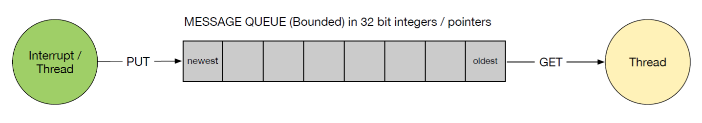
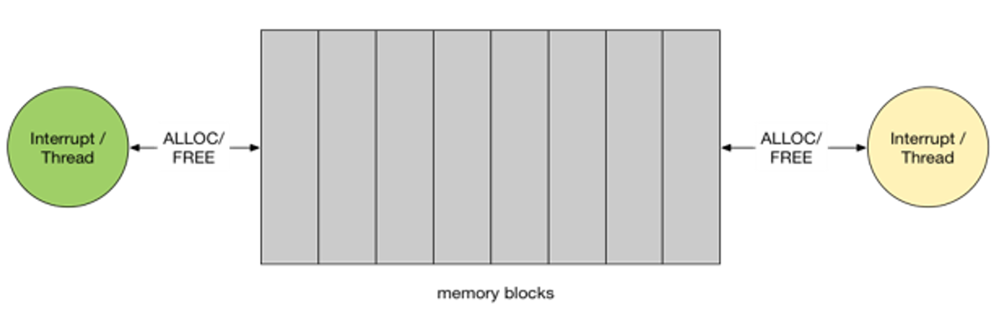
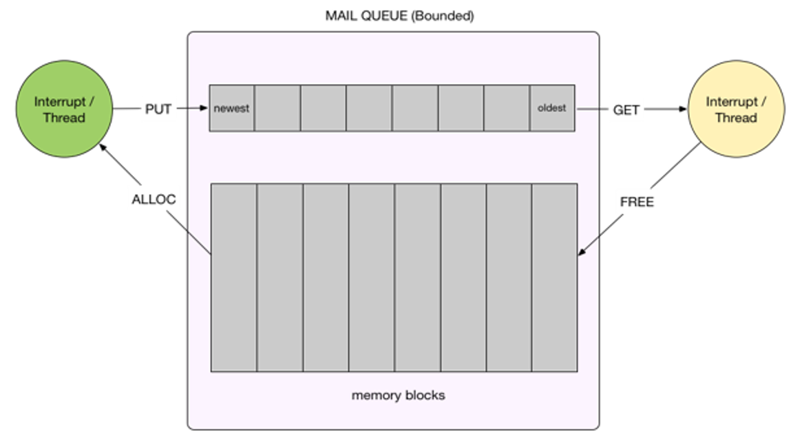
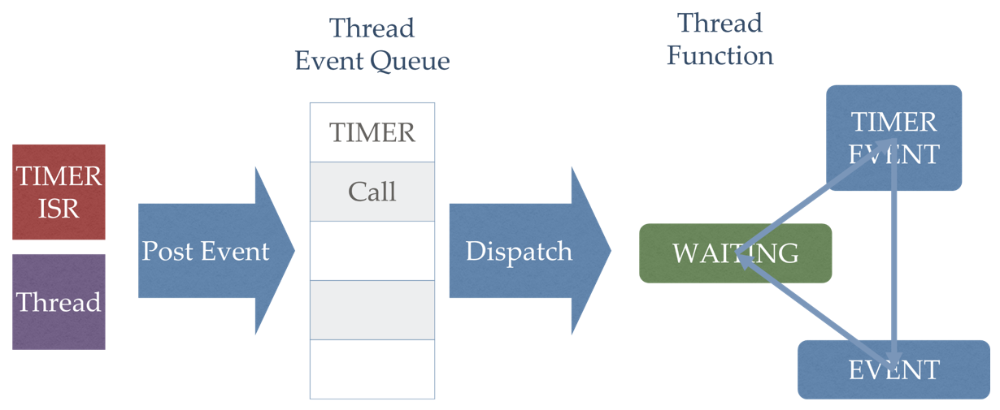

[Back to Contents](README.md)

---

# Thread Abstractions
I could not think of the right title for this section, so I've gone with _thread abstractions_. Multi-threaded programming is in itself an abstraction. The presence of a scheduler and small operating system abstracts you from both the hardware specifics and the job of task switching.

> As problems scale, if you write code at a bare-metal level, you may find yourself replicating the facilities that an RTOS provides.

We have already met what one might call "multi-threading primitives"

* Threads
* Mutex locks
* Counting semaphores
* Condition variables
* Signal-wait

Writing efficient and safe multi-threaded code using these facilities is a non-trivial task of course. 

> What you might discover is that over time, this can become somewhat repetitive as you encounter similar same problems in different projects.

It has been recognised that there are some common tasks which can be identified with known good solutions. Thankfully, some of these common tasks have been anticipated and provided (as classes) for you to reuse. 

> For such tasks, it is usually advisable to not try and reinvent your own solutions and to reuse well established and tested libraries.

Pre-built solutions to such common tasks are what this section is about and includes:

* FIFO Queues for safely moving data from an interrupt/thread to another interrupt/thread
* Memory pools for safe memory allocation and deallocation
* Mailboxes which combine the above
* EventQueues for safely "dispatching tasks" to run on other threads either once or periodically.

All the above must be thread-safe and where blocking is employed, should block in the `WAITING` state.

> In some sense, we are introducing another layer of abstraction, protecting us from the complex details of certain multi-threaded tasks. 

## Message Queues

Where data is shared between threads, mbed offers some higher
level objects to help data move across thread boundaries or
between an interrupt and a another interrupt or (more typically) thread.

The first of these is the message queue. This is an object that can be used to safely move data between threads and/or
interrupts. It is backed by a FIFO buffer.

In Mbed os, a message queue can be represented by the figure
below:

<figure>

<figcaption>Message Queue - backed by a FIFO buffer</figcaption>
</figure>

The queue is backed by a fixed size (bounded) array. Data that is “put” in one end are added to the queue. If the queue is full, the put function will return an error code indicating that there are no more free resources.

The consumer end will “get” samples from the queue. For an
empty queue, this is blocking if a timeout is specified. There are non-blocking versions as well.

A key feature of this object is that the API for the message queue is both thread and interrupt safe.

A limitation of this object is that it can only send 32-bit integers. These can be integer values, or more often **pointers**. In the case of the latter, further support is needed for thread-safe access to shared memory. See the entry on memory pools.

In the next task, you will send data at constant intervals using a timer interrupt. This interrupt (producer) will pass the data to a thread (consumer) via a message queue. The thread will get data from the queue and write it to the terminal. We will examine the impact of blocking in both the producer and consumer.

| TASK-380 | Message Queues |
| --- | --- |
| 1. | Make Task-380 your active project. Read the code carefully |
| 2. | Build and run. |
| -  | The green LED should flash ON/OFF once a second. You can use this to help with the tasks below |
| -  | Check the serial terminal to see data being read from the queue and displayed |
| 3. | Press and hold button A to stop sending data into the buffer for 5 seconds. What happens? |
| 4. | Press and hold button A to stop sending data into the buffer for more than 10 seconds (to allow the buffer to become empty). What happens? |
| 5. | Press and hold button B for 5 seconds (to pause reading data from the buffer). What happens (check the LEDs)? |
| 6. | Press and hold button B for >10 seconds (to allow the buffer to fill). What happens (check the LEDs - `printf` cannot be used in an ISR)? |

This exercise illustrates a few key points:

* The Message Queue is a FIFO buffer - First In, First Out
* The buffering nature of the queue gives this system **timing slack**.
    * If the consumer end is busy, the producer (ISR) can still save the incoming data and is not held up.
    * If the producer end is busy, the consumer will read data as long as there is data in the buffer. Otherwise it will block
* Writing to the message queue is usually non-blocking (although other variants exist)
    * A boolean false is returned if the buffer is full
    * A write can be safely performed in a thread context. The write is said to be both thread and interrupt safe
* Reading from a message queue can be blocking
    * A timeout can be (optional) specified to detect deadlocks
    * Read can be safely performed in a thread or an interrupt. However, if a timeout is specified, it will block in the `WAITING` state when the buffer is empty. In such cases, _it should not be performed in an ISR because it is blocking_ (see the non-blocking APIs)

Note how you did not need to use any mutex locks, signals or semaphores? This is all done for you. You can put and fetch data and not concern yourself with thread synchronisation.

The blocking read is a key property of the queue. 

> The idea is that if there is no data in the buffer, there is nothing to do, so read can simply block.
>
> Writing data into the queue will unblock it, and in a thread-safe and interrupt-safe way.
>
> The queue is uni-directional.

**Note**
Used standalone, the `Queue` class can only send 32-bit integers (type `uint32_t*`). The expectation (as we will learn later) is that pointers will be sent through the queue.

> Why `uint32_t*`? That looks scary!
>
> Do not be put off by the data type being a pointer. 
>
> Remember that at a physical level, there is no difference between `uint32_t` and `uint32_t*`. **Both are simply 32-bit integers** (size is platform specific). *The only difference is how the compiler interprets operations, such as arithmetic*

### Challenge
Can you add a watch-dog to this application so that if the buffer becomes full, the device resets?

### Pointer Arithmetic Challenge
Consider the two sections of code below:

```C++
uint32_t u = 0;
u = u + 1;

uint32_t* v = 0;
v = v + 1;
```

Can you predict the final values of `u` and `v`? Explain.

*Hint:* If you use `printf`, you can use the `%p` placeholder for pointer types (instead of `%u`).

## Memory Pool
In the previous example, a message queue was used to (safely)
pass a simple integer from an ISR to a thread. In the next task, we pass a more complex data structure with the aid of another object, a memory pool.

<figure>

<figcaption>Memory pool. A pre-allocated block of memory divided into equal size segments. Each segment is enough space for the specified data type</figcaption>
</figure>

A memory pool is a pre-allocated block of memory, divided up into equal size segments. It provides a thread-safe and interrupt-safe mechanism to "requesting" and "releasing" a block of memory.

We then fill this segment of memory with some data and send the address through a message queue.

| TASK-382 | Memory Pools |
| --- | --- |
| 1. | Build and run Task 382. Use the serial monitor to view the output |
| 2. | Add some code to the ISR to busy-wait block on buttonA |
| - | What happens if you hold down buttonA? |
| 3. | Add some code to the consumer thread to busy-wait block on buttonB |
| - | What happens if you hold down buttonB? |
| 4. | For each interrupt, how many bytes are sent by the message queue to the consumer thread? |
| 5. |  The objects use shared memory without any locks. Why is this code thread safe? |

First, let's look at how we create the memory pool:

```C++
//Memory Pool - with capacity for 16 message_t types
MemoryPool<message_t, 16> mpool;

//Message queue - matched to the memory pool
Queue<message_t, 16> queue;
```

Both the Memory Pool and Queue has the same dimensions (16). However:

* The memory pool reserves `16 * sizeof(message_t)`
* The queue reserves space for 16 pointers

The angle brackets are a C++ feature known as **templates**. This is a somewhat advanced C++ topic, but one well worth researching.

Note the following code in the ISR:

```C++
message_t* message = mpool.try_alloc();
```

This asks the memory pool for a block of memory (same size as the structure type `message_t`). It is NON BLOCKING and will return NULL if the memory is already fully allocated.
It can also be called from an ISR context.

Note that `message` is a pointer to a block of memory. This is now filled with data as follows:

message->fValue = sample;
message->sw1State = switch1State;
message->sw2State = switch2State;
```

We then send the pointer to this block down the queue.

```C++
bool ok = queue.try_put(message);
```

At the receiving end (thread), we see the blocking call to read data from the queue:

```C++
message_t* payload;

//Block on the queue (non blocking versions exist)
bool ok = queue.try_get_for(10s, &payload);
```

Note that the pointer is now copied into the variable `payload`. **The next two steps are very important**:

1. You must copy the data pointed to by `payload` into a (local) variable, in this case `msg`

```C++
message_t msg(payload->fValue, payload->sw1State, payload->sw2State);
```

Here we use a constructor to create a new instance of `message_t` and copy the values.

2. Once you have a copy, you must free the memory up for another sample:

```C++
mpool.free(payload);
```

If you forget to free the memory, the memory pool will fill and attempts to allocate will return a `NULL`.

### Dynamic memory vs memory pools
Some might be wondering why we need this given dynamic memory allocation already exists in C and C++.

For those unsure what this means, this is where you also request a quantity of memory from the region of the system memory known as the **heap**.

* In C you use `malloc` to request a block of bytes and `free` to return it
* In C++ you use `new` and `delete`

Dynamic memory allocation can be both slow and hazardous. 

* Memory leaks can occur if you forget to free even 1 byte
* It takes time to locate and allocate a block of memory
* It makes it harder to guarantee the total memory requirement does not exceed the system memory during any point of execution.
* Memory can become fragmented
* Do not assume `malloc/free` (C) or `new/delete` (C++) are re-entrant.

> For these reasons, preallocating memory is recommended for embedded systems. It helps us guarantee that the system will not run out of memory if left to run for long periods of time.

The disadvantages of memory pools are:

* You preallocate memory even if you never use it all
* Each block must be the same size. Dynamic memory allocation allows you to allocate blocks of an arbitrary size.

### Challenge
Change the interrupt from a timer to a switch press. If **either** switch A or B are pressed and then released, the `switchISR` function should be invoked.

* Use the same ISR for both switches
* Add a watch-dog to reset the board if nothing is pressed within 30s.

## Mailbox
As you probably appreciate, the queue and memory pool are designed to work together, so much so that the `Mailbox` class uses composition to combine them together.

<figure>

<figcaption>Mailbox - encapsulating both a message queue and memory pool</figcaption>
</figure>


| TASK-384 | Mailbox |
| --- | --- |
| 1. | Make Task-384 your active program. |
| -  | Study the code. Build and run, while watching the serial monitor |

This code is quite similar to the previous examples. Instead of creating a queue and memory pool, you now only need one object:

```C++
Mail<message_t, 16> mail_box;
```

Acquiring memory is also similar:

```C++
message_t* message = mail_box.try_alloc();
```

What is slightly different is the `put` function:

```C++
osStatus stat = mail_box.put(message);
```

> **Note:** At the time of writing, this returns a value of type `osStatus`. If `message` is not `NULL`, then given the queue is the same size as the mailbox, there must be room so this should always succeed. The return type is somewhat redundant and is expected to be deprecated (see comments in `Mail.h`)

In the consumer thread, we again use a blocking call with a timeout:

```C++
message_t* payload;

//Block on the queue
payload = mail_box.try_get_for(10s);
```

> Note that non-blocking variants exist

## What about interrupts?
In the examples above, data has been copied from an interrupt context to a thread. Other options to consider:

* Interrupt to thread - a very useful way to cross from the ISR context to the thread context.
* Thread to thread - useful for passing data between threads as the synchronisation and buffering is built in
* Thread to interrupt - this requires use of the non-blocking APIs for get.  
* Interrupt to interrupt - both ends use non-blocking APIs (although I've not tried this!)

So yes, these can be used with interrupts for both put and get, but you need to ensure that interrupts should never be blocked.

## Event Queues
I confess this is my personal favourite and they deserve some exploration.

One of the most interesting objects in Mbed os is the EventQueue. This is something that will feel familiar to developers on mobile and desktop computing platforms. In essence, for a given thread, it is possible to have a queue of jobs that will be performed **sequentially** (one after the other). Furthermore, tasks can be posted to a queue from any context (another thread or ISR). 

> A task in this context is “calling a function, with optional parameters”.

<figure>

<figcaption>Event Queue Concept: </figcaption>
</figure>

The event queue will "dispatch" each task in a defined sequence on the thread in which it is running.

Tasks can be set to run in the following ways:

* Periodically
* After a delay (which can be zero)

A key point is that all queued tasks (in given queue, running in a dedicated thread) will run atomically and in  sequence with respect to each other. In other words, non of the tasks in an event queue can pre-empt each other.

Of course, they can pre-empt tasks on other threads.

Some uses cases for this are:

* An interrupt can easily defer non-real-time tasks to a background thread (allowing it to exit more quickly)
* Queuing up non re-entrant functions - thus helping to avoid
race conditions
* Queues can also be chained together, and allow the developer to synchronise operations to avoid races and maximise throughput.

Remember that you can do much more in a thread than you can in an ISR. Nearly every object in Mbed os is protected and thread safe whereas only a minority are interrupt safe. The same applies to the standard library (`printf`, `scanf` etc.).

| TASK-386 | Event Queues |
| --- | --- |
| 1. | Make Task 386 your active program. Build and run it |
| 2. | Monitor the serial terminal. Every time the red LED lights, press and release the blue user button |
| -  | Note the number of switch bounces! |

This task is not about switch-bounce per-se, but about how you can use event queues to simplify your code.

This application has two threads:

* main
* `t1`

For each thread, an instance of `EventQueue` has been created for illustrative purposes.

```C++
EventQueue mainQueue;
EventQueue workerQueue;
```

Early in the code, the function `workerThread` is run in a parallel thread.

```C++
t1.start(workerThread);
...
void workerThread()
{
    workerQueue.dispatch_forever();
}
...
```

This function has only one task: to run `workerQueue.dispatch_forever()`

From the documentation, it says "Dispatch events without a timeout." So what does this mean?

> Dispatch queues initially block and wait for tasks to be sent to them.
>
> As tasks are received, these are held in a queue and dispatched in turn. Tasks are essentially functions and their parameters. These tasks are run in sequential order, and not concurrently. 
>
> From an ISR or another thread, you can add a task to the queue.
>
> There there are no tasks to perform, they block in the `WAITING` state. 

We can see a number of examples in this application:

```C++
workerQueue.call_in(3s, printf, "(Note the switch bounce)\n");
```

This requests that the queue `workerQueue` (on thread `t1`) dispatches the function `printf("(Note the switch bounce)\n")` in 3 seconds time.

```C++
mainQueue.call_every(2s, heartBeat);
```

This requests that the queue (on the main thread) dispatches the function `heartBeat()` every 2 seconds

```C++
workerQueue.call(addSample, t);
```

Called from the switch ISR, this requests that the function `addSample(t)` is dispatched at the next opportunity(on thread `t1`). 

* `addSample` is non-reentrant and not thread safe as it uses static local variables. It does not contain any mutex locks either.
    * However, is it is always called on the same event queue, there is no danger of it pre-empting itself, so this is permitted
* Similarly, all the `printf` operations are performed on the same thread `t1` via it's event queue.
    * Although this does contain locks, this is still  useful as it ensures that each `printf` is allowed to fully complete before the next, thus avoiding their output being interleaved.

| TASK-386 | Event Queues |
| --- | --- |
| 3. | Can you modify the `hearBeat()` function to call `printf("Main Thread Alive\n")` by posting this to the workerQueue on thread `t1` |
| - | For your reference, the current `heartBeat` function is as follows |

```C++
void heartBeat() {
    redLED = !redLED;
}
```

## Call-backs, function pointers and lambdas
Something that we have seen multiple times, but possibly did not question, are statements such as this:

```C++
workerQueue.call(addSample, t);
```

You might have wondered why the name of a *function* is passed as a parameter?

### Data Pointers 
Up until this point, you have already used pointers to data. A pointer is a variable that stores an **address**. This variable is a 32-bit integer on the Arm Cortex M4. The syntax for a pointer variable, 

```type* pointerName;```

If pointers are always 32-bit integers, you might wonder why we need a type? The key to this is in *pointer arithmetic* and type-safety (where the compiler tries to help you avoid errors).

Let's consider pointer arithmetic, commonly used in arrays.

```C++
char* pChar;
float* pFloat;

pChar  = 0x1000000000000000; //32-bit address
pFloat = 0x2000000000000000;

//Increment the address values to the next element
pChar  += 1;
pFloat += 1;
```

The result of the two increment operations is very revealing:

`pChar` will equal `0x1000000000000001`
`pFloat` will equal `0x2000000000000004`

The data-type tells the compiler about *the size of the data stored at the pointer address*. This gives it the necessary information to perform integer arithmetic on the pointer itself.

As a consequence, the following operations store data correctly at the correct alignment:

```C++
pChar[0] = 0xFF;    // Address 0x1000000000000000
pChar[1] = 0xAA;    // Address 0x1000000000000001
pFloat[0] = 0.1234; // Address 0x2000000000000000
pFloat[1] = 9.8765; // Address 0x2000000000000004
```

> Another word for a pointer is a reference. When we refer to data using the `*` operator or square brackets `[]`, we call this de-referencing.

The equivalent code is as follows:

```C++
*pChar      = 0xFF;    // Address 0x1000000000000000
*(pChar+1)  = 0xAA;    // Address 0x1000000000000001
*pFloat     = 0.1234;  // Address 0x2000000000000000
*(pFloat+1) = 9.8765;  // Address 0x2000000000000004
```

Equally, the compiler can use this information to help you. The following code would produce a compiler warning or even error:

```C++
pChar[0] = 3.14f;    //Warning!
```

This is known as **type safety**. The C and C++ languages come from a family of type-safe languages, where the emphasis is for the compiler to help you spot errors by enforcing additional language rules.

### Function Pointers
Functions are program code, and program code (blocks of machine code) also reside in the memory of the microcontroller computer. Like data, program code is simply blocks bytes in a computer memory (albeit in a different region). The only fundamental difference is machine code is permitted to be read into the CPU and executed as instructions.

> As program code resides in memory, it therefore follows that we can obtain the address of a function. Such an address can be stored in a variable, and this is known as a **function pointer**.

A function typically has a return type, a name and a list of typed parameters:

```
<return type> name ([type parameter1, type parameter2, ...])
```

Unlike data, there are potentially multiple types to contend with, so the syntax for a function pointer is more complex (and easy to forget!).

```
<return type> (*name) ([type, type, ...]);
```

For example, if we define the following function in our code, it will reside in somewhere in the computer memory:

```C++
bool myFunc(int a, int b) {
    return (a > b) ? true : false;
} 
```

Let's now obtain the address of this function and store it in a function pointer named `fPointer`.

```C++
int main() {
    bool (*fPointer)(int, int);

    fPointer = &myFunc; // Store the address of the function - the & is optional

    //Code continues

    ...
}
```

We can use this to call the function:

```C++
    bool res = fPointer(2,3);   //Type safety in action again!
```

Note again that the compiler can check the data types are correct. More useful, we can pass it as a parameter to another function. Here is an example:

```C++
bool sort(int *data, unsigned N, bool(*sortRule)(int,int) ) 
{
    bool hasupdated = false;
    for (unsigned int n=0; n < (N-1); n++) {
        int u = data[n];
        int v = data[n+1];

        //Apply criteria for sort
        bool swap = sortRule(u,v);
        
        if (swap == true) {
            data[n]   = v; 
            data[n+1] = u;
            hasupdated = true;
        }
    }
    /*  Recursive method
        if (hasupdated) {
            return sort(data, N, sortRule);
        }
    */
    return hasupdated;
}

bool myFunc(int a, int b) {
    return (a > b) ? true : false;
} 
     
int main()
{
    bool (*fPointer)(int, int);
    fPointer = &myFunc; 
    
    int x[] = {4, 2, 3, 1, 7};
    uint16_t N = (sizeof(x)/sizeof(int));
    
    bool updated = false;
    do {
        updated = sort(x, N, fPointer);
    } while (updated == true);
    
    for (unsigned n=0; n<N; n++) {
        cout << x[n] << endl;    
    }
    
    return 0;
}
```

| TASK-387 | Function Pointer Sort |
| --- | --- |
| 1. | Modify the code above to sort in descending order |
| 2. | Can you see scenarios where this code could deadlock? |

Now let's look at something more closely aligned with embedded systems: function call-backs.

### Task-388 - Function Callbacks
In C++, we have learned how we can use both class inheritance, composition, overloading and overriding to extend/adapt functionality. There is another pattern we can use which pre-dates object orientated programming, and that is the "function callback".

| TASK-388 | Function Call-back |
| --- | --- |
| 1. | Open and build Task-388. Read through the code and all the comments |
| 2. | Run the code. Press and release buttons A and B |


Let's highlight some points of interest in this code.

The class has a type definition. The syntax is a different to a regular type definition.

```C++
typedef void(*funcPointer_t)(void);
```

The new type is `funcPointer_t`, and it is a pointer to function that takes no parameters and returns nothing.

We see this used in the class constructor:

```C++
PressAndRelease(PinName buttonPin, funcPointer_t press=NULL) : button(buttonPin), onPress(press)
{
    t1.start(callback(this, &PressAndRelease::handler));
    button.rise(callback(this, &PressAndRelease::button_rise));  
}
```

When the class is instantiated, we see the function pointer being passed as the second parameter:

```C++
    PressAndRelease btnA(BTN1_PIN, &flashLed1);
    PressAndRelease btnB(BTN2_PIN, &flashLed2);
```

where `flashLed1` and `flashLed2` are C-functions. Each are stored in a class member `onPress`.  

```C++
void(*onPress)(void);  
```

The function `flashLed1` is shown below:

```C++
void flashLed1() {
    // This is NOT on the main thread
    flashLed(led1);                         
    //Dispatch printf on main thread
    mainQueue.call(printf, "Button A\n");    
}
```

These functions are invoked from within the class. The chain of events is as follows:

* User presses a button
* ISR runs and signals (unblocks) the waiting thread which does the following:
   * Turns off the press interrupt and invokes the call-back
   * Waits for switch bounce to clear
   * Clears any pending signals (caused by switch bounce)
   * Sets up the falling edge interrupt
   * Blocks waiting for a signal

This sequence is then mostly mirrored for the falling edge detection.

The code sample below highlights some of these steps. Note the call back `onPress()`.

```C++
    void handler() 
    {
        while (true) {
            //Wait for ISR to signal, then unblock
            ThisThread::flags_wait_all(BTN_PRESS);                          
            //Turn off interrupt 
            button.rise(NULL);                                              
            //Callback (from this thread)
            if (onPress) onPress();
            //Debounce
            ThisThread::sleep_for(50ms);                                    
            //Clear any additional signals (due to bounce)
            ThisThread::flags_clear(BTN_PRESS);                             
            //Enable ISR for switch release
            button.fall(callback(this, &PressAndRelease::button_fall));
            ... (continued)
```

> **Important**
>
>  Note that `onPress()` is a C-function located in `main.cpp`, but is called from a separate thread encapsulated in `PressAndRelease`.
>
> We have **three** threads in this code. One for each button, and the main thread. It would be very easy to mistakenly assume `flashLed()` is called on the main thread (and inadvertently create a race condition). 


| TASK-388 | Continued |
| --- | --- |
| 3. | Modify `flashLed1` and `flashLed2` to perform the LED flash on the main thread. |
| 2. | What might be the impact on the timing of the LEDs by doing this? |
| -  |  <p title="The LED toggle will be queued with other jobs, including the (slow) printf statements. This adds significant latency.">Hover over this for a suggested answer</p> |
| 3. | Create a separate lower-priority thread and event queue. Dispatch all  `printf` statements on this thread |

A point to note about this code. Where the code in main instantiates a `PressAndRelease` object, it also *passes a function pointer as a parameter*.

```C++
PressAndRelease btnA(BTN1_PIN, &flashLed1);
```

> The callback function allows us to hook into the `PressAndRelease` event cycle and add custom behaviours.

What is maybe appealing is that the callback code is located in the same file as main, thus keeping related code together. However, we have to create separate functions, so in that sense, related code is still separated within the source file (C does not permit nested functions). It would be really nice if all related code could be kept close together, so that it is easier to understand and debug. In C, this is not always possible. In C++ however, we have an alternative, known as *lambda functions*. These also lead us to a new concept, *closures*.

| TASK-388 | Continued |
| --- | --- |
| 4. | Add a call-back for a switch-release event. Simple use this to print a message about which button has been released. Again, make sure `printf` is performed on the main thread |

## Task-389 - C++ Closures
Function pointers are used extensively in the C language. We also see them used in Mbed OS when we start a thread or attach an interrupt. 

Borrowing from other languages, C++ takes this idea further, and now offers *lambda functions* and *closures*. Here is a brief summary of closures.

### C++ function type
If we have a C-style function

```C++
int increment(int a) {
    return a+1;
}
```

we could write

```C++
function<int(int)> f1;
f1 = increment;
int y = f1(2);
cout << y << endl;
```

This would output the value 3. Note how variable `f1` is a `function` type, that takes an `int` as a parameter and returns an `int`.

###  Simple lambda function

Instead of writing a global function, you can use an inline lambda function as shown below:

```C++
    function<int(int)> f2;
    f2 = [](int a){
        return a-1;
    };

    y = f2(2);
    cout << y << endl;
```

where the output would be `1`. Note the syntax of the function. The square brackets `[]` are used to specify the 'capturing behaviour' (see below). What is noticeable here is how the function and it's invokation are written alongside each other. 

### Using auto - inferring the type

The closure in the code below does not use the `function` keyword. Instead, the **type** of `f3` is automatically determined by the compiler. This is not only convenient, but also essential in some cases (shown below).

```C++ 
auto f3 = [](int a) {
    return a*10;
};

y = f3(2);
cout << y << endl;
```
The output of this code will be `20`.

### Passing a lambda as a parameter

One of the most useful facilities is the ability to pass functions as a parameter. Consider the function below. This takes a parameter of type `function<void(void)>`

```C++
void doThis( function<void(void)> fn ) {
    cout << "***********" << endl;
    fn();
    cout << "***********" << endl;
}
```

Elsewhere, this function can be called, passing in another function as a parameter.

```C++
function<void(void)> fp;
fp = []() {
    cout << "Hello" << endl;
};
doThis(fp); //Pass function as a parameter
```

The output is

```
***********
Hello
***********
```

(The `doThis` function is known as a decorator!. Accepting functions as a parameter is useful for making a function more customisable.

### Capture by value

So far we have focused on lambda functions. However, C++ can do more than a simple function pointer. Lambda functions can actually "capture" data that is in scope (technically, this is becomes known as a *closure* as will be explained). For example:

```C++
    int a = 16;
    auto f4 = [a](void) {
        return a >> 1;
    };
    cout << "By value: y=" << f4() << endl;
    a = 32;
    cout << "By value: y=" << f4() << endl;
```

Note how `a` is in the same scope as `f4`. It is also listed within the square brackets `[a]` which tells the compiler to "capture a copy of `a`". A **copy** of `a` will become available to `f4`. Later when `a` is changed to `32`, this has no impact on the value captured inside `f4`. The output is `8` each time.

You therefore visualise `f4` not just as a function, but as a class. This class would have a new (constant) private property `a`, which is initialised to `16`. In other words, `f4` is not just a simple function (as we saw with function pointers), but an object. We call this type of object a **closure**.

Interestingly, if `f4` is now passed as a parameter (as was done in the previous section), both the data and the function are passed together as one data structure.

> You might wonder why `d4` has an automatically determined type (using the `auto` keyword). This is related to the capturing behaviour, which in turn, changes it's type (according to the rules of C++). In fact, in this instance you must use `auto`.

There are different rules for *capturing behaviour*, and it is worth looking at some of these now.

### Capture by reference
In the previous section, we saw an example of *capture by value*. This implies that any data captured by a closure is copied. Conversely, we can also **capture by reference**.

A modified example from the previous section is shown below:

```C++
a = 16;
auto f5 = [&a](void) {
    return a >> 1;
};
cout << "By reference: y=" << f5() << endl;
a = 32;
cout << "By reference: y=" << f5() << endl;
```

Note how the capture rules in the square brackets have changed to `[&a]`. This means capture `a` by reference. You can think of a reference as another word for address. Therefore, if `a` were to change outside the closure, this will impact on the value inside. In the example, here the outputs is first `8` and then `16`.

###  Capture by reference and value
If it possible to use both value and reference semantics. Consider the example below. Can you predict the outputs?

```C++
    int b = 10;
    auto f6 = [&a,b]() {
        cout << a << endl;
        cout << b << endl;
        a = b;
    };

    cout << "a = " << a << endl;
    cout << "b = " << b << endl;
    f6();
    cout << "a = " << a << endl;
    cout << "b = " << b << endl;

```

`b` is captured by value, so external changes have no effect on `f6`. However, `a` is captured by reference, so the `a` inside and outside the closure are same (they have the same address).

### Returning a closure 
Not only is it possible to pass closures as parameters, it is also possible to return them. Consider the following example:

```C++
    // Return another closure
    auto f7 = [](int a) {
        //Create another lambda that captures a
        auto f = [a]() {
            static int sum = a;
            sum++;
            return sum;
        };
        return f;
    };

    auto acc = f7(10);
    y = acc();
    cout << "y = " << y << endl;
    y = acc();
    cout << "y = " << y << endl;
```

Look closely at `f7`. Within this closure, another closure is created. This closure captures `a` (by value) and maintains a copy in a static local variable `sum`. This `closure` is then returned and held in `acc`. Remember it is a closure that is returned, not just data.

This closure is then invoked twice as shown. The outputs are `11` and `12`.

This might all seem rather confusing (especially this last example). It really does take practise to understand them. There is also more that could be said of course.

### Capturing Rules
The capturing rules are listed in the square brackets `[]`

* [] - nothing is captured
* [=] - default is to capture by value
* [&] - default is to capture by reference
* [&,a] - capture by reference, except for `a` which is captured by value
* [=,&a] - capture by value, except for `a` which is captured by reference


## Task 389 - Using Lambda Functions and Closures for call-backs | 
Let's modify the example in the previous section to use closures.

| TASK-389 | Lambda Functions and Closures |
| --- | --- |
| 1. | Make Task-389 the active program |
| 2. | Read through the code and all the comments |
| 3. | Run the application. Press button A and observe the LED and the serial output |

Let's now look at what has changed. First, the `PressAndRelease` class

```C++
class PressAndRelease {
private:
    typedef enum {BTN_PRESS=1, BTN_RELEASE=2} ISR_EVENT;
    Thread t1;
    InterruptIn button;

    void handler() 
    {
        while (true) {
            ThisThread::flags_wait_all(BTN_PRESS);
            button.rise(NULL);
            onPress();      //Call back

            ThisThread::sleep_for(50ms);
            ThisThread::flags_clear(BTN_PRESS);
            button.fall( [&]() { t1.flags_set(BTN_RELEASE); } );

            ThisThread::flags_wait_all(BTN_RELEASE);
            button.fall(NULL);
            onRelease();    //Call back

            ThisThread::sleep_for(50ms);
            ThisThread::flags_clear(BTN_RELEASE);
            button.rise( [&]() { t1.flags_set(BTN_PRESS); } );
        }
    }

    //Hooks into the button press and release events
    function<void()> onPress;
    function<void()> onRelease;

public:
    PressAndRelease(PinName buttonPin, function<void()> press = [](){},  function<void()> rel = [](){}) : 
        button(buttonPin), onPress(press), onRelease(rel)
    {
        t1.start(callback(this, &PressAndRelease::handler));
        button.rise( [&]() { t1.flags_set(BTN_PRESS); } );
    }

    Thread& getThread() {
        return t1;
    }
};
```

First note that the two private functions (interrupt service routines) have been removed. They have been replaced with closures.

```C++
button.rise( [&]() { t1.flags_set(BTN_PRESS); } );
```

and

```C++
button.fall( [&]() { t1.flags_set(BTN_RELEASE); } );
```

This serves to keep the code together in one place.

In the `main` function, we also see more use of closures:

```C++
int main() {  
    //Event queue for main (normal priority thread)
    EventQueue mainQueue;

    //Setup a lower-priority event queue for printf statements
    EventQueue msgQueue;
    Thread t1(osPriorityBelowNormal);
    t1.start([&]() {msgQueue.dispatch_forever();});

    //Instantiate a couple DigitalOut objects for controlling LEDs 
    DigitalOut led1(LED1);
    DigitalOut led2(LED2);

    //Write closures for capturing the LEDs (by reference) and performing call-back operations
    auto lFuncApress = [&]() {
        led1 = 1;                                   
        msgQueue.call(printf, "Button A pressed\n");
    };
    auto lFuncArel = [&]() {
        led1 = 0;
    };    

    // Note that no DigitalOut type needs to be passed via the constructor.
    // It is all "captured" inside the two closures
    PressAndRelease btnA(BTN1_PIN, lFuncApress, lFuncArel);

    //Dispatch jobs on the main thread
    mainQueue.dispatch_forever();
}
```

The thread and event queue for logging text to the serial terminal is written very concisely:

```C++
EventQueue msgQueue;
Thread t1(osPriorityBelowNormal);
t1.start([&]() {msgQueue.dispatch_forever();});
```

The `PressAndRelease` class is instantiated with two closures as parameters.

```C++
PressAndRelease btnA(BTN1_PIN, lFuncApress, lFuncArel);
```

The first is used as a call-back when the switch is pressed, and the second for when the switch is released. Note however that these closes run on the thread encapsulated in the object `btnA`. 

If we look at the first of these closures:

```C++
auto lFuncApress = [&]() {
    led1 = 1;                                   
    msgQueue.call(printf, "Button A pressed\n");
};
```

We note the following:

* The LED is flashed using a different thread to `main`. 
   * This is ok as `led1` has the type `DigitalOut` which is thread-safe.
* `printf` is always dispatched to a queue on a lower priority thread.
   * This ensures the serial interface does not slow down other operations and prevents text from becoming interleaved.

| TASK-389 | Continued |
| --- | --- |
| 4. | Update the code to use Button B to control `led2` |
| -  | Try and keep your changes minimal |

| Challenge |
| --- |
| Write an application that updates the LCD with the time once a second. Use the real time clock and an event queue. Use closures where possible to keep your code compact |

## Reflection
Event queues are incredibly useful and can really simplify your code.

A critical points are:

* Each event queue runs in it's own thread
* All functions dispatched by an event queue are allowed to complete and are atomic with respect to each other

A useful use-case it to separate different tasks to run on different event queues.

* If all functions sharing some mutable data can be run on the same event queue, then races can be avoided
* Functions that are non-re-entrant do not need locks if only run on the same event queue
* Using call-backs is another technique for extending and customising functionality. Care needs to be exercised about which thread a call-back (function pointer or closure) is run on. 
* Closures are difficult to understand, so be aware that even if you understand them, others may not. The capturing behaviour in particular may be unfamiliar to many people. Remember to comment your code.

---

[Next - Lab8 - Network Programming](network_programming.md)
