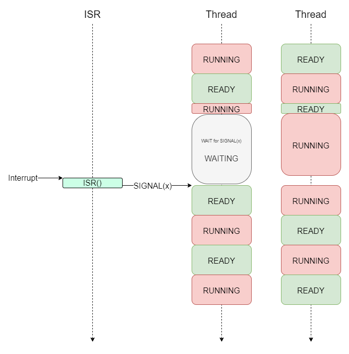
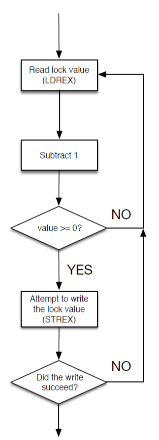
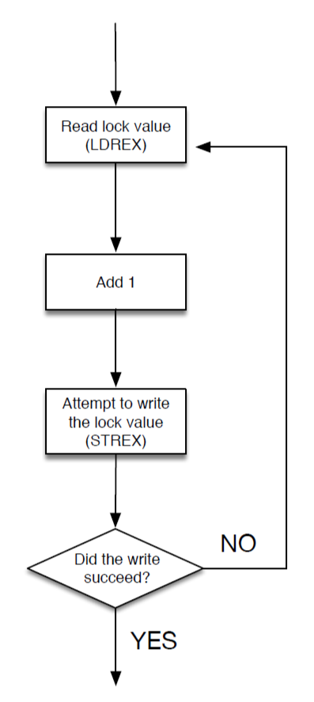
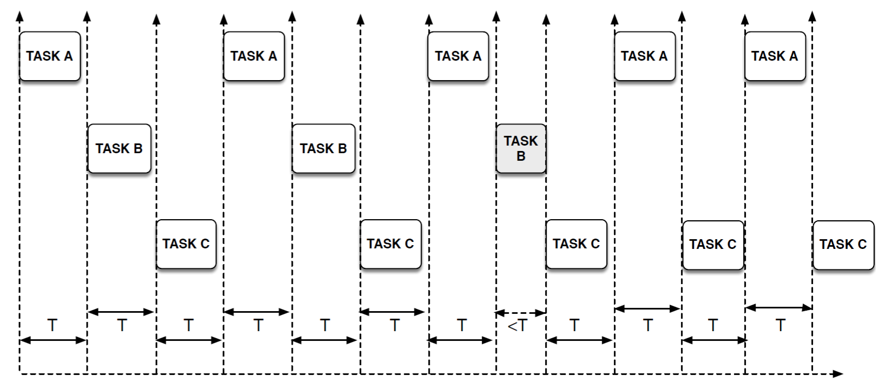
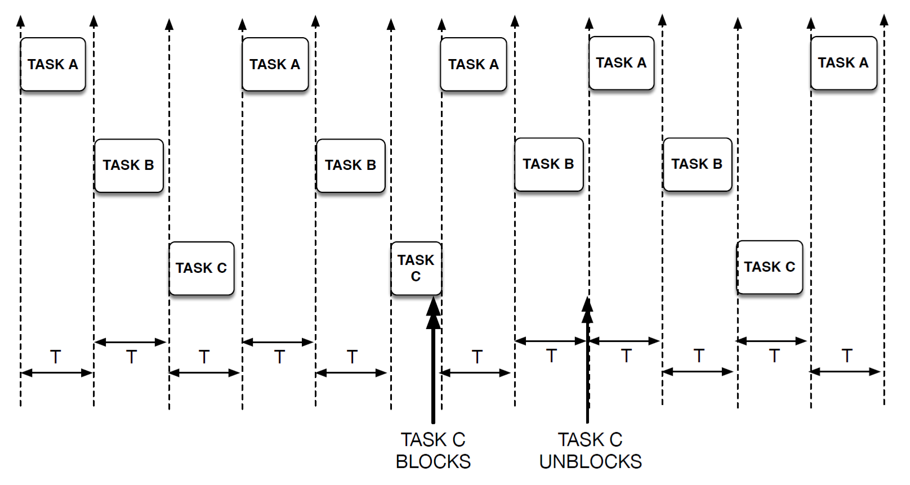
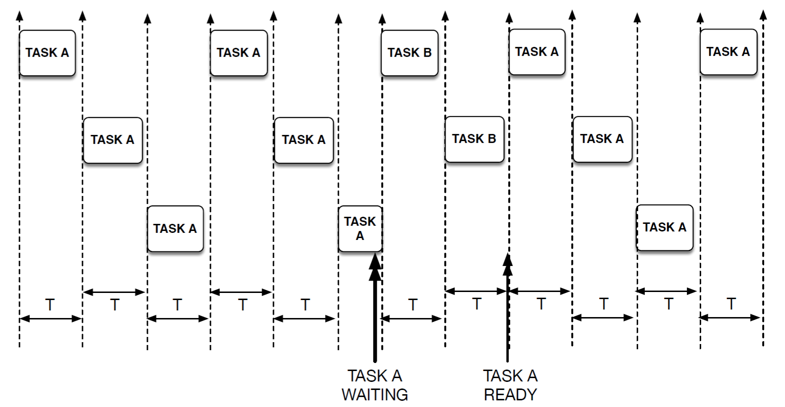

[Back to Contents](README.md)

---

# Multi-Tasking with Multi-Threaded Programming
In the previous sections, we met two techniques for managing multiple hardware devices:

* Rapid Polling
    * Whereby hardware is polled without blocking
    * Internal state has to be managed to keep track of changes
    * This has the disadvantage of being wasteful of CPU cycles and power, as well as becoming unwieldy as the task scales.
    * This has the benefit of being safe - there are no risks of race conditions with this approach.
* Interrupts
    * Whereby the hardware forces the CPU to branch in response to a change in the hardware.
    * This has the advantage of allowing the CPU to sleep in lower power states, only to wake when a hardware event occurs.
    * This has several disadvantages. Race conditions can easily occur and remain undetected; not many functions are interrupt safe (re-entrant).
    * Code involves out of sequence programming which can be hard to write and interpret

Both these techniques are valid and have their place. 

> Remember that this discussion started with **Blocking** (by spinning / busy-wait loop), which is arguably the simplest way to interact with hardware. 
>
> However, blocking is considered an _anti-pattern_ and is not permitted in either of these two approaches.  


There is another technique that allows use to interact with multiple devices and still use simple coding styles such as blocking whilst remaining power-efficient. 

> That technique is known as **multi-threaded programming**.

**multi-threaded programming** is a technique that allows the developer to write and execute _functions_ **concurrently**, that is, seeming to execute in parallel. 

> A **thread** is simply a function that is scheduled to run in parallel with other thread functions

This idea is not new and has been around for a long time. It was always designed to work on a single-core CPU (as we typically have in our embedded devices). This is achieved by rapid **task switching**.

> Under the hood, **task switching** is quite involved. The good news is that the responsibility for task switching is taken away from the developer so they can concentrate on writing their code. Task switching is performed by an operating system with a real-time scheduler. Mbed os is such an operating system.

* Note that automatic task switching which comes with overheads, including larger code size, memory consumption and CPU overheads.
* For complex tasks, such as networking, an RTOS is usually the best (and sometimes only) way to keep code complexity down to a manageable level.
* Hardware support for **threads** is much wider than interrupts
* Thread switching is still based on a Timer interrupt, so suffers the same risk of race conditions

## Why Mbed OS?
Mbed os is what we call a **Real Time Operating System (RTOS)**. It is C++ wrapper around the established [CMSIS-RTOS](https://www.keil.com/pack/doc/CMSIS/RTOS2/html/index.html).

The scheduler is also suited to real-time tasks, the sort we often encounter in embedded systems.

> There is nothing unusual about Mbed OS except that it allows for very rapid development. The _concepts_ you will learn are the same for other (more complex) systems. In education,we call this a _transferable skill_.

It might also be worth noting that an undergraduate student should not spend more than 20-30Hrs on a single assignment. This is less than a working week for most graduate engineers!

With that in mind, let's look at how we create some threads in Mbed OS!

## Template Code (Important)
Until this point, every project has had a small file `mbed_app.json` with the following contents:

```JSON
{
    "requires": ["bare-metal"],
    "target_overrides": {
        "*": {
            "target.printf_lib": "std"
        }
    }
}
```

This forces Mbed os to use the "bare metal" profile. This has the following implications:

* A shorter build time
* A smaller binary file
* No operating system scheduler, and hence all timer interrupts are turned off.

From this point, for each application that is multi-threaded, we will use the following profile:

```JSON
{
    "target_overrides": {
        "NUCLEO_F429ZI": {
            "target.printf_lib": "std",
            "target.components_add": ["SD"]
        }
    }
}
```

> You will find this in the project `TemplateApp-300`.
>
> If you wish to use shared mbed-os libraries, make sure you share with this project

This is no longer a bare-metal project, thus enables the scheduler. We also add support for the SD card filing system.

* Projects will take significantly longer to build (on the first occasion) and deploy to your board.
* Do not use the `sleep()` function - allow the RTOS to manage this for you

## The two-switch task
The purpose of this task is compare and contrast some of the merits of the following techniques:

* Rapid Polling (Task-360A)
* Interrupts (Task-360B)
* Threads (Task-360C)

The task is very simple:

* The yellow LED shall flash ON and OFF independently.
* Pressing Button A will toggle the red LED
* Pressing Button B will toggle the green LED

All switches must be debounced.


### Polling Method
This first variant uses a rapid polling method to implement a solution. The C++ class `SWPoll` was created to keep this code clean and tidy.

| TASK 360A | Polling |
| --- | --- |
| 1.  | Make Task-360A the Active Program |
| -   | Note this still uses the bare-metal profile |
| 2.  | Build and run. |
| -   | Press and release buttons A and B |
| 3.  | Using the debugger, step through the code to understand how it works |

If you study `SWPoll.hpp`, you can see how both `Timer` and `DigitalIn` types are used for inputs. These are both polled and there is no spinning anywhere in the code**.

> The polling speed is very high, so high that the LED does not have sufficient time to illuminate. If you add a 1&mu;s delay, you will see it flash with 50% duty cycle.

### Interrupt Based Method
The second variant is based entirely on interrupts. This example demonstrates the CPU being put in sleep mode as often as possible.

| TASK 360B | Interrupts |
| --- | --- |
| 1.  | Make Task-360B the Active Program |
| -   | Note this still uses the bare-metal profile |
| 2.  | Build and run. |
| -   | Press and release buttons A and B |
| 3.  | Using the debugger and by setting breakpoints in the interrupt service routines, step through the code to understand how it works |

Again, a C++ class `SwitchManager` is created to try and minimise repetition. There are some useful tips that come from this example:

The the three sets of interrupts are setup as follows:

```C++
    //Interrupt controlled red led using BTN1
    SwitchManager sm1(BTN1_PIN, TRAF_RED1_PIN);

    //Interrupt controlled green led using BTN2    
    SwitchManager sm2(BTN2_PIN, TRAF_GRN1_PIN);    
    
    //Simple ticker for the yellow LED
    yellowTick.attach(&toggleYellowISR, 500ms);
```

Note how the two instances of `SwitchManager` are provided with the necessary information through the constructor.

| TASK 360B | Interrupts |
| --- | --- |
| 4.  | Using a break-point, can you debug the constructors for both `sm1` and `sm2`?  |

The ticker is set up manually, but it is very simple.

The main loop has only two lines:

```C++
    while(1) { 
        sleep();
        printf("count=%u\n",SwitchManager::getCount());
    };
```

> **Question** - when you run the code, the same count value is often written to the terminal. Why is this?
> 
> <p title="The CPU is woken from sleep every 500ms by the Ticker">Hover your mouse here for the answer</p>

| TASK 360B | Interrupts |
| --- | --- |
| 5.  | The total number of switch presses is stored in a variable`count` that is shared between `sm1` and `sm2`, and is accessed via the function `SwitchManager::getCount()`  |
| -   | What is different about `count` and `getCount()`?  |
| -   | <p title="They are static, so belong to the class object and not any single object">Hover here for the answer</p> |
| 6. | **Challenge** For practise, now write your own class to handles all the code for flashing of the yellow LED. |
| -  | To make this work, all you should need to do is instantiate your class, passing in a `PinName` for the LED`. Use composition or inheritance (composition is easier). |

Note again the effort required to make the code simple and scale gracefully. Chaining interrupts together is quite hard to follow and even harder to write correctly.

| TASK 360B | Interrupts |
| --- | --- |
| 7.  | Did you spot anything in this code that could result in a race condition? |
| -   | How likely is it you would have noticed any errors caused by race conditions? |

Yes, there is a potential race condition. The most likely is in `main`, when reading the value of `count` via `getCount()`.

> While in the process of reading `count`, it is possible a switch could be pressed (see `waitForRising()`). This low-probability timing could corrupt it's value. But did you spot it?
>
> Can you spot any more situations?

| TASK 360B | Interrupts |
| --- | --- |
| 8.  | Can you remote the race condition bug by making the `SwitchManager` class interrupt safe? |
| -  | Hint: Use the class `CritcalSectionLock` |
| -  | Read the documentation to see how to use it |
| -  | See `Task-360B-ISR-Soln` for a solution |

For such a simple task, that was quite a bit of work! Interrupts can be difficult to work with. Now finally, we look at threads as the third alternative. 

| TASK 360C | Threads |
| --- | --- |
| 1.  | Make Task-360C the Active Program |
| -   | Note this does NOT use the bare-metal profile |
| 2.  | Build and run. |
| -   | Press and release buttons A and B |
| 3.  | Using the debugger and by setting breakpoints, step through the code to try and understand how it works |
| -  |  For now, don't look at `task2()` as this needs further explanation |

Let's start with the two switches. In `main`, we note the following:

* There are two functions `task1()` and `task2()`
* There are two objects of type `Thread`, namely `t1` and `t2`

We can run both `task1()` and `task2()` **concurrently** (in parallel) by starting each on separate threads

```C++
t1.start(task1);
t2.start(task2);
```

It really is that simple. 

> Of course, a lot of work is done behind the scenes to make this possible.

### `task1()` and blocking
Take a look inside `task1()` and we see something that may surprise you:

```C++
void task1() {
    DigitalOut red_led(TRAF_RED1_PIN);  
    DigitalIn sw1(BTN1_PIN);
    red_led = sw1;
    
    while(true) {
        while (sw1 == 0) {};            //BLOCKS via SPINNING
        ThisThread::sleep_for(50ms);    //Blocks in the WAITING state
        while (sw1 == 1) {};            //BLOCKS via SPINNING
        red_led = !red_led;             
        ThisThread::sleep_for(50ms);    //Blocks in the WAITING state
    }    
}
```

Firstly, we have a while-loop that loops forever. 
> This is quite unlike an ISR which should always run and exit as fast as possible.

Inside the while loop we see something that was previously described as an _anti-pattern_, a busy wait loop (or spinning):

```C++
while (sw1 == 0) {}; 
```

Although not power efficient, this is perfectly allowed and has the benefit of simplicity.

> The reason this is permitted? 
>
> Because it is running in a thread, and therefore will not occupy all the CPU time. The scheduler will pre-empt it and allow other threads to run, giving each a fair-share of CPU time.
>
> This is handled for you.

There is an argument to say it is still wasting a proportion of the CPU time (and power), but at least it does not impact on the other threads. The other two threads (`main` and `t2`) still get their full allowance of time.

Consider also the simplicity of this code.

```C++
        while (sw1 == 0) {};            //BLOCKS via SPINNING
        ThisThread::sleep_for(50ms);    //Blocks in the WAITING state
        while (sw1 == 1) {};            //BLOCKS via SPINNING
        red_led = !red_led;             
        ThisThread::sleep_for(50ms);    //Blocks in the WAITING state
```

* Block on the switch until pressed
* Wait (for debounce)
* Block on the switch until released
* Wait (for debounce)

We are back where we started when we talked about blocking. However, **there are two blocking mechanisms being used here**:

**Busy-wait blocking (aka spinning)**
Blocking on the switch is clearly utilising all it's allocated CPU time polling the switch.

```C++
while (sw1 == 0) {}; 
```

**Efficient blocking in the `WAITING` state**
For the debounce delay, we could have used a busy-wait loop via `wait_us(50ms)`, but instead, another API was used:

```C++
ThisThread::sleep_for(50ms);
```

This is the `sleep_for()` function in the namespace `ThisThread` (`ThisThread` is not a class). 

In short, this puts the thread to sleep for 50ms. What actually happens is that it puts the CPU into the `WAITING` state for a period of time. This is both CPU and power efficient. 

> In other words, this thread will not be scheduled to run for another 50ms, giving up it's time allocation to other threads.

We say it immediately _yields_ to the scheduler and enters the `WAITING` state. 

* The scheduler only runs threads in the `READY` state
* The current running thread is said to be in the `RUNNING` state
* If all threads are in the `WAITING` state, the CPU enters a sleep mode to save power.


### `task2()` and **signal-wait**
Many objects in Mbed OS are designed to work with threads. For example, reading a serial port will block in the `WAITING` state if there is no data.

So how does this work, or more importantly, how do we acheive this ourselves?

A push switch clearly has no memory or buffering capability, but at the same time, busy-wait loops still waste CPU time and power.

In `task2()`, we use a self-written driver class `PushSwitch` that avoids busy-wait loops entirely. Key to this are the mechanism for interrupts to communicate with threads, known as **signal-wait**. It works like this:

* A thread waits (in the `WAITING` state) for a signal to be sent to it
    * When the signal is received, it returns to the `READY` state, ready to execute it's code once again
* An interrupt (or another thread) can send a signal to the waiting thread.
* The APIs for this are all built into the Mbed os RTOS, and are both interrupt-safe and thread-safe

The signal-wait mechanism is depicted in the figure below:

<figure>

<figcaption>Depicting the signal-wait mechanism for a system with two threads and an interrupt</figcaption>
</figure>

Note the following key points:

* This assumes a round-robin schedule, whereby all (non waiting) threads are given equal epochs of time in strict rotating order.
* While a thread is `WAITING`, other threads can use their time allocation. 
* The ISR could potentially disrupt the scheduler timing, so it is kept very short. It's only role is to respond to a hardware event in real-time and signal a waiting thread. It will then exit.
* Sending a signal is both thread and interrupt safe
* Waiting for a signal is only thread-safe

In this case, the switch interrupt is managed using `InterruptIn` and corresponds to either the rising or falling edge of a switch.

Let's now look at the code in `task2()`:

```C++
void task2() {
    DigitalOut green_led(TRAF_GRN1_PIN);
    PushSwitch button2(BTN2_PIN);

    green_led = button2;    //Blocks until there is a change

    while(true) {
        button2.waitForPress();         //Blocks in the WAITING state 
        ThisThread::sleep_for(50ms);    //Blocks in the WAITING state
        button2.waitForRelease();       //Blocks in the WAITING state
        green_led = !green_led;         
        ThisThread::sleep_for(50ms);    //Blocks in the WAITING state
    }    
}
```

We see an instance of `PushSwitch` replacing `DigitalIn`. It too is associated with a GPIO pin. This has two important APIs:

* `waitForPress()` which blocks in the WAITING state until a rising edge it detected
* `waitForRelease()` which blocks in the WAITING state until a falling edge it detected

> This whole thread spends most of it's time in the `WAITING` state!

#### PushSwitch class
The details are to be found encapsulated in the `PushSwitch` class. 

* Note that this class has the simple role of _waiting for a switch event in a low power state_. Nothing else.
* The debounce wait is already handled in `task2()` using `ThisThread::sleep_for(50ms);`

| TASK 360C | Threads |
| --- | --- |
| 4.  | Open  `PushSwitch.hpp` and study the code carefully |
| -   | Use the debugger to help understand it if needed |

Let's begin with the public API (`waitForPress()` and `waitForRelease()`)

```C++
void waitForPress() {       
    switchInterrupt.rise(callback(this, &PushSwitch::switchPressed));
    ThisThread::flags_wait_any(RISING_EVENT);      
}
```

Here we see two things:

* Setting up an interrupt for a rising edge
    * Note the utility `callback` function, which is used to get the address of an member function
* Blocking, by putting the thread into a `WAITING` state and waiting for a signal "RISING_EVENT"
    * The signal identifier is simple an integer
* This function will unblock and return as soon as the signal is received.

That covers the waiting aspect. The ISR for the rising edge is `PushSwitch::switchPressed()`, and looking at this, we see the signalling part of API:

```C++
void switchPressed() {
    switchInterrupt.rise(NULL);
    osSignalSet(threadID, RISING_EVENT);
}
```

When a switch is pressed, the ISR will run (and will wake the CPU if sleeping). 
* The interrupt is first turned off
* The `RISING_EVENT` signal is then sent to the waiting thread using `osSignalSet`
* The ISR exits

This takes a very short length of time so should not adversely interfere with the timing of the program. A very similar pattern is used for the falling edge.

**One more thing...**
I thought I would just drop this idea in here. The `PushSwitch` class has one more trick which make for an interesting example (and I could not resist)

> The type operator for `int` is overloaded.

What does this mean? Well, consider when you normally use `DigitalIn`, you might do something along these lines:

```C++
DigitalIn sw(D7);
...
int x = sw;
printf("Switch value is %d\n", x);
```

When we write `int x = sw;`, this is short-hand for `int x = sw.read();`

If we use the object as if it was type `int`, then we can write an overloaded function. It makes sense for `PushSwitch` to also offer this API, so it's been added as follows:

```C++
operator int() {
    switchInterrupt.rise(callback(this, &PushSwitch::switchChanged));
    switchInterrupt.fall(callback(this, &PushSwitch::switchChanged));
    ThisThread::flags_wait_any(RISING_EVENT | FALLING_EVENT); 
    return switchInterrupt.read();
}
```

This function blocks in the `WAITING` state, waiting for one of two possible signals from an ISR. When the signal is received, it returns a 1 or 0 depending on the state of the input. The corresponding ISR is here:

```C++
    void switchChanged() {
        switchInterrupt.rise(NULL);
        switchInterrupt.fall(NULL);
        osSignalSet(threadID, RISING_EVENT | FALLING_EVENT);
    }
```

### Thread Priority
So far, all three threads (running `main`, `task1` and `task2`) have the same priority. In Mbed os, this defaults to a **round-robin** scheduling algorithm.

If you were to elevate the priority of one of the threads, it becomes a **priority scheduler**. It is important to know the attributes and risks associated with this.

For a priority scheduler:

* The highest priority thread will keep running and only yield to the scheduler if it enters the `WAITING` state
    * If it never enters the `WAITING` state, it will consume ALL the CPU time. All other threads are said to be **starved**.
    * As soon as this thread unblocks, it will return to the `RUNNING` state and pre-empt any other lower priority thread that happens to be running.

We can see the impact this has with a simple experiment:

| TASK 360C | Threads |
| --- | --- |
| 5.  | Uncomment the line that reads `t1.set_priority(osPriorityRealtime);` |
| -   | Build and run the code. Try pressing A and B. |
| -   | Can you explain the behaviour? |

The mistake here was that `task1()` has a busy-wait loop. It will consume all CPU cycles until a switch it pressed. Only while waiting for the switch-bounce to clear will other threads get any CPU time! Then we are back to spinning inside `task1` again.

| TASK 360C | Threads |
| --- | --- |
| 6.  | Change the line to read `t2.set_priority(osPriorityRealtime);` |
| -   | Build and run the code. Try pressing A and B. |
| -   | Can you explain the difference? |

In the second case, thread `t2` avoid any busy-wait loops, and thus spends most of it's time in the `WAITING_STATE`. 

* This gives ample time for the other threads to run
* It also means that button B takes priority 

That was quite a lot to take in!

### Reflection
In this example, we saw three functions running in separate threads.

* main() - which remains in the `WAITING` state
* task1() - which handles button A
* task2() - which handles button B

In `task1()`, we were able to use simple coding styles and even a busy-wait loop to interface with the input. This works as long as `task1()` has the same / lower priority than the other threads. 

In `task2()`, we added some more sophistication, and leveraged interrupts with the **signal-wait mechanism** to create a thread-safe switch handler that wastes less power and CPU cycles. This was more complex than `task1()`, but once written, is very reusable (with some help from C++). It also enabled this thread to run with higher-priority if needed. 

A key point is that blocking takes two forms:

* busy-wait (spinning) loop
* blocking in the `WAITING` state (scheduler friendly) 

Both are permitted within threads, whereas busy-wait should never be used in an ISR.

> As a general rule, you should not use busy-wait loops in the highest priority thread.
>
> The exception is if you can **guarantee** it will only consume a small percentage of that thread's execution time. 
> 
> Even then, it might get rejected by your team!

## Race Conditions
Threads abstract the task-switching from the developer, so they can write more natural and sequential code in their thread functions, without impacting on the timing of others.

A closer look would show you that this is all driven from a timer interrupt. It is a timer interrupt that pre-empts whatever is currently running.

> You can think of the scheduler as a high-priority timer interrupt service routine, but where most ISRs return to where they were last interrupted, the registers are swapped around so that execution resumes at another point (also previously interrupted). More on this later.

In the previous section, you may have observed that none of the three threads shared any **mutable state**.

> **mutable state** refers to anything that can be modified, such as variables, CPU registers, peripheral I/O registers or even a database table. It does not include constants (which can never change). 

Of course most applications are not that simple. Let us now return to a familiar scenario we met back in the section on Interrupts

| TASK 362A | Threads and Races |
| --- | --- |
| 1.  | Make Task-362A the Active Program |
| -   | Note this still does NOT use the bare-metal profile |
| 2.  | Build and run. |
| 3.  | Run first without pressing the blue button. |
| -   | The green and yellow lights do not come on at the same time and the red light goes out at the end |
| 4.  | Now hold down the Blue button and reset the code |
| -   | What is the final value of count (check the serial terminal) |
| -   | Using the potentiometer, adjust the timing skew between the two threads and repeat 4. Why do you get different results each time? |

If you look at this code carefully, you should recognise this from the section on interrupts. 

> When both threads run concurrently (button down), each can (and will) pre-empt the other at ANY point
>
> The scheduler timer does not know about C or C++, so `counter++` and `counter--` are likely to be interrupted before they complete

Once again, we discover that there is a race condition. 

* The variable `counter` is shared between two threads
* At least one of the threads is modifying `counter` (actually both do, but the condition for a race only requires one)

These are the conditions for a race condition, so we **MUST prevent `counter++` and `counter--` from being pre-empted**.

> For threads, we do **NOT** generally turn off interrupts (that would stop the scheduler and interfere with the task-switch timing).

This problem has been understood for many years, and therefore there is a long standing solutions: the **lock**.

### Thread Synchronisation with MUTEX Locks
To address the race condition, we first establish where each critical section occurs.

> Every `counter++` and `counter--` is a critical section. However, taking and releasing locks is quite expensive in CPU cycles, so we will protect at a more granular level.

For each mutable object (or group of objects) that needs protection, you create a single **mutex lock** (an object of type `Mutex`)

* Entering each critical section, we "take" or "acquire" the lock
* Leaving each critical sections, we "return" or "release" the lock

For the counter, you would first create a lock:

```C++
Mutex counterLock;
```

When you enter a critical section, you would attempt to take the lock:

```C++
counterLock.lock();
```

When you leave the critcal section, you **must** remember to release the lock:

```C++
counterLock.unlock();
```

| TASK 362A | Threads and Races |
| --- | --- |
| 5.  | Try and fix the race condition in using a mutex lock |
| -   | Remember that taking and releasing a lock consumes a significant amount of time |
| -   | One solution is given in Task-362B |

If you did this correctly, you should notice two things:

* When the blue button is pressed, a race condition never occurs
* The code is running significantly slower

## Deadlocks
A solution to the previous exercise is provided:

| TASK 362B | Threads and Races - Solution |
| --- | --- |
| 1.  | Make Task-362B the Active Program |
| -   | Note this still does NOT use the bare-metal profile |
| 2.  | Build and run with the blue button held down |
| -   | The counter should end with the value 0 |
| 3.  | Compare this solution with your own |

Note that the lock is taken around all ten increments / decrements. This is to reduce the amount of locking and unlocking (otherwise it becomes very slow).

| TASK 362C | Threads and Races - Deadlock |
| --- | --- |
| 1.  | Note the extra two lines in main:  |
| 2.  | Build and run again (with the blue button held down) 
| -   | Wait for approx 2 mins |
| -   | What happens and why? |

_Additional code in main_
```C++
        //INDUCE A DEADLOCK
        counterLock.lock(); // Add one extra lock (oops)
        t1.join();  //Wait for t1 to complete
        t2.join();  //Wait for t2 to complete
        counterLock.unlock(); //Release again 
```

Don't wait forever as you will be waiting a very long time!

* Main takes the lock
* Main then blocks, waiting for the other threads to finish..
    * Meanwhile, the other threads will also try to take the lock, and will block as main still has it
* Main is waiting on threads `t1` and `t2` to finish, but they can't finish as they are waiting on `main`

> This one example of a **deadlock** and is a serious problem. Like race conditions, they are hard to track down and can occur sporadically.

This is caused when two or more threads are waiting on each other to release a shared lock.

A problem with deadlocks is they are hard to spot. However, we can **detect** when they occur by **checking for a timeout**.

## Mitigation against deadlocks - Timeouts
Many of the blocking functions (those that block in the `WAITING` state) provide the option for a _timeout_. The MUTEX lock is one such example. Instead of `lock()`, we can use `try_lock_for()` passing in a timeout.

For example, for a 5s timeout

```C++
if (counterLock.trylock_for(5s) == true)
{
    // GOOD - WE ACQUIRED THE LOCK WITHIN 5s
    // Enter critical section
    // *** Critical Section ***
    // Leave critical section and return the lock
    counterLock.unlock();  
} else {
    // Did not get the lock - timed out!
    // REPORT ERROR and TAKE APPROPRIATE ACTION
    // Do not unlock as we don't have it!
}
```

| TASK 362C | Threads and Races - Deadlock |
| --- | --- |
| 3.  | Try strategically replacing `counterLock.lock()` with `counterLock.trylock_for(5s)` |
| -   | Do this where you think it is appropriate |
| -   | Consider what makes sense if the return value is false |
| -   | Do not unlock in the case that you don't have the lock |
| -  | Use printf to log errors to the serial terminal |

Don't be surprised if you struggle with this task. One solution is given in the next task.

| TASK 362D | Deadlock - Solution |
| --- | --- |
| 1.  | Make Task-362D the Active Program |
| -   | Note this still does NOT use the bare-metal profile |
| 2.  | Build and run with the blue button held down |
| 3.  | Monitor the serial console for errors |
| 4.  | Read through the code and compare with your own solution |

### Reflection
A MUTEX lock is a power efficient way to guard a critical section. 
* If the lock is acquired, the code will proceed. 
* If not, it will block in the WAITING state
* Once another thread releases the lock, the scheduler will allow another waiting thread to acquire the lock

Once we prevent race-conditions, we then introduce the risk of deadlocks. Like races, they can be hard to spot and may only occur occasionally (aka sporadically).

> Even if we think our code is perfect, it may not be! The very nature of these errors is that they are hard to spot.
>
> Furthermore, even if a bug does not exist now, with future edits, one may be introduced. A simple early return from a function, forgetting to release a lock is one example of this.

An embedded system is rarely accessible, and often not monitored, so we should be concerned about such bugs occurring.

> So, we often **mitigate** against the occurance of such bugs. One way is to use timeouts.

* Many of the blocking APIs offer a timeout value, and return a result to indicate the outcome.
* A real challenge is to know what to do in the event of such an error.
    * Logging to a serial terminal or storage device is important to that engineers can be informed of such errors.
    * In the case of sporadic deadlocks, a system restart might keep the system running

What you do depends on context and would form part of your risk-assessment.
 
## Watchdog
A very common facility on real-time systems is the watch-dog. 

> I should point out that some individuals might find some of the terminology around watch-dogs offensive. The historical API for notifying a watch-dog that the system is still working is to "kick" it. This is not the only example in history where APIs and application names may seem inappropriate.

| TASK 364A | Watch Dog |
| --- | --- |
| 1.  | Make Task-364A the Active Program |
| 2.  | Build and run the application, and monitor the serial terminal. |
| -  | Wait until the system counts down and resets |
| 3.  | Now press the blue button before the countdown resets |
| 4.  | Locate the button ISR and find the API that resets the watch-dog timer |

The `WatchDog` class is designed to be a **singleton**, that is, **only one instance of this class may be created**.

We obtain a reference to the single instance as follows:

```C++
Watchdog &watchdog = Watchdog::get_instance();
watchdog.start(TIMEOUT_MS);
```

We pass in the amount of time before the system times-out.

Once started, the timer starts counting down. If the count gets down to zero, the system will automatically reset.

Active threads and interrupts can then indicate the system is alive by "kicking" the watch-dog timer.

```C++
Watchdog::get_instance().kick();
```

> This API is both interrupt and thread safe. It also works with both bare-metal and full mbed-os profiles.

Although not as fine-grained as timeouts, this is a common facility and one you need to be aware of.

[See the documentation here](https://os.mbed.com/docs/mbed-os/v6.4/apis/watchdog.html)

| TASK 364B | Watch Dog Application |
| --- | --- |
| 1.  | Make Task-364B the Active Program |
| 2.  | Build and run the application, and monitor the serial terminal. |
| -   | You need to press each button (A and B) once every 10 seconds or the watch-dog will fire and reset the software |

Let's look at the code:

```C++
typedef enum {NONE=0, THREAD1=1, THREAD2=2, ALL=3} THREADHEALTH; 
uint8_t threadHealth = 0;
Mutex threadHealthLock;
void isAlive(THREADHEALTH th)
{
    threadHealthLock.lock();
    threadHealth |= th;
    if (threadHealth & THREAD1) {
        printf("Thread 1 checked in\n");
    }
    if (threadHealth & THREAD2) {
        printf("Thread 2 checked in\n");
    }
    if (threadHealth == ALL) {
        Watchdog::get_instance().kick();
        threadHealth = NONE;
        printf("Both checked in: Reset Watchdog\n");
    }
    threadHealthLock.unlock();
}
```

Each thread reports in via the `isAlive` function. 

* `task1()` calls `isAlive(THREAD1);` every time a switch is pressed
* `task2()` calls `isAlive(THREAD2);` every time a switch is pressed


| TASK 364B | Watch Dog Application |
| --- | --- |
| 3.  | Press A and B together (needs to be within 50ms of each other) |
| -   | Now try both button A and B, and note the deadlock! |
| -   | Wait for the watch dog to reset the software |
| 4.  | Inspect `task1()` and `task2()`. Can you see why the deadlock occurs? |

> Note - The two MUTEX locks in `task1` and `task2` are both unnecessary. This is an engineered demo designed to create a deadlock for demonstration purpose.

| TASK 364B | Watch Dog Application |
| --- | --- |
| 5.  | Remove the Mutex locks `m1` and `m2`.  |
| 6.  | Now add another switch (button C) to control the yellow LED. Ensure it also checks in with the watchdog. |
| -   | Ensure the system resets if one (or more) buttons is not pressed in a 10s period  |

## Signal-wait
Let's take a formal look at the signal-wait mechanism. 

| TASK 366 | Signal-Wait |
| --- | --- |
| 1. | Make Task-366 the Active Program |
| 2. | Build and run the application, and monitor the serial terminal. |
| 3. | Press the blue button to start |
| -  | Press switch A then B. Then try different sequences.|
| -  | Press switch C and D in any sequence |

In this code has three threads (`main`, `t1` and `t2`). We see signals being _sent_ from both interrupt and thread contexts.

> You cannot wait on a signal in an ISR (as it would be blocking)

Signals (or flags) exist independently for each thread. You can send multiple signals to any given thread. This is organised as an integer, where each bit position (flag) represents a different signal.

Consider the following code in `main`

```C++
mainThreadID = ThisThread::get_id();

while (true) {
    ThisThread::flags_wait_all(1 | 2);  // (1 | 2) => 3 
    printf("Buttons C and D have been pressed\n");
    ThisThread::sleep_for(50ms);    //Debounce
    ThisThread::flags_clear(1 | 2);     //Clear both flags
}
```

This code blocks in the `WAITING` state until both flag bits 1 and 2 have been set. Another way to write this would be:

```C++
ThisThread::flags_wait_all(3);
```

This will block until ALL flag bits (1 and 2) have been set. The ISR for buttons C and D are shown below:

```C++
void buttonC_rise()
{
    osSignalSet(mainThreadID, 1);
}

void buttonD_rise()
{
    osSignalSet(mainThreadID, 2);
}
```

* Button C sends the signal 1 (flag bit 0)
* Button D sends the signal 2 (flag bit 1)

Note we have used the C-API as Main does not have an instance of `Thread`.

> Clearing Flags
>
> Note that once both flags are set, `ThisThread::flags_wait_all` unblocks
>
> However, these signal flags are set by interrupt, and may be set multiple times due to switch bounce.
> 
> We therefore wait for 50ms (for the switches to settle), clear both flags with `ThisThread::flags_clear(1 | 2);` and then block again.

Once again, switch bounce add complication to our code.

| TASK 366 | Signal-Wait |
| --- | --- |
| 4. | What happens if we were to wait in main using the following instead? |
| - | `ThisThread::flags_wait_any(3);` |
| | |

Note the difference between `all` and `any` in the API here.

> **What is the significance of this?**
>
> Reflecting on what this code does, we see that we have synchronised an interrupt and a thread. 
>
> As interrupts are so limited (and need to exit quickly), a useful strategy is to simply signal a waiting thread when an interrupt occurs. This allows the operations to continue in a thread context, where you have a lot more flexibility!

In the functions `task1()` and `task2()` we also see signal-wait being used to coordinate with each other.

This uses the C++ API to send a signal:

```C++
t1.flags_set(1);
```

This sets signal flag 1 on thread `t1`.

```C++
t2.flags_set(1);
```

This sets signal flag 1 on thread `t2`.

> Note that each thread has separate flags. Sending a signal to one thread has no effect on the another.

You may with to explore the signal-wait mechanism more by studying the header files. Right click any of the signal-wait APIs and click "Go to Definition" to read the details and explore other APIs.
 
I suggest you now revisit `PushSwitch.hpp` to better understand how it works. 

## Passing Parameters to Threads
When you start a thread, it is possible to also pass parameters to the thread function. This can make thread functions more reusable and generic.

| TASK 368 | Thread Parameters |
| --- | --- |
| 1. | Make Task-368 the Active Program |
| 2. | Build and run the application |
| 3. | Study the code carefully. |

There are two examples given in this code. The simpler example is where the `PinName` is provided so the thread can use different GPIO pins.

```C++
PinName redPin(TRAF_RED1_PIN);
t1.start(callback(FlashLED, &redPin));
```    

Note the second parameter must be an **address**.  The thread function is as follows:

```C++
void FlashLED(PinName* p)
{
    PinName pin = *p;
    DigitalOut led(pin);
    while (true) {
        led = !led;
        ThisThread::sleep_for(500ms);
    }
}
```

Note again the parameter is an address. This allows us to change the pin for `DigitalOut`. A slight concern with this code however is that it assumes the outputs are designed for *push-pull* signals.

> The second set of traffic lights on the module board are open drain, so this would not work.

The second variant is much more flexible and allows the following to be specified:

* Pin
* Output mode (pushpull, opendrain etc..)
* Flash duration

To encapsulate all of this, a structure type is defined:

```C++
typedef struct {
    PinName pin;
    PinMode mode = PullDefault;
    Kernel::Clock::duration_u32 interval = 500ms;

} FlashyParam;
```

When the thread is started, the address of a structure containing all the relevant data is passed:

```C++
FlashyParam p1 = {.pin=TRAF_YEL2_PIN, .mode= PinMode::OpenDrainNoPull, .interval=250ms};
t2.start(callback(FlashLED2, &p1));
```

Note this uses a separate function `FlashLED2`

```C++
void FlashLED2(FlashyParam* p)
{
    FlashyParam params = *p;
    DigitalInOut led(params.pin, PIN_OUTPUT, params.mode, 1);

    while (true) {
        led = !led;
        ThisThread::sleep_for(params.interval);
    }
}
```

This is a much better option and can be used for all pin types.

## Task 370 - Challenge
You are to write some code to perform accurate sampling at a rate of 1kHz.

| TASK 370 | Signal-Wait Challenge |
| --- | --- |
| 1. | Make Task-370 the Active Program |
| 2. | Write some code to perform the tasks below |
| STEPS  | - |


1. Create an ISR - called by a Ticker every 1ms. This ISR simply has the job of signalling a waiting thread to perform an ADC conversion
2. Create a thread that waits for a signal from the ISR. This thread should ideally have the highest priority
3. Each time it is unblocked by the signal, it should read the ADC (Use `AnalogIn`) for the LDR and add it to a running sum.
4. Every 1s, it should print out the average of the past 1000 samples to the terminal. 

This challenge, if done correctly, is an excellent basis for accurate sampling in Mbed OS.

## Semaphores
The `Mutex` lock is actually a special case of a more generic object, `Semaphore`.

> Whereas `Mutex` only takes the values 0 (Locked) or 1 (Unlocked), the `Semaphore` takes a range of values from 0 (locked) to 2<sup>32</sup>-1 (unlocked).
>
> Like the `Mutex`, if you try to acquire a `Semaphore` with a value of 0, the code will block in the `WAITING` state.

This has a number of applications, including the solution to the well-known _producer consumer problem_. Let's focus on the function of `Semaphore` for now.

| TASK 372 | Semaphore |
| --- | --- |
| 1. | Make Task-372 the Active Program |
| 2. | Build and run the code. Monitor the serial output |
| 3. | Press buttons A and B to see what they do. |
| -  | Note the LEDs which come on to indicate the semaphore is blocked |
| 4. | Press and release button A until the counter stops changing |
| 5. | Press and release button B until the counter stops changing |
| 6. | Why can you not get past 10 or below 0? |

To help answer 6 above, let's look at the code. 

Two semaphores are used in this example. 

```C++
Semaphore sem1;
Semaphore sem2(10);
```
* `sem1` is initialised with a value of 0
* `sem2` is initialised with a value of 10

Inside each of the threads `t1` and `t2`, there is code that modifies these semaphores using two members functions of the class `Semaphore`. 

* The member function `acquire()` will attempt to decrement the semaphore. **If the semaphore is equal to zero, any attempt to acquire it will block (in the `WAITING` state).**
* The member function `release()` will increment the semaphore. This is non-blocking.
* The members functions `acquire()` and `release()` are written such that they are **atomic** (entirely thread safe).

> As long as neither semaphore is equal to zero, buttons A and B can be used to increment and decrement the counter.

A general name for a semaphore is a _counting semaphore_. This is because you can atomically count up or down.

> It is the automatic blocking on `acquire()` that is most useful (if it did not have the blocking behaviour, we could simply use an integer and a mutex lock).
>
> Usually, **counting semaphores are used to block when a resource (such as an array) is full or empty**.

| TASK 372 | Semaphore |
| --- | --- |
| 7. | Modify the code so that `counter` starts with the value of 5 |
| -  | All other behaviour must be the same |

## Condition Variables
Condition variables are another signal-wait mechanism, only these only work for threads (do NOT use them in an ISR context!)

You create a condition variable for a given Mutex. For example:

```C++
Mutex mutex;
ConditionVariable cond(mutex);
```

The Mutex will be protecting some resource, such as a variable or some I/O.

> The idea of a conditional variable is that you want to wait until there has been a change in this resource (changed in another thread).

For this, you would simply invoke the `wait()` member function:

```C++
cond.wait();

```
The following now happens:

* The associated Mutex lock is automatically **released**
* The thread enters the `WAITING` state and waits for a signal (from another thread)

> The `wait()` function therefore blocks **without** holding on to the mutex lock. This frees up another thread to change the protected resource.

In another thread, you would acquire the Mutex lock and make some changes. When finished, you then **notify** any waiting threads that there been a change by invoking `notify()` on the conditional variable. 

When you invoke `notify()` on a conditional variable, the following happens:

* The `wait()` unblocks and attempts to take the lock
    * If more than one thread is waiting, only one will the lock

This is best shown by example (derived from the Mbed OS documentation)

| TASK 374 | Condition Variables |
| --- | --- |
| 1. | Make Task-374 the Active Program |
| 2. | Build and run the code. Monitor the serial output |
| 3. | Compare and contrast what happens when you call `notify_one()` instead of `notify_all()` |

The example shown here is a reusable pattern which you might want to reuse of in your own code. 


## SPIN-LOCKS
A spin lock is a simple implementation of a MUTEX lock that does not require the use of a scheduler. It performs a thread-safe busy-wait on a single value.

* *A wait will loop continuously (spin) as long as the value is 0.
* *A release will increment the value.

A spinlock is typically backed by a single byte (or even bit) of data, but the main code never directly accesses it. 

It is critical that the read-modify-write cycle of the value is atomic. The ARM Cortex® M4 has some specific instructions to facilitate this. These are “Load Exclusive” and “Store Exclusive”.

* `LDREX`
* `STREX`

Let’s first look at the algorithm to wait (lock).

### Lock
The flow-chart below outlines the logic.

1. The value is read from memory into a register with the `LDREX` instruction. This will ‘request’ exclusive access.
1. The value in the register is decremented. If this produces a negative result, then the lock is already taken, so branch back to 1.
1. If positive or zero, then the lock was available.
1. Attempt to store the new value - if the load in 1 had exclusive access, then this will succeed, otherwise branch to 1 and try again.

The code to perform this is in `myasm.s`

<figure>

<figcaption>Flow chart for the LOCK operation of a spin-lock</figcaption>
</figure>

### Unlock
The unlock is somewhat simpler. Again, an attempt is made to
read the value into a register and acquire an exclusive lock. The register is incremented and an attempt is made to write the result back.

1. If the exclusive lock was granted, the save is successful and the code can proceed.
1. If the exclusive lock was not granted, the code loops and tries again.

Again, the code is in `myasm.s`

<figure>

<figcaption>Flow chart for the UNLOCK operation of a spin-lock</figcaption>
</figure>

### Compatibility
The spin-lock, by its very nature, utilises 100% of the CPU core while running. It does not assume anything about operating systems, and so does not yield to the scheduler.
A priority scheduler will always run the highest priority thread. If a spin-lock is used in the highest priority thread, and fails to acquire the lock, the application will deadlock.

A spin-lock must not be used with a priority scheduler or the highest-priority interrupt.

> Remember that a MUTEX lock puts a thread in the `WAITING` state, and yields control back to the scheduler. Although often the preferred method, this may not always be the most efficient choice due to the overheads involved in such a process.

Let’s now look at an example to illustrate this:

**ATTENTION - the following task does not work with the ARMC6 Compiler - I am looking into updating it**

| TASK-376 | SPINLOCKS |
| --- | --- |
| 1. | Open the project Task-376 and make it your active program |
| 2. | Build and deploy the code. |
| -  | Note approximately how long it takes for all the LEDs to flash and go off. |
| 3. | Now uncomment the line that reads //#define SPIN. 
| -  | Build and run the code again. Is there any speed difference and why? |

This is a striking demonstration of how expensive it is to use a Mutex. 

> For very fast and repetitive operations, such as those in this example, a spin lock is actually more efficient. 

In general we will not be taking and releasing locks quite so frequently.

## Scheduling and Priority
The scheduler in an operating system performs a number of tasks, including:
* Saving the context of a pre-empted function
* *Choosing the next thread to run (using a “scheduling algorithm”)
* Restoring the context of the next function

Mbed os supports two scheduling algorithms, although one is just a special case of the other.
 
* Round-robin (recommended)
* Priority (use with caution!)

### Round Robin Scheduling
One of the first, fairest and most deterministic scheduling
algorithms that trades throughput for determinism. 

In essence, each task (or thread) is run in strict sequence with no prioritisation. Each task is given a fixed time slice before the next task is allowed to run. A task can finish early of course. This method also has the advantage of avoiding thread starvation (or priority inversion).

For example, consider the diagram below. Three tasks are
scheduled. Each is run in strict sequence A, B, C and is given the same time slice of `T`ms. On the third context switch, Task B finishes within it’s time slice and becomes inactive. The execution of Task C is brought forward, and now A and C share the CPU time evenly.

<figure>

<figcaption>Round Robin Scheduling</figcaption>
</figure>

A key benefit of this scheme is that you can calculate the worst-case latency. For example, if a task were to become blocked. The figure below gives an example:

<figure>

<figcaption>Round Robin Scheduling with Blocking</figcaption>
</figure>

When Task C blocks, it is marked as waiting, and is no longer scheduled. This means all the CPU resource can go to Tasks A and B.

Consider the worst-case scenario where Task C unblocks just as Task A is about to run. The delay, and therefore latency is bounded to a maximum of (N-1)T, were N is the number of threads. (N-1 is the maximum number of tasks that can be scheduled before it).

This may not be the most efficient in terms of throughput, but is suited to hard-real-time tasks where latency can be guaranteed.

### Priority Scheduling
A basic priority scheduler always gives priority to the thread with the highest priority. To avoid thread starvation, this means the highest priority thread must never use a spin-lock.

<figure>

<figcaption>Priotity Scheduling with Blocking</figcaption>
</figure>

Unless TASK A enters the WAITING state, TASK B will never
run. Task A can enter the WAITING state by waiting on a number of objects, including a Mutex, signal, semaphore or sleep.

Mbed-os actually uses a priority scheduler, but by default, all threads are given the same priority. When this is the case, it becomes a round-robin scheduler.

> Threads can have equal or different priorities. Where priorities are all equal, the scheduler on mbed becomes a round-robin scheduler. When any thread has a higher priority, it becomes a priority scheduler (see above).

| TASK-378 | Scheduling Priority 1 |
| --- | --- |
| 1. | Open Task-378 and read through the code. |
| - | Note there are two types of wait in thread 2. |
| 2. | Run the code and trying holding button A |
| 3. | Hold down button B and reset (to set a higher priority for thread 2). Repeat. |
| - | What do you notice? |
| - | <p title="If thread 2 has a higher priority and never enters the WAITING state, no other threads get any time">Hover here for an answer</p> |


**Key Points:**

* A `Thread::sleep` will yield control back to the scheduler
* BUSY-WAIT loops should not be used with a priority scheduler as they can starve other threads from running.
* If all threads have the same priority, then BUSY WAIT delays can be tolerated as they will still be pre-empted. The may consume additional power however.

## Reflection
For the Mutex and semaphore, we see a common **condition** that causes blocking: that is attempting to acquire a lock when the value is zero. Being equal to zero is just one possible condition however.

The condition variable, as it's name suggests, can be used to block on conditions other than _equal to zero_. 

For example, you can notify waiting threads when an integer is within a particular range, or when a particular set of bits are set high.

* Threads waiting for a particular "condition" will first attempt to take the lock, then wait for a notification.

* Another thread making changes to a resource, will notify waiting threads if a particular condition occurs.

You can think of counting semaphores being a special case, where the value (of the semaphore) becomes greater than zero.

---

[NEXT - Lab4-Thread Abstractions](thread_abstractions.md)